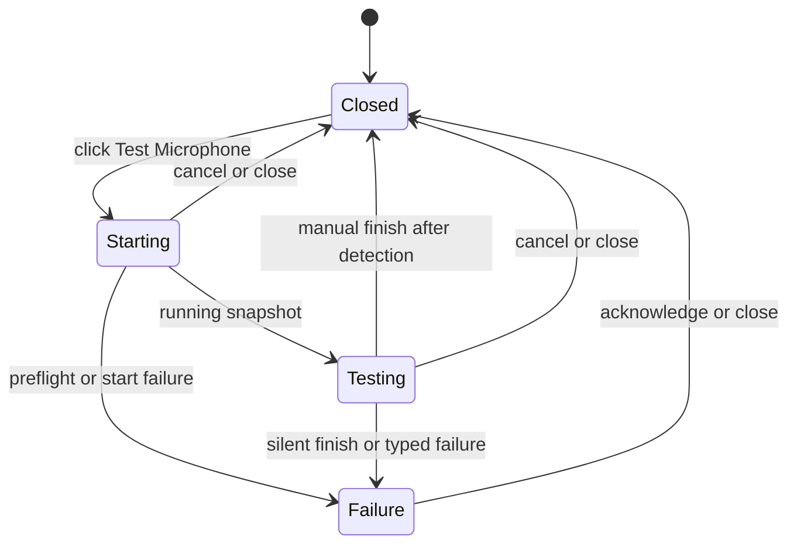
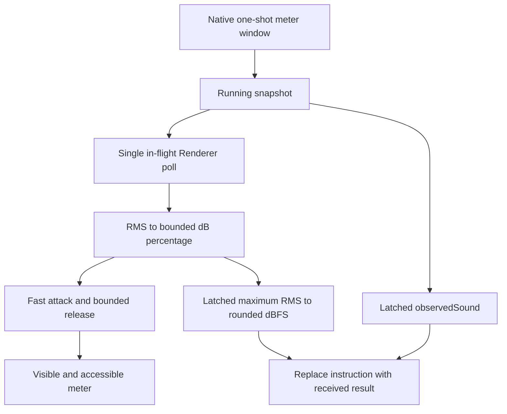

# Microphone Test Feedback Refinement - Plan

## Goal Capsule

| Field | Contract |
| --- | --- |
| Objective | 用户点击一次即可开始麦克风测试，并能从清晰、稳定且不重复的反馈中判断麦克风是否工作以及本次测试的最高输入电平。 |
| Means | 删除独立说明阶段，让测试入口直接进入连接；检测到声音后将 Dialog 说话指引原位替换为结果和最大 RMS 输入电平；Renderer 使用 RMS、分贝映射和快升慢降包络呈现音量。（KTD1、KTD2、KTD3） |
| Authority | 本计划定义本次聚焦改动。`docs/plans/2026-08-25-1021-fix-desktop-input-workspaces-plan.md` 继续定义手动结束、typed failure、资源释放和正式录音互斥。`docs/plans/2026-08-26-1651-fix-bluetooth-microphone-test-plan.md` 继续定义蓝牙恢复和 Helper 兼容性。`AGENTS.md` 定义 Electron、无障碍和验证权限。 |
| Execution profile | U1 先收紧测试入口、Dialog 状态和取消竞态；U2 在该生命周期上替换音量展示节奏。 |
| Stop conditions | 不修改 Native、Main、Preload 或共享 snapshot schema；不增加自动结束、成功结果页、音量等级或试听录音；不在未获当前任务授权时启动应用、浏览器或视觉测试。 |
| Tail ownership | 本计划只覆盖 Electron Renderer 的麦克风测试入口、Dialog 文案、音量展示和对应单元测试。正式录音、移动端、Native 采集算法、蓝牙恢复和发布证据不在范围内。 |

---

## Product Contract

### Summary

麦克风测试将从一次明确点击直接进入连接和运行状态。Dialog 初始提示用户说话；检测到声音后，同一位置替换为“已收到声音”和本次测试的最高 RMS 输入电平。不显示“暂未收到声音”，音量条下方不再放第二份状态文字，音量条使用平滑反馈代替原始峰值跳动。

### Problem Frame

当前入口先打开说明状态，再要求用户点击“开始测试”。第二次点击没有引入新的选择，却延长了一个短任务。

运行状态在 Dialog 描述和音量条下方重复显示“暂未收到声音”或“已收到声音”。这会削弱信息层级。在尚未检测到声音时，“请对着麦克风说话。”已经说明下一步，不需要再附加一个否定状态。

Renderer 每次 snapshot 完成后等待 50 ms 再轮询。Native 的 `MicrophoneMeterAccumulator.consume` 会在读取后清空窗口，因此下一次读取可能在新 buffer 到达前得到零值。界面又使用 `normalizedPeak` 驱动 200 ms 宽度动画，导致目标值在动画完成前多次改变。抖动来自轮询节奏、一次性窗口、峰值数据和动画时长不匹配，而不是单一的音频采样时长问题。

### Key Decisions

- **一次点击直接开始测试。** (session-settled: user-approved — chosen over a separate instruction step: the extra action adds no user decision.) Governs R1、R2、R3。
- **Dialog 指引在检测成功后原位切换为结果。** (session-settled: user-approved — chosen over a persistent “暂未收到声音” and a second status below the meter: the instruction is sufficient before detection, and the same location can carry the result afterward.) Governs R4、R5。
- **检测结果显示本次测试的最大 RMS 输入电平。** (session-settled: user-approved — chosen over a generic dB label or instantaneous peak: normalized audio amplitude supports dBFS, and RMS is consistent with the stable meter.) Governs R5、R6、R9。
- **音量条优先表达稳定的平均输入。** (session-settled: user-approved — chosen over rendering raw peak values: users need a stable signal that the microphone is working.) Governs R6、R7、R8。

### Requirements

**Entry and lifecycle**

- R1. 用户点击“测试麦克风”后，Renderer 必须立即打开 Dialog 并开始现有 preflight 与 Native 测试流程，不得再显示独立“开始测试”操作。
- R2. 连接期间必须显示“正在连接麦克风…”和可用的取消或关闭入口；测试 meter 和“结束测试”只在 running snapshot 到达后出现。
- R3. 同一入口的快速重复激活只能创建一个测试；连接中关闭、迟到 start 和迟到 snapshot 必须继续走现有幂等取消与 generation 隔离。

**Information hierarchy and accessibility**

- R4. 测试运行时，Dialog 标题必须保持“测试麦克风”；检测到声音前，Dialog 描述显示“请对着麦克风说话。”，不得显示“暂未收到声音”。
- R5. `observedSound` 首次为 true 后，同一 Dialog 描述必须原位替换为“已收到声音 · 最高输入电平 −N dBFS”；音量条下方不得再显示第二份状态文字。“已收到声音”只表达一次有意义的状态变化。

**Meter behavior**

- R6. 可见 meter 必须使用 `normalizedRMS` 生成显示值，并将有效输入范围映射到可辨识的百分比；本次测试必须单独锁存最大 `normalizedRMS`，通过 `20 × log10(RMS)` 转换为取整的 dBFS 结果。`normalizedPeak` 不再直接控制进度条或最高电平文字。
- R7. Meter 必须快速响应上升并缓慢回落；一次缺少新 buffer 导致的零 snapshot 不得让进度条瞬间清零，持续静音必须在有界时间内回落到零。
- R8. Snapshot 轮询必须保持单请求 in-flight，并将显示刷新调整到约 80–100 ms；显示过渡不得持续长于连续目标更新的节奏。
- R9. Meter 的可访问值必须保持在 0–100，减少动态效果时不得依赖宽度动画表达 `observedSound`，且不得新增重复 live region 或实时 dBFS 播报。最高电平文字最多每 500 ms 刷新一次，只显示更高的已取整值。

**Preserved behavior**

- R10. 手动结束、收到声音后直接关闭、静音失败、typed failure、麦克风设置恢复、正式录音互斥、无自动时限和所有资源释放路径必须保持现有行为。

### Acceptance Examples

- AE1. **Covers R1、R2.** Given 存在可用麦克风，when 用户点击一次“测试麦克风”，then Dialog 先显示连接状态并在 start 返回 running 后显示 meter，期间不存在“开始测试”按钮。
- AE2. **Covers R4、R5、R6、R9.** Given 测试正在运行且尚未收到声音，when Dialog 渲染，then 描述只显示“请对着麦克风说话。”，页面不存在“暂未收到声音”；收到声音后，同一描述原位替换为“已收到声音 · 最高输入电平 −N dBFS”，且后续只在出现更高 RMS 时以不高于 500 ms 的频率更新取整数值。
- AE3. **Covers R6、R7、R8.** Given 连续 snapshot 依次包含有效 RMS、一次零值和后续静音，when Renderer 更新 meter，then 有效输入快速显示，单个零值只触发平滑回落，持续静音在有界时间内归零且没有高频来回闪动。
- AE4. **Covers R3、R10.** Given start 尚未返回，when 用户关闭 Dialog，then 迟到 start 的 testId 只被取消一次，Dialog 不会复活，测试按钮在 teardown 完成后恢复。
- AE5. **Covers R1、R10.** Given 麦克风权限被拒绝、设备不存在或 Helper 不兼容，when 用户点击一次“测试麦克风”，then 流程直接进入现有对应失败状态，不要求第二次点击，也不暴露底层错误。
- AE6. **Covers R3.** Given 用户快速重复激活“测试麦克风”，when 第一次 start 仍在进行，then 只产生一个测试身份和一条终止责任链。
- AE7. **Covers R9、R10.** Given 用户启用减少动态效果，when 测试从等待说话变为收到声音，then Dialog 描述仍明确切换为结果，meter 值保持有效，且没有新增重复播报或实时 dBFS 播报。

### Scope Boundaries

#### Deferred to Follow-Up Work

- 只有真实设备证据表明 80–100 ms Renderer 轮询仍无法得到连续 RMS 时，才单独评估 Native meter 的 peek、hold 或推送式协议；本计划不预先改变一次性消费契约。
- 峰值保持线、分段音量刻度或设备校准属于新的产品能力，不包含在本次修复中。

#### Out of Scope

- 正式录音的音量算法、采样格式、设备选择或蓝牙恢复。
- 移动端麦克风测试和 Goo 组件。
- 自动通过、自动结束、录音回放或弱、中、强分类。
- Electron release candidate、打包资源和发布验证。

---

## Planning Contract

### Key Technical Decisions

- KTD1. **入口直接驱动现有 start 生命周期。** (session-settled: user-approved — chosen over preserving the instruction phase: the first click already carries explicit microphone-use intent.) 删除 `instructions` presentation phase；触发控件在同一用户事件中进入 `starting` 并调用现有 `startTest`。Governs R1–R3。
- KTD2. **Renderer 继续拥有显示节奏。** 保留 Native 的 250 ms 一次性 meter window、`observedSound` 锁存和 `MicrophoneTestSnapshot` schema；本次只改变 Renderer 对现有事实的呈现。Governs R6–R10。
- KTD3. **Meter 使用 RMS 分贝映射和快升慢降包络。** (session-settled: user-approved — chosen over direct raw-peak rendering: a stable average signal better supports the test decision.) 将 RMS 转为有下限的 dBFS 显示百分比，上升使用较短响应，回落使用约 250–400 ms 的有界衰减。另外锁存本次测试的最大 RMS，转换为取整 dBFS 作为结果文字，不使用 Peak 或 dB SPL 标注。Governs R5–R7、R9。
- KTD4. **轮询与动画使用同一时间尺度。** 单请求完成后约 80–100 ms 再请求下一次 snapshot；宽度过渡不长于刷新间隔，避免 200 ms 动画被更频繁的新目标持续打断。Governs R7、R8。
- KTD5. **可访问状态保持粗粒度。** Dialog 描述先承载操作指引，再在 `observedSound` 首次为 true 后原位切换为结果；`role="meter"` 承载有界数值。不创建额外 announcer、底部状态或实时百分比/dBFS live region。Governs R4、R5、R9。
- KTD6. **平滑逻辑保持局部且可测试。** 在现有音频路由 feature 内使用小型纯转换函数或局部状态，不为单一 meter 引入共享抽象；若实现时需要独立文件，必须有第二个真实消费者或显著的测试隔离收益。Governs R6–R9。

### High-Level Technical Design

测试入口删除说明分支，保留连接、运行、失败和关闭状态。终止路径继续复用现有 generation 与 cancel 所有权。

Native 继续发布采集事实。Renderer 分别消费 RMS 和 `observedSound`，避免把瞬时显示值与测试结果混为一体。

### Sequencing

1. U1 先用现有 Renderer 测试固定单击启动、连接中取消和指引到结果的单位置切换，再删除 `instructions` 分支。
2. U2 在稳定的新生命周期上增加最大 RMS/dBFS 结果、meter 转换和计时测试，最后替换当前 peak 与 50 ms/200 ms 组合。
3. 任一 UI 代码在最终静态检查后改变，都必须重新执行受影响的非视觉验证；视觉验证仍受当前任务授权约束。

### Risks and Mitigations

| Risk | Mitigation |
| --- | --- |
| 快速重复点击绕过 React 禁用状态并创建两个 start | 使用同步 in-flight 所有权或现有 generation 边界防止重复创建，并覆盖重复激活测试。 |
| RMS 线性值过小导致 meter 看起来不动 | 使用有界 dBFS 映射，并保持 `observedSound` 的 -55 dBFS Native 判断独立。 |
| 平滑回落掩盖持续静音 | 为 release 设置明确上限，并用 fake timer 证明持续零值最终归零。 |
| Timer 或迟到 snapshot 在 Dialog 关闭后继续更新 | 在现有 effect cleanup、generation token 和 active flag 中统一停止 poll 与显示状态更新。 |
| 说话指引被结果替换后产生重复播报 | 只在同一 Dialog 描述中切换一次粗粒度结果；数值更新不创建额外 live region。 |
| 把数字音频幅度误标为现实声压级 | 文案始终使用 dBFS，不使用没有物理校准依据的 dB SPL。 |
| 单元测试证明逻辑但未证明真实视觉节奏 | 未授权时明确报告视觉验证未执行；获得授权后按 `AGENTS.md` 执行 Electron UI 检查。 |

### Sources and Research

- `apps/desktop-electron/src/renderer/features/audios/audio-route-feature.tsx` owns the current `instructions → starting → testing → failure` presentation, 50 ms polling, duplicated status, and peak-driven 200 ms transition.
- `apps/desktop-electron/tests/unit/renderer/audio_route_test.tsx` covers manual finish, late start, late snapshot, typed failures, settings recovery, and recording mutual exclusion.
- `packages/desktop_macos_native/Sources/CaptureCore/MicrophoneCapture.swift` defines the 250 ms consume-on-read accumulator that explains zero snapshots between buffers.
- `packages/desktop_macos_native/Tests/CaptureCoreTests/MicrophoneCaptureTests.swift` characterizes consume-once and retention behavior; this plan preserves it.
- `docs/plans/2026-08-25-1021-fix-desktop-input-workspaces-plan.md` defines Renderer-owned display rhythm, manual finish, typed failures, and teardown behavior.
- `docs/plans/2026-08-26-1651-fix-bluetooth-microphone-test-plan.md` defines concise copy, Bluetooth recovery, and Helper compatibility behavior that remains unchanged.

---

## Implementation Units

### U1. Start the microphone test from the entry action

- **Goal:** Remove the redundant instruction step while preserving the existing start, cancel, failure, focus, and teardown lifecycle.
- **Requirements:** R1–R5、R9、R10；AE1、AE2、AE4–AE7；KTD1、KTD5。
- **Dependencies:** None.
- **Files:**
  - `apps/desktop-electron/src/renderer/features/audios/audio-route-feature.tsx`
  - `apps/desktop-electron/tests/unit/renderer/audio_route_test.tsx`
- **Approach:**
  1. Change the trigger to enter `starting` and invoke the existing preflight/start operation from the first activation.
  2. Remove the `instructions` branch and its “开始测试” action without changing the Native request or selected-device resolution.
  3. Keep the Dialog title as “测试麦克风”; show connection progress while starting and “请对着麦克风说话。” while testing before detection.
  4. Remove the bottom status and the “暂未收到声音” copy; after detection, replace the Dialog instruction in place with the received-sound result while retaining the current finish/failure behavior.
  5. Prevent rapid duplicate activation before React commits the busy state, while preserving generation-based late-response rejection.
- **Execution note:** Update the existing lifecycle tests first because they currently encode the two-click flow and are the closest stable interaction boundary.
- **Patterns to follow:** Existing `startTest`, `cancelActiveTest`, `finishTest`, generation token, Radix Dialog autofocus, and typed failure helpers in `audio-route-feature.tsx`.
- **Test scenarios:**
  1. Covers AE1. One click opens the starting Dialog, invokes preflight and start once, and never renders “开始测试”.
  2. A running start response replaces connection progress with the meter, “请对着麦克风说话。”, and “结束测试”; it renders no waiting-for-sound status.
  3. Covers AE2. After `observedSound` latches, the instruction is replaced in the same Dialog description by one “已收到声音 · 最高输入电平 −N dBFS” result, with no duplicate status below the meter.
  4. Covers AE4. Closing while start is pending cancels the late testId exactly once, does not reopen the Dialog, and restores the trigger only after teardown settles.
  5. Closing during an in-flight snapshot ignores the late result and does not publish a stale status.
  6. Covers AE5. Permission denial, missing device, Helper mismatch, snapshot failure, and settings recovery remain reachable from one entry click with their existing typed outcomes.
  7. Covers AE6. Two rapid trigger activations invoke at most one start and leave one cancellation owner.
  8. Detected finish closes without a success result; silent finish shows the existing failure; cancel, close, Escape, and unmount never show a result.
  9. Formal recording keeps the test trigger disabled; starting or running a test keeps formal recording disabled until teardown completes.
  10. Keyboard activation starts and ends the test, focus enters the running primary action, and close restores focus through existing Radix behavior.
- **Verification:** Renderer tests prove the one-click lifecycle, instruction-to-result replacement, absence of duplicate status copy, failure preservation, race handling, mutual exclusion, and keyboard path without launching Electron.

### U2. Stabilize the microphone meter presentation

- **Goal:** Replace raw peak-driven motion with a deterministic RMS display that responds quickly and decays smoothly.
- **Requirements:** R5–R10；AE2、AE3、AE7；KTD2–KTD6。
- **Dependencies:** U1.
- **Files:**
  - `apps/desktop-electron/src/renderer/features/audios/audio-route-feature.tsx`
  - `apps/desktop-electron/tests/unit/renderer/audio_route_test.tsx`
- **Approach:**
  1. Convert `normalizedRMS` into a clamped display percentage over a bounded dBFS range; keep the result decision on Native `observedSound`.
  2. Track the maximum RMS for the current test separately from the smoothed display value, convert it with `20 × log10(RMS)`, round it to a whole dBFS value, and reset it for each test.
  3. Apply a deterministic attack/release envelope to the displayed percentage so rising input reacts quickly and missing or falling input decays over the R7 window.
  4. Change snapshot scheduling to the R8 interval while keeping one request in flight and reusing the existing cleanup boundary.
  5. Align or remove the width transition so CSS does not animate longer than the data update interval; retain `motion-reduce` behavior.
  6. Expose the smoothed, clamped percentage through the existing `role="meter"` attributes; refresh the visible maximum at most every 500 ms without making its numeric changes a live announcement.
- **Execution note:** Use fake timers and a deterministic snapshot sequence before changing timing constants; avoid runtime visual tuning until the user authorizes visual validation.
- **Patterns to follow:** Current self-scheduling poll effect, bounded snapshot schema, `motion-reduce` classes, and renderer-local pure presentation helpers.
- **Test scenarios:**
  1. A zero RMS maps to 0, a value near the Native sound floor maps to a visible bounded percentage, and full scale maps to 100.
  2. The maximum result safely handles zero, uses unsmoothed RMS rather than Peak, converts positive values to a rounded dBFS value no greater than 0, increases monotonically during one test, and resets when a new test starts.
  3. The visible maximum text refreshes no more than once per 500 ms and does not regress when later RMS values are lower.
  4. An increasing RMS sequence raises the meter within one update and never produces a value outside 0–100.
  5. Covers AE3. A valid RMS followed by one zero snapshot decays instead of clearing immediately; repeated zero snapshots reach zero within the release bound.
  6. A new rise during release reverses direction without waiting for the prior decay to finish.
  7. Polling waits about 80–100 ms after each response and never overlaps requests when one snapshot is slow.
  8. A failed or terminal snapshot stops scheduling and routes through the existing failure lifecycle.
  9. Closing or unmounting cancels scheduled updates and prevents late timer or snapshot work from updating the Dialog.
  10. Covers AE7. Reduced-motion mode keeps the result text and meter value meaningful without adding a live percentage/dBFS announcement or duplicate status region.
  11. `normalizedPeak` changes alone do not control the displayed width or maximum result when RMS is unchanged.
- **Verification:** Fake-timer tests prove mapping, attack, release, request cadence, cleanup, terminal behavior, and accessible value bounds without relying on screenshots.

---

## Verification Contract

| Lane | Applies when | Command or evidence | Pass condition |
| --- | --- | --- | --- |
| Focused Renderer behavior | During U1 and U2 | From `apps/desktop-electron`: `bunx vitest run tests/unit/renderer/audio_route_test.tsx` | One-click flow, races, failures, meter timing and semantics pass in jsdom. |
| Static correctness | After the focused tests pass | From `apps/desktop-electron`: `bun run format:check`, `bun run lint`, and `bun run typecheck` | Formatting, lint and TypeScript checks pass for the final code state. |
| Electron UI gate | Only after explicit visual-validation authorization in the current implementation task | From `apps/desktop-electron`: `bun run check:ui:quick`, then one final `bun run check:ui` after UI code stops changing | The authorized renderer gate passes once for the final UI code state. |
| Visual or browser-driven validation | Only when the user explicitly authorizes its exact scope | Inspect one-click starting, speaking instruction, received-sound plus maximum dBFS result, release-to-zero, permission failure, and close-during-start states | The visible hierarchy and meter rhythm match R1–R10; otherwise report this lane as skipped by policy. |
| UI device watcher | Only after explicit visual-validation authorization | From the repository root: `./tool/ensure_ui_watcher.sh` as a best-effort final check | The script exits normally; no device is required. |

Do not run `bun run package`, `resources:all`, `check:release`, screenshot updates, goldens, Electron launch, browser control, or the repository-wide `./tool/dev_check.sh` for this bounded Renderer change unless the user separately expands the task or requests the corresponding lane.

---

## Definition of Done

- A single “测试麦克风” activation enters connection and starts the existing Native test without an intermediate start action.
- Running UI initially contains only the speaking instruction; after detection, the same Dialog description contains one received-sound result with the maximum RMS input level in rounded dBFS and no bottom status.
- Meter width is derived from RMS, remains bounded, rises promptly, does not collapse on one empty window, and reaches zero after sustained silence; the maximum result is monotonic within one test and resets for the next test.
- Existing finish, failure, settings, mutual-exclusion, generation and teardown behavior remains covered and unchanged.
- Focused Renderer tests and permitted static checks pass for the final code state.
- Authorized UI checks pass when authorization is granted; otherwise the handoff states that visual validation was skipped under repository policy.
- No Native, Main, Preload, shared contract, mobile, release or unrelated UI changes remain in the diff.
- Abandoned timing experiments, duplicate helpers, stale instruction-state code and unused test fixtures are removed before completion.
