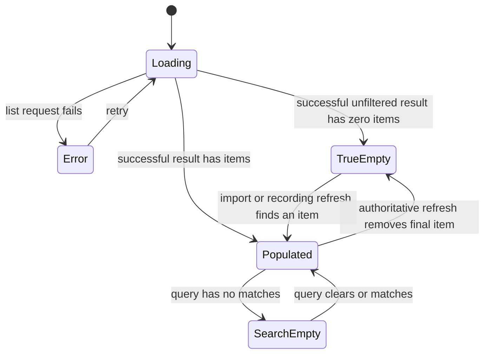
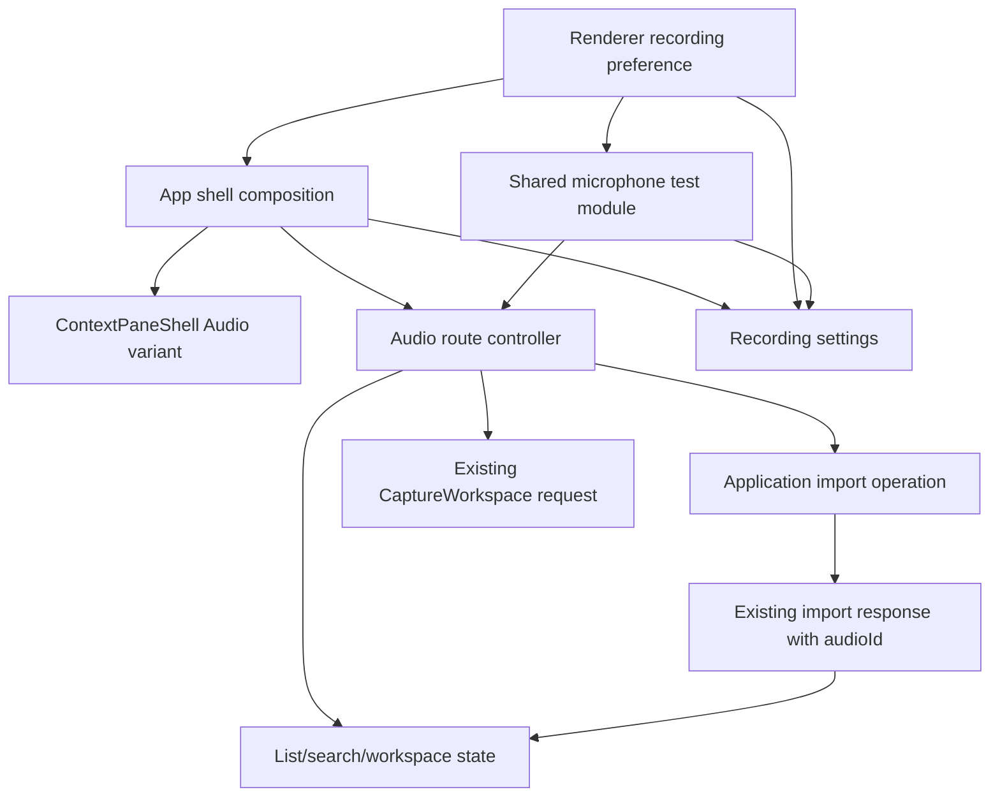

# Audio Workspace First-Use Refinement - Plan

## Goal Capsule

| Field | Contract |
| --- | --- |
| Objective | 首次进入空资料库的用户能立即理解如何开始，有音频的用户则获得更紧凑、层级更清楚的列表与工作区。 |
| Means | 把真实零音频提升为第三栏的全局首次使用状态，以音频专属 Shell 变体收紧布局，并把默认麦克风与测试统一归入“录制”设置。（KTD1、KTD2、KTD5、KTD6） |
| Authority | 本计划承接当前会话确认的产品范围。`AGENTS.md` 约束 Electron 组件、可访问性和验证权限；`docs/plans/2026-08-17-1554-refactor-electron-sidebar-09-context-shell-plan.md` 继续约束 pane 偏好；`docs/plans/2026-09-01-1554-fix-microphone-test-feedback-plan.md` 继续约束麦克风测试生命周期与反馈。 |
| Execution profile | 先抽离可复用的录制偏好与麦克风测试边界，再完成音频列表状态和导入回传，随后调整 Shell 表现，最后接入“录制”设置。 |
| Stop conditions | 不改变 Flutter、互联、消息、Native 采集算法、处理协议或发布资源；不为录制自动选中新增跨进程 `audioId` 契约；未获当前实现任务的视觉验证授权时不启动应用、浏览器、截图、watcher 或 UI gate。 |
| Tail ownership | 本计划覆盖 Electron 音频工作区、录制设置、Renderer 偏好和相邻单元测试；视觉验收与真实设备验收仍由后续明确授权的实现任务承担。 |

---

## Product Contract

### Summary

音频资料库确认为空时，第二栏让位给第三栏的首次使用引导；资料库有内容时恢复紧凑的搜索列表和工作区。
导入、录制、麦克风测试与默认麦克风设置各自放在用户预期的位置，同时沿用现有业务和可访问性契约。

### Problem Frame

当前第二栏使用略灰的 sidebar surface，而第三栏使用白色 background；两栏头部均为 58px，第三栏在常见桌面宽度又从 16px 放大到 24px 内边距，导致主音频页面显得松散。

真实零音频目前被表达为第二栏的“还没有音频”和第三栏的录制准备表单两套状态。
第二栏此时没有导航价值，导入入口也被放在即将失去意义的列表工具栏中。
搜索无结果仍然需要第二栏；列表初次加载和失败则尚未取得可靠数据，应暂时以一个整体工作区状态取代分栏。因此“资料库为空”不能继续与过滤结果为空、加载中或失败共用一个判断。

麦克风选择和测试目前内嵌在音频无选择状态，悬浮控制条则孤立在“通用”设置中。
这让录制配置与内容浏览混合，也使麦克风测试难以在首次使用状态和设置页之间安全复用。

### Key Decisions

- **真实零音频使用全局首次使用状态。** (session-settled: user-approved — chosen over keeping separate second-pane and main-workspace empty states: the list pane has no navigation value before any audio exists.) Governs R1–R5。
- **音频页单独收紧密度。** (session-settled: user-approved — chosen over globally changing every Electron route: Companion, Messages, Settings, and capture detail were not part of the requested visual change.) Governs R7–R9。
- **新增“录制”设置分类。** (session-settled: user-approved — chosen over continuing to place capture preferences in General: microphone choice, testing, and the floating bar form one coherent settings area.) Governs R10–R13。
- **只借鉴 ReUI 的信息结构。** (session-settled: user-approved — chosen over copying the reference implementation and styling: local shadcn/Radix primitives and project tokens remain authoritative.) Governs R3、R16。

### Requirements

**Library and pane states**

- R1. 全局首次使用状态只在音频路由已启用、未过滤列表成功完成加载、没有列表错误且原始 `audios` 为零条时出现；搜索结果、旧数组、加载中和失败状态不得触发它。
- R2. 初次加载和列表加载失败把音频第二、三栏视为一个整体工作区：加载中只显示居中的 Spinner 与“正在加载音频…”，失败只显示错误与“重新载入”；两种状态都不展示搜索、导入、录制或栏内内容。进入真实零音频状态同样结构性隐藏第二栏、其布局占位和重开 trigger；这些结构性状态都不得写入或改变 `voice2text.shell.context-panes.v1`，成功得到非空列表后按原保存偏好恢复第二栏。
- R3. 首次使用状态使用居中的单栏布局，标题为“开始你的第一段音频”，描述为“录制一段新音频，或导入已有文件开始转写和整理。”，并按“开始录制”主操作、“导入音频”次操作、“测试麦克风”低强调操作建立层级；所有窗口宽度都不展示预览栏、插画或虚构内容。
- R4. 初次加载和列表失败使用 R2 的整体工作区状态，不展示首次使用文案，也不根据尚未确认的列表推断有无数据；后台刷新保留当前可用内容并使用局部进度，避免整页 Spinner 闪烁；只有有音频但搜索无结果继续在第二栏显示“没有匹配的音频”。
- R5. 导入成功和录制完成后必须重新读取权威音频列表，使真实零音频状态退出；导入使用现有响应中的 `audioId` 精确打开目标，录制完成本期只刷新列表，不猜测或自动选择新音频。
- R6. 有音频但尚未选择 workspace 时，第三栏显示轻量的选择提示而非首次使用状态；音频第三栏操作区仍提供导入入口，选择音频后显示文件名和现有详情。

**Audio-only composition and density**

- R7. 音频第二栏使用与第三栏相同的 `background` surface；音频第二、三栏头部均为 48px；音频第三栏内容固定为 16px 内边距，不随桌面宽度增加。
- R8. 音频第二栏的可见“音频”标题由搜索框替代，搜索框与收起控制同处固定头部；列表结构继续沿用现有本地组件语义，不为本期新增 VoiceOver 或屏幕阅读器专用协议。
- R9. “导入音频”从第二栏移除，在有音频时由第三栏操作区提供，在真实零音频时由首次使用状态提供；初次加载和列表失败不显示导入入口。所有可见入口共享同一 pending、取消、成功和错误反馈。

**Recording settings and microphone behavior**

- R10. 设置导航在“通用”之后新增“录制”，其中按同一设置 section 展示默认麦克风、测试麦克风和现有悬浮控制条；悬浮控制条不再出现在“通用”。
- R11. 默认麦克风偏好由 Renderer 持久化为“跟随系统默认”或具体设备 ID；首次值为系统默认，存储读取失败或设备暂时不可用不得阻止录制，并使用系统默认再回退到首个可用设备。设置页读取设备期间保留已保存的麦克风名称并禁用选择器；读取失败时在同一设置行显示错误与“重新载入设备”，且不影响其他设置。
- R12. 首次使用状态和“录制”设置必须复用同一麦克风测试 controller/Dialog，不复制测试状态机；一次点击直接连接，串行 snapshot、RMS meter、最高输入、手动结束、typed failure、权限恢复、幂等取消和卸载清理保持不变。
- R13. “开始录制”继续进入现有 preflight、权限和 CaptureWorkspace 设置流程；初始 preflight 期间按钮显示“正在检查麦克风…”并暂时不可点击，成功后恢复“开始录制”，失败时在操作附近显示错误和“重试”。资料库不可写、正在录制或明确禁止新录制时仍应阻止重复开始。

**Feedback and interaction scope**

- R14. 导入、麦克风偏好和测试错误必须显示在触发操作所属的第三栏、设置行或 Dialog 中；列表加载错误由整体音频工作区显示并只提供重新载入，结构性隐藏的第二栏不得保留导入 pending 或错误反馈。
- R15. 本期不新增自定义键盘焦点转移、VoiceOver、屏幕阅读器播报或相关专项测试；移除原计划中结构隐藏后的主动焦点恢复要求，但不破坏本地 shadcn/Radix primitives 和原生 HTML 已有的默认行为。
- R16. 所有新表面继续使用本地 shadcn/Radix primitives、现有图标和设计 tokens；保持无阴影、简短文案和既有交互回调，不复制 ReUI 的 Card、尺寸、阴影或专用交互样式。

### Acceptance Examples

- AE1. **Covers R1–R4、R7.** Given 音频列表首次加载完成且原始列表为空，when 音频页稳定呈现，then 第二栏、占位和重开 trigger 均不可见，第三栏展示首次使用标题、描述和三个分层操作，内容使用白色 surface 与固定 16px padding。
- AE2. **Covers R1、R2、R4、R9.** Given 音频列表正在初次加载或加载失败，when 对应状态出现，then 第二、三栏被一个整体状态替代并分别只显示 Spinner 或错误与重新载入，不显示导入或首次使用操作，保存的 pane 偏好没有被改写；Given 已成功加载非空列表但搜索无匹配，then 第二栏显示“没有匹配的音频”且第三栏保持当前可用内容。
- AE3. **Covers R2、R5、R9、R14.** Given 资料库为空且默认 pane 偏好为打开，when 用户成功导入新文件，then 导入响应沿用现有 `audioId`，列表刷新、第二栏恢复并打开目标音频；取消保持空态，失败在第三栏可见且允许重试。
- AE4. **Covers R2、R5、R15.** Given 最后一条音频被结构性刷新移除，when 权威列表确认变为空，then 第二栏隐藏、偏好不变且不执行自定义焦点转移或 VoiceOver 播报。
- AE5. **Covers R6–R9.** Given 资料库有音频但没有当前选择，when 音频页呈现，then 第二栏头部是搜索与收起控制，第三栏提供选择提示和导入操作；选择音频后第三栏头部显示文件名且仍可导入。
- AE6. **Covers R10、R11.** Given 用户进入“录制”设置，when 设备正在读取，then 保留已保存的麦克风名称且选择器暂不可用；读取失败时显示错误和“重新载入设备”，其他设置仍可用；选择具体麦克风后重新加载 Renderer 或设备暂时断开，偏好仍存在并安全回退。
- AE7. **Covers R3、R12、R13.** Given 首次使用状态正在执行录制 preflight，when 检查进行、成功或失败，then 主按钮依次显示检查中、恢复“开始录制”或显示错误与“重试”；Given 用户从首次使用状态或“录制”设置点击“测试麦克风”，then 两个入口呈现同一 Dialog 行为、不会并发创建两个 testId，关闭或导航清理活动测试一次。
- AE8. **Covers R7、R8、R15、R16.** Given 音频页面进入有内容、真实空态、加载或错误状态，when 页面切换对应组合，then 搜索、收起、导入、录制和测试只出现在其约定状态，Companion、Messages、Settings 和 capture detail 的现有尺寸与本地 primitive 默认行为不变。

### Success Criteria

- 真实零音频、搜索无结果、列表加载和列表失败四种状态在组件测试中被独立证明，没有共享错误分支。
- 导入成功可以精确打开返回的音频，录制完成可以可靠退出首次使用状态，且两者都不依赖处理任务是否创建。
- 麦克风测试的现有生命周期与 meter 测试继续通过，新设置不引入第二套测试状态机。

### Scope Boundaries

#### Deferred to Follow-Up Work

- 如果后续产品明确要求录制完成后自动打开新音频，再为 capture 终态设计稳定的 `audioId` 关联；本期不按时间、标题或列表排序猜测。
- 在功能落地并验证后，考虑把“真实资料库空 / 搜索无结果 / 加载失败”三类状态的分离记录为新的 `docs/solutions/` 学习。

#### Out of Scope

- Flutter/Goo、移动端麦克风设置、互联、消息和其他 Electron 路由的密度调整。
- Native Helper、Main capture 算法、共享音频存储 schema、处理任务协议和发布资源。
- 新插画生成、第三方 ReUI 依赖、完整 Nova stylesheet、阴影或新的全局视觉 token。
- Electron release candidate、打包验证、浏览器驱动视觉测试和未经授权的截图更新。

---

## Planning Contract

### Key Technical Decisions

- KTD1. **把结构性可见性叠加在用户偏好之上。** 由 `pane.open`、真实零音频事实以及初次 Loading/Error 的整体工作区状态共同得到 effective presentation，并让 pane、Inset margin、trigger 和可访问状态读取同一结果；不把结构不可用持久化为用户主动收起。
- KTD2. **为 Audio 提供 Shell 组合变体。** (session-settled: user-approved — chosen over changing shared Shell defaults: only the Audio route was approved for 48px headers, white pane surface, and fixed 16px padding.) `ContextPaneShell` 与 main presentation 接受 Audio 专属 header/content 配置，其他路由继续使用现有默认。
- KTD3. **列表本身是空态 authority，应用快照只作为刷新信号。** `audio.audios` 的成功加载结果决定 R1；application library phase/count 和 capture 终态只触发重新读取，不直接替代列表事实。
- KTD4. **让既有导入结果返回 Audio controller。** `useProcessingTasks` 把现有 imported/canceled 结果返回给调用方，controller 复用 pending guard，成功后刷新并用响应 `audioId` 调用现有选择路径；不新增 IPC 字段。
- KTD5. **默认麦克风使用 Renderer preference。** Renderer 是唯一的偏好消费者，并已通过现有 capture/test command 传递设备 ID，因此使用版本化 localStorage、安全解析和确定性 fallback，不新增 Main/Preload/IPC 持久化；Main-owned floating preference 保持原边界。
- KTD6. **提取一个共享麦克风测试模块。** 把现有 hook/controller、Dialog 和设备解析从 `RecordingReadyState` 中分离，入口只负责提供当前有效设备与打开意图，保持 `docs/plans/2026-09-01-1554-fix-microphone-test-feedback-plan.md` 的生命周期 authority。
- KTD7. **适配 ReUI 的信息层级而非双栏实现。** (session-settled: user-approved — chosen over copying the reference block or inventing preview content: the first-use state stays a centered single column at every width.) 本期只保留标题、描述和一主一次一低强调的三个操作，不实现预览栏。

### High-Level Technical Design

**Library presentation state**

`Loading` 和 `Error` 使用跨第二、三栏的整体工作区 presentation；`TrueEmpty` 使用第三栏首次使用状态并抑制第二栏。
`Populated` 和 `SearchEmpty` 恢复按保存偏好控制的第二栏；search filtering 从不改变 library authority。

**Component and data ownership**

Shell composition owns placement and effective pane visibility.
Audio controller owns list truth and import transitions.
Renderer preference owns the configured device identity, while existing Main/Native commands remain the execution boundary for capture and testing.

### Sequencing

1. Preserve the existing microphone-test tests while extracting shared preference, device resolution, controller and Dialog behavior.
2. Return import results through the current application operation and make Audio list refresh independent of processing-task creation.
3. Add the true-empty state and effective pane visibility before moving search and import controls, so each relocated action has an authoritative state owner.
4. Apply the Audio-only Shell density and header slots, then connect the Recording settings category to the shared preference and test module.
5. Update static and component expectations for the final code state; run conditional UI gates only if the implementation task receives explicit visual-validation authorization.

### Risks and Mitigations

| Risk | Mitigation |
| --- | --- |
| 加载或失败时误显示空态或导入 | R2、R4、R9 把未知列表状态提升为整体 Spinner/Error presentation，只有成功列表结果才能进入真实空态或有内容界面。 |
| 搜索无结果被误判为资料库为空 | R1 只读取成功完成的原始 `audios`；为四种列表状态建立独立测试。 |
| pane 内容隐藏但 Inset margin 或 trigger 仍存在 | KTD1 让所有 Shell projection 读取同一 effective visibility，并测试布局与 aria 状态。 |
| 结构隐藏覆盖用户的 pane 偏好 | 禁止空态路径调用 preference 写入；测试 localStorage 在隐藏与恢复前后不变。 |
| 导入成功但列表不刷新，或错误显示在隐藏栏 | KTD4 返回现有结果，刷新后再选择；pending/error 始终由可见第三栏入口拥有。 |
| 复制麦克风测试造成并发 testId 或资源泄漏 | KTD6 保留一个共享状态机与现有 generation/cancel/cleanup 测试。 |
| 设备拔出后保存的 ID 阻止录制 | KTD5 把保存值与 effective device 分开，当前设备集无法解析时确定性回退。 |
| 共享 Shell 或 Settings 样式被无意改变 | KTD2 使用 Audio 专属组合变体，并断言其他 route 的现有 header/padding 不变。 |
| 单元测试证明结构但未证明真实视觉密度 | 未授权时明确记录 UI gate 未运行；获得授权后只对最终稳定代码执行项目规定的 UI gate。 |

### Sources and Research

- `apps/desktop-electron/src/renderer/App.tsx`：三栏组合、主 header、route padding、设置导航和 CaptureWorkspace handoff 的当前 authority。
- `apps/desktop-electron/src/renderer/features/audios/audio-route-feature.tsx`：列表、搜索、workspace、导入 pending、录制准备和麦克风测试的当前单一 route controller。
- `apps/desktop-electron/src/renderer/features/shell/use-context-pane-shell.ts`：版本化 Renderer pane 偏好与安全解析模式。
- `apps/desktop-electron/src/renderer/features/shell/context-pane-shell.tsx`：第二栏固定 header、内容和 footer 的组合边界。
- `apps/desktop-electron/src/renderer/features/processing/use-processing-tasks.ts` 与 `apps/desktop-electron/src/shared/contracts/ipc.ts`：导入操作和已存在的 `audioId` 响应。
- `apps/desktop-electron/tests/unit/renderer/audio_route_test.tsx` 与 `apps/desktop-electron/tests/unit/renderer/shell_test.tsx`：当前音频状态、pane、header、设置和导入回归边界。
- `docs/plans/2026-08-17-1554-refactor-electron-sidebar-09-context-shell-plan.md`：结构性隐藏不得覆盖用户 pane 偏好的既有产品约束。
- `docs/plans/2026-09-01-1554-fix-microphone-test-feedback-plan.md`：一次点击、serial polling、RMS、typed failure 和 cleanup 的麦克风测试 authority。
- `docs/solutions/architecture-patterns/desktop-first-workstation-boundaries.md`：Renderer/composition work 留在 Electron application root，不把 UI state 推入共享 Dart packages。
- [ReUI Empty State 4](https://reui.io/blocks/application/empty-state/empty-state-4)：仅作为 zero-state 标题、描述和操作层级参考；本期明确不采用其双栏预览结构。

---

## Implementation Units

### U1. Extract recording preference and microphone-test ownership

- **Goal:** 建立可由首次使用状态和设置页共同使用的默认麦克风与测试边界，同时保持现有测试体验不变。
- **Requirements:** R11–R13；KTD5、KTD6。
- **Dependencies:** 无。
- **Files:**
  - `apps/desktop-electron/src/renderer/features/capture/use-recording-preference.ts`（新增）
  - `apps/desktop-electron/src/renderer/features/capture/microphone-test-dialog.tsx`（新增）
  - `apps/desktop-electron/src/renderer/features/audios/audio-route-feature.tsx`
  - `apps/desktop-electron/src/renderer/features/capture/capture-workspace.tsx`
  - `apps/desktop-electron/tests/unit/renderer/audio_route_test.tsx`
  - `apps/desktop-electron/tests/unit/renderer/capture_workspace_test.tsx`
- **Approach:**
  1. 把版本化偏好、安全解析、system-default sentinel 和 effective-device fallback 封装在 Renderer capture feature 中。
  2. 把现有麦克风测试 controller/Dialog、RMS display state、typed failure 与 cleanup 移到可复用模块；不改变 Main/Preload/IPC 或 Native contracts。
  3. 让 Audio route 和 CaptureWorkspace 读取同一有效偏好，但保留正式录音自身的 preflight 和现有命令边界。
- **Execution note:** 先用现有麦克风测试回归作为 characterization coverage，再移动生命周期代码。
- **Patterns to follow:** `use-context-pane-shell.ts` 的 localStorage 安全读写；`RecordingReadyState` 的 generation、serial polling、finish/cancel 和 failure helpers；`CaptureWorkspace` 的默认设备解析。
- **Test scenarios:**
  1. 未保存偏好时选择系统默认设备，若系统默认不存在则使用首个可用设备。
  2. 保存具体设备后重新挂载 Renderer，设备存在时录制和测试都传递该 ID。
  3. 保存设备暂时缺失时不清除偏好，本次录制和测试回退到系统默认；设备恢复后重新采用保存值。
  4. localStorage 缺失、无效 JSON、未知版本或写入失败时保持页面和录制可用，并给设置消费者稳定错误状态。
  5. Covers AE7. 两个入口各自一次点击进入同一连接、运行、结果和 failure 行为；Modal 阻止导航时不会创建并发测试。
  6. Covers AE7. 连接中关闭、运行中关闭、迟到 start、迟到 snapshot 和组件卸载仍只取消一次并清理 timer。
  7. 现有 RMS 快升慢降、最高 dBFS 节流、静音 failure、Helper mismatch 和系统设置 fallback 断言保持不变。
- **Verification:** 偏好解析和麦克风测试回归证明行为等价；diff 不包含 shared contract、Preload、Main 或 Native 变更。

### U2. Make Audio first-use transitions authoritative

- **Goal:** 分离真实零音频与列表局部状态，并让导入和录制完成可靠刷新列表。
- **Requirements:** R1、R4–R6、R9、R13、R14；KTD3、KTD4。
- **Dependencies:** U1。
- **Files:**
  - `apps/desktop-electron/src/renderer/features/audios/audio-route-feature.tsx`
  - `apps/desktop-electron/src/renderer/features/processing/use-processing-tasks.ts`
  - `apps/desktop-electron/src/renderer/App.tsx`
  - `apps/desktop-electron/src/renderer/components/ui/empty-state.tsx`
  - `apps/desktop-electron/tests/unit/renderer/audio_route_test.tsx`
  - `apps/desktop-electron/tests/unit/renderer/application_operations_test.tsx`
- **Approach:**
  1. 以成功完成的未过滤 `audios` 派生 true-empty，保留 loading/error/query-empty 的现有 owner。
  2. 扩展本地 EmptyState 或使用 Audio route-local composition，使其支持居中的单栏描述与三层操作，不增加 preview API，也不向 shared primitive 注入 route-specific 业务。
  3. 让 application import operation 返回现有 imported/canceled 结果；成功时刷新列表并用 `audioId` 走既有 `selectAudio`，取消不改变状态，失败在第三栏呈现。
  4. 用 application library/capture 结构变化触发列表重新读取；录制完成只刷新，不推测新音频身份。
  5. 为有音频但无 workspace 提供选择提示，并保持第三栏导入可达。
  6. 把初次 Loading 与 Error 暴露为 Audio workspace presentation state：Loading 只提供 Spinner，Error 只提供错误和重新载入；两者不挂载旧的 `RecordingReadyState`、搜索、导入或录制操作。后台刷新继续保留已有可用内容。
  7. 在首次使用状态消费现有 preflight：检查期间切换主按钮文案并禁用，失败时提供局部错误与重试，成功后才允许进入现有 CaptureWorkspace 流程。
- **Patterns to follow:** 当前 `loadAudios` intent token、`selectAudio` playback close/open serialization、`userFacingError`、application snapshot acceptance 和本地 EmptyState primitive。
- **Test scenarios:**
  1. Covers AE1. 初次成功加载零条音频时只呈现首次使用状态和三个操作。
  2. Covers AE2. 初次 pending、recoverable error 和 query-empty 分别进入整体加载、整体错误和第二栏搜索无结果状态，均不派生 true-empty。
  3. Covers AE2. 初次 Loading/Error 分别只呈现整体 Spinner 或错误与重新载入，不显示搜索、导入、录制准备或首次使用文案；后台刷新不替换已有工作区。
  4. Covers AE3. imported/inserted=true 刷新列表并打开返回的 `audioId`；inserted=false 打开既有音频。
  5. Covers AE3. canceled 保持空态且不清除错误之外的状态；import rejection 恢复按钮并在第三栏显示可重试错误。
  6. 录制从进行中进入已提交终态且 library count 改变时只发起必要的结构刷新，重复 snapshot 不形成刷新循环。
  7. 有音频但未选择时显示选择提示和导入，不显示首次使用文案或麦克风 selector。
  8. 选中音频被结构刷新移除时仍先关闭 playback，再清空 workspace；若列表仍有音频则停留在选择提示。
  9. Covers AE7. 录制 preflight 的检查中、成功、失败与重试分别驱动主按钮文案、可用性和局部反馈，明确禁止永久 pending。
- **Verification:** Audio controller 测试证明四类列表状态、导入结果和录制刷新；application operation 测试证明结果回传与全局 snapshot/error 协调。

### U3. Add Audio-only shell composition and pane suppression

- **Goal:** 实现白色第二栏、48px 头部、固定 p-4、header 搜索和真实空态下的完整 pane 抑制。
- **Requirements:** R2、R6–R9、R15、R16；KTD1、KTD2、KTD7。
- **Dependencies:** U2。
- **Files:**
  - `apps/desktop-electron/src/renderer/App.tsx`
  - `apps/desktop-electron/src/renderer/features/shell/context-pane-shell.tsx`
  - `apps/desktop-electron/src/renderer/features/audios/audio-route-feature.tsx`
  - `apps/desktop-electron/src/renderer/components/app-sidebar.tsx`
  - `apps/desktop-electron/tests/unit/renderer/shell_test.tsx`
  - `apps/desktop-electron/tests/unit/renderer/audio_route_test.tsx`
  - `apps/desktop-electron/tests/e2e/sidebar_navigation_test.ts`
  - `apps/desktop-electron/tests/visual/renderer-shell.visual.spec.ts`
- **Approach:**
  1. 为 ContextPaneShell 增加可选 primary-header composition 和 Audio surface/density variant；默认 section label 和其他 route 保持原样。
  2. 在 App 组合层派生 effective pane visibility，让 Sidebar presentation、ContextPaneShell、Inset margin、standalone trigger 和 aria/inert 一致读取，同时不调用 preference mutator；初次 Loading/Error 由跨第二、三栏的整体 presentation 接管，成功列表结果再恢复分栏或进入 true-empty。
  3. 把 Audio search 移入 48px 固定头部；把第三栏 title/action header 扩展为有选择和有列表未选择两种状态，true-empty 时由居中单栏首次使用状态接管，Loading/Error 不挂载这些栏内操作。
  4. 音频第三栏使用固定 p-4，其他 content presentation 继续保留现有 spacing。
  5. 不为 true-empty 切换增加主动焦点转移、VoiceOver 或屏幕阅读器播报；只保留本地 primitives 的默认行为。
- **Patterns to follow:** `ContextPaneShell` 的单一 pane DOM；`useContextPaneShell` 的独立 preference；现有 `ContextPaneTrigger` 的 Radix/shadcn behavior；Audio flat rows 与 shadowless surface guidance。
- **Test scenarios:**
  1. Covers AE1. true-empty 时 pane、sidebar gap、Inset margin 和 reopen trigger 同时消失，第三栏填满剩余宽度。
  2. Covers AE2. 初次 Loading/Error 使用一个整体工作区状态且不呈现分栏操作；结构抑制与恢复前后 localStorage pane 值相同，保存 open 恢复 open，保存 closed 仍保持 closed。
  3. Covers AE4. 最后一条音频消失时不写 pane 偏好，也不执行自定义焦点转移或专用播报。
  4. Covers AE5. 搜索和 collapse control 位于第二栏固定 header；导入不再位于第二栏，有/无 workspace 的第三栏操作正确。
  5. Covers AE8. Audio header 为 48px、pane surface 为 background、内容固定 p-4；Companion、Messages、Settings 和 capture detail 保持原 class contract。
  6. 搜索、pane 和隐藏行为复用现有本地 primitives 与原生语义，不新增 VoiceOver、屏幕阅读器或自定义键盘协议的专项实现和测试。
  7. 更新视觉夹具对 true-empty、search-empty、48px header 和新设置分类的预期，但在无授权任务中不执行视觉套件或更新截图。
- **Verification:** Shell、Audio 和 navigation 测试证明 DOM、layout class 与 preference 语义；视觉文件只更新与新 contract 直接冲突的 fixture/assertion。

### U4. Add the Recording settings category

- **Goal:** 把默认麦克风、共享测试入口和悬浮控制条组织为一个可导航的录制设置 section。
- **Requirements:** R10–R12、R14、R16；KTD5、KTD6。
- **Dependencies:** U1、U3。
- **Files:**
  - `apps/desktop-electron/src/renderer/App.tsx`
  - `apps/desktop-electron/src/renderer/features/settings/settings-section-contract.ts`
  - `apps/desktop-electron/src/renderer/features/settings/recording-settings-feature.tsx`（新增）
  - `apps/desktop-electron/src/renderer/features/capture/capture-workspace.tsx`
  - `apps/desktop-electron/tests/unit/renderer/shell_test.tsx`
  - `apps/desktop-electron/tests/unit/renderer/capture_workspace_test.tsx`
  - `apps/desktop-electron/tests/unit/renderer/recording_settings_test.tsx`（新增）
- **Approach:**
  1. 在 settings section contract 和导航中加入 `recording`，保持 scroll/focus/aria-current 行为。
  2. 使用现有 SettingsPageSection、SettingsListBlock、Field、Select、Button 和 Switch 排列默认麦克风、测试和悬浮控制条。
  3. 设置页用无权限副作用的 preflight 读取设备；选择写入 U1 偏好，测试调用 U1 共享 Dialog，悬浮控制条继续使用既有 Main-owned preference API。
  4. 将 FloatingCapturePreferenceSetting 从 General 移入 Recording，而不改变其 optimistic/pending/rollback 行为。
  5. 设备读取期间保留已保存的偏好文本并禁用选择器；读取失败时在默认麦克风设置行显示错误和“重新载入设备”，同时保持其他设置可用。
- **Patterns to follow:** 本地模型/云模型设置 section 导航、SettingsListBlock density、FloatingCapturePreferenceSetting rollback 和 settings heading focus。
- **Test scenarios:**
  1. Covers AE6. 设置导航按“通用、录制、本地模型、云端模型”排列，选择 Recording 后 heading、aria-current 和 scroll target 正确。
  2. 默认麦克风行在读取期间保留已保存名称并禁用选择器；成功后列出 system default 与 preflight devices，读取失败显示“重新载入设备”；选择、重新挂载、缺失 fallback 和存储失败反馈符合 R11。
  3. Covers AE7. 设置页测试入口呈现与首次使用入口相同的连接、meter、finish、failure 和 cleanup 行为。
  4. 悬浮控制条只出现在 Recording，读取、pending、成功和 rollback 测试保持原 contract。
  5. preflight 读取失败时设置 section 显示局部可恢复反馈和“重新载入设备”，不影响悬浮控制条或其他 settings sections。
- **Verification:** 新 section 的组件测试覆盖导航、设备偏好、测试复用和浮动条迁移；现有 General/Local/Cloud 设置仍可访问。

---

## Verification Contract

| Gate | Applicability | Evidence | Exit signal |
| --- | --- | --- | --- |
| Focused Renderer unit coverage | Implementation code changes | From `apps/desktop-electron`, run focused Vitest for `audio_route_test.tsx`, `shell_test.tsx`, `application_operations_test.tsx`, `capture_workspace_test.tsx`, and `recording_settings_test.tsx`; these are non-visual jsdom tests and must not launch an app or browser. | R1–R16 and AE1–AE8 have passing component/state coverage. |
| Static correctness | After focused tests pass | From `apps/desktop-electron`, run `bun run format:check`, `bun run lint`, and `bun run typecheck`. | Formatting, lint and TypeScript checks pass for the final static code state. |
| Electron UI gate | Only after explicit visual-validation authorization in the current implementation task | From `apps/desktop-electron`, run `bun run check:ui:quick`, then one final `bun run check:ui` after UI code stops changing. | The authorized renderer gate passes once for the final UI state; without authorization it is skipped and reported, per `AGENTS.md`. |
| Visual/browser evidence | Only when separately and explicitly authorized | Run only the specifically authorized visual/browser suite or manual flow; do not infer permission from implementation authority. | Approved viewports prove the centered single-column empty state, 48px density and surface result; otherwise report not performed. |
| Scope guard | Always | Inspect the final diff and imports. | No Flutter, Native, Main, Preload, shared-contract, release-resource or unrelated route changes; if scope expands, recalculate reverse consumers and run their required lane. |

The full repository gate, Electron packaging, release validation, screenshots, golden updates and UI watcher are not part of this routine Electron Renderer plan.

---

## Definition of Done

- R1–R16 and AE1–AE8 are implemented without unresolved launch-blocking questions.
- True-empty, search-empty, loading and error states are independently represented and tested.
- Initial loading shows one workspace Spinner; loading failure shows one workspace error with retry; neither state exposes Import or infers an empty library, while background refresh preserves usable content.
- The second pane disappears only for true-empty, consumes no layout width, writes no preference, and restores the saved preference when audio appears.
- The first-use state contains the approved copy and action hierarchy; imported audio refreshes and opens by exact `audioId`, while recorded audio refreshes without heuristic selection.
- Audio alone uses white second-pane background, 48px headers and fixed p-4; other routes retain their current contracts.
- Search replaces the visible Audio pane title without losing semantic headings, and Import is reachable only from visible third-column ownership.
- “录制” settings owns default microphone, the shared test entry and the existing floating bar; missing devices and preference failures degrade safely.
- Existing microphone-test polling, meter, feedback, failure, cancellation and cleanup regressions pass unchanged.
- No custom keyboard-focus transfer, VoiceOver flow, screen-reader announcement protocol or related dedicated test is added; existing native and local primitive behavior is left intact.
- Focused non-visual tests and static checks pass; conditional UI/visual gates are either authorized and pass or are explicitly reported as skipped by policy.
- The final diff contains no abandoned experiments, duplicate test state machines, dead empty-state branches or unrelated cleanup.
