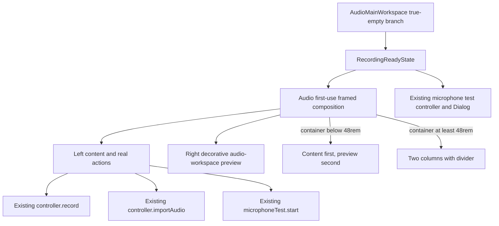

# Audio First-Use Reference Fidelity - Plan

## Goal Capsule

| Field | Contract |
| --- | --- |
| Objective | 空音频资料库首次使用页在常见桌面尺寸下清楚呈现录制与导入入口，并在构图、排版和元素层级上与 ReUI Empty State 4 属于同一视觉语言。 |
| Means | 使用 Audio route-local 的本地 Card/Button 组合重建带预览区的响应式双栏空态，同时保留现有状态和回调。（KTD1–KTD4） |
| Authority | 当前用户明确要求的高保真参考方向优先于旧计划的居中单栏约束；`AGENTS.md` 继续约束本地 primitive、无阴影、可访问性和视觉验证权限。 |
| Execution profile | Electron Renderer 局部视觉修正；先锁定结构与业务回归，再在获得授权时完成视觉对照。 |
| Stop conditions | 不修改 true-empty 判定、Pane 偏好、录制/导入/麦克风测试状态机、Main/Preload、共享契约、存储或 worker；未获视觉验证授权时不得启动应用、浏览器、截图或视觉测试。 |
| Tail ownership | 本计划覆盖音频首次使用页及其最近的 Renderer 测试；其他 EmptyState 消费者和音频工作区业务保持原样。 |

---

## Product Contract

### Summary

真实空音频资料库继续占据完整主工作区，但首次使用内容改为 ReUI Empty State 4 风格的居中描边框架。
框架在普通桌面宽度显示左右双栏，左侧承载音频图标、标题、说明和操作，右侧承载非交互的音频工作区预览。
窄宽度改为上下堆叠，并保留完整操作和预览。

### Problem Frame

当前实现把参考页收窄为居中单栏文字和纵向按钮，并主动关闭图标。
它保留了标题、描述和操作层级，却删除了参考页最显著的框架、双栏、左对齐排版、图标块、横向按钮组和预览区。
结果符合旧计划，但不符合用户最初要求的样式参考。

### Key Decisions

- **高保真采用参考页的完整视觉语法。** (session-settled: user-directed — chosen over borrowing only the information hierarchy: the centered single-column result visibly failed the requested reference.) Governs R1–R5, R11。
- **预览只表达真实产品能力。** 右栏不伪造用户历史、人物、文件或可操作控件。Governs R4, R9。
- **视觉修正保持 Renderer route-local。** 共享 EmptyState 和其他页面不承担本次参考页差异。Governs R6–R8, R12。

### Requirements

**Reference fidelity**

- R1. 首次使用页使用居中的大尺寸圆角描边框架，表面保持无阴影，并在主内容区留出均衡空白。
- R2. 首次使用框架的 route-local container 在 inline-size 达到 `48rem` 时显示近似 0.9:1.1 的左右双栏和清晰分隔，低于 `48rem` 时按左栏在前、预览在后的顺序堆叠；切换依据是音频主内容的实际可用宽度，不是整个 Electron 视口。
- R3. 左栏使用与音频导航一致的图标块、明显强于正文的左对齐标题、简短弱化说明和紧凑操作组；“开始录制”与“导入音频”在可用宽度内横向排列，“测试麦克风”保持低强调。
- R4. 右栏是明确的音频工作区预览，只使用录音整理、播放进度、时间戳、说话人和转写片段等现有能力语言，不出现姓名、公司、日期、真实文件名、虚构会议内容或波形编辑等不存在的能力。
- R5. 右栏在参考页对应的位置形成内嵌描边预览表面，桌面下保留右侧视觉重量，窄宽度下不得隐藏、横向溢出或裁切。

**Behavior preservation**

- R6. 首次使用页继续显示现有标题与描述，并按“开始录制”“导入音频”“测试麦克风”的顺序保留三个入口。
- R7. 录制 preflight、写权限、录制中、阻塞、麦克风测试和 teardown 的 disabled/pending 条件、文案、Spinner 和回调保持不变。
- R8. 导入取消、导入失败、preflight 失败与重试、导入成功退出空态、录制完成刷新以及麦克风测试 Dialog 生命周期保持不变。
- R9. 预览不包含 Button、链接、输入、`tabIndex`、事件处理、hover affordance 或其他假交互，并作为一个装饰子树从辅助技术树中排除。
- R10. 导入和 preflight 错误继续位于左栏操作之后并保留现有 `role="alert"` 与重试归属；route-level operation/transition error 继续由外层工作区显示。

**Boundaries and evidence**

- R11. 实现以 ReUI 官方页面和官方浅色缩略图的可见构图为视觉依据，不承诺无法取得的源码类名或逐像素复制。
- R12. 实现只使用本地 shadcn/Radix primitives、Lucide 图标和现有 tokens，不新增 ReUI 运行时依赖、不导入 ReUI/Nova 全量样式，也不改变共享 primitive 的装饰默认值。
- R13. true-empty authority、首次加载/失败分支、上下文 Pane 抑制、主内容 `p-4` 和保存的 Pane 偏好保持不变。
- R14. 外层页面允许短窗口纵向滚动；框架、两栏和操作组必须使用可收缩布局，错误、重试和预览在窄且矮的窗口中仍可到达。

### Acceptance Examples

- AE1. **Covers R1–R5, R11.** Given 1240×820 的空音频资料库，when 首次使用页稳定呈现，then 主内容中央出现无阴影描边框架，左栏左对齐显示图标、标题、说明与横向主次操作，右栏显示分隔后的内嵌音频预览。
- AE2. **Covers R2, R5, R14.** Given 首次使用 container 的 inline-size 低于 `48rem`，when 页面呈现，then 左栏先于预览纵向排列且操作可以换行；Given 窗口高度不足，when 页面呈现，then 无论当前是双栏还是堆叠，页面都可以纵向滚动，任何错误、重试和预览都不被裁切。
- AE3. **Covers R6–R8, R10.** Given preflight 正在进行、失败或成功，when 状态变化，then 主按钮、错误和重试继续遵循当前文案、disabled 条件和 callback，视觉框架不创建第二套状态。
- AE4. **Covers R6–R8.** Given 用户取消导入、导入失败或导入成功，when 操作结束，then 分别停留空态、显示可重试错误或刷新并打开返回的 `audioId`。
- AE5. **Covers R4, R9.** Given 首次使用页已呈现，when 检查右栏，then 它没有可聚焦或可点击后代，不读取用户数据，辅助技术只接触左栏真实操作和反馈。
- AE6. **Covers R12, R13.** Given 资料库加载、失败、非空或搜索无结果，when 路由进入对应状态，then 现有 Shell、共享 EmptyState、Pane 偏好和非首次使用页面不发生视觉或行为变化。

### Scope Boundaries

#### Deferred to Follow-Up Work

- 其他 Activity、Companion、搜索无结果和“选择一段音频”空态的视觉统一。
- 在取得独立产品要求后，为预览生成专用插画或真实产品截图资产。

#### Out of Scope

- 修改录音、导入、转写、播放、麦克风测试或 Pane 状态机。
- 修改 Main、Preload、IPC、共享 contracts、storage、workers、Flutter 或 Goo。
- 引入 ReUI 依赖、复制受认证保护的 registry 源码、导入完整 Nova stylesheet、添加阴影或全局 token。
- 未经授权启动 Electron、浏览器、视觉测试、截图更新或 UI watcher。

### Sources and Research

- [ReUI Empty State 4](https://reui.io/blocks/application/empty-state/empty-state-4)：双栏空态、图标、文案、双操作和预览槽的官方描述与公开渲染。
- [ReUI Empty State 4 light thumbnail](https://reui.io/thumbnails/blocks/empty-state-4-light.webp)：外框比例、左栏排版、按钮密度、分隔和内嵌预览位置。
- [shadcn Empty](https://ui.shadcn.com/docs/components/radix/empty)：Empty 的 media、title、description、content 组合模型。
- [shadcn Card](https://ui.shadcn.com/docs/components/radix/card)：Card 组合与 spacing ownership。
- `docs/plans/2026-09-01-1659-feat-audio-workspace-first-use-plan.md`：保留 true-empty、Pane、导入和麦克风行为；其“居中单栏、不展示预览”视觉决定被本计划替代。
- `docs/solutions/architecture-patterns/desktop-first-workstation-boundaries.md`：Electron 保持平台组合根，业务与共享边界不随局部 UI 改动移动。
- `apps/desktop-electron/src/renderer/components/ui/card.tsx`、`apps/desktop-electron/src/renderer/components/ui/button.tsx`：本地 Nova-aligned 表面、按钮变体和薄焦点权威。

---

## Planning Contract

### Key Technical Decisions

- KTD1. **新增 Audio route-local 首次使用组合。** (session-settled: user-directed — chosen over extending the shared centered EmptyState: route-local composition preserves unrelated consumers while implementing R1–R5.) `RecordingReadyState` 改用专属框架，`components/ui/empty-state.tsx` 保持不变。
- KTD2. **用本地 Card 和 Button 适配公开渲染。** Card 负责圆角、细描边、表面和 overflow，Audio consumer 只覆盖本次网格、密度与分隔；按钮保留现有 variant、focus 和 callback。
- KTD3. **预览使用静态语义标记而非图片或假控件。** 预览由 route-local 展示 markup 组成，根节点统一 `aria-hidden`，只投射 R4 的通用能力标签，不读取 controller/workspace 数据。
- KTD4. **展示层包裹现有状态机。** `RecordingReadyState` 继续唯一创建 microphone-test controller 和 Dialog，所有条件、错误与操作仍由当前 controller 拥有。
- KTD5. **响应式由 route-local container query 和现有滚动容器承担。** 框架建立本地 container，以 `48rem` inline-size 为唯一双栏/堆叠切换阈值；子项允许收缩，操作允许换行，外层不建立新的 viewport 或 Shell 模式。实现使用已安装 Tailwind v4 的 `@container` 与任意值 min-container variant，不用普通 viewport `md:` 代替。
- KTD6. **视觉证据受当前任务授权控制，但也是高保真完成的必要条件。** 静态结构和 jsdom 行为可以先验证；只有用户在实施任务中明确授权后，才运行 UI gate、启动视觉 harness 或更新截图。未获授权时可交付“静态实现完成、待视觉验收”状态，但不得将本计划或高保真目标标记为完成。

### High-Level Technical Design

The route owns state and actions.
The new frame owns only presentation.
The shared microphone test module keeps resource cleanup and Dialog behavior.

### Sequencing

1. Establish the route-local frame, preview semantics and responsive structure without changing callbacks.
2. Reconnect the existing action, pending and error markup inside the left column and preserve Dialog ownership.
3. Strengthen unit and geometry contracts, then collect visual evidence only within explicit authorization.

### Risks & Dependencies

| Risk | Mitigation |
| --- | --- |
| Shared EmptyState changes regress Activity, Companion or search-empty pages | Keep the new composition route-local per KTD1 and assert unrelated states remain unchanged. |
| Preview looks like fake user history or a disabled app | Use only generic capability labels, no user data, no fake controls, and one `aria-hidden` root per R4/R9. |
| Long errors break the two-column frame | Use shrinkable columns, wrapping actions and scrollable outer content per R14/KTD5. |
| Visual polish accidentally changes async behavior | Move existing action/error markup without changing controller expressions; keep behavior tests beside the change. |
| Static tests pass while fidelity remains poor | Do not claim reference fidelity without the permission-gated comparison in KTD6. |
| ReUI source cannot be inspected without authentication | Bind fidelity to the official public page and thumbnail per R11, not hidden class names. |

---

## Implementation Units

### U1. Build the route-local first-use frame

- **Goal:** Replace the first-use `EmptyState` call with a responsive framed composition that implements the reference layout and truthful decorative preview.
- **Requirements:** R1–R5, R9, R11–R14; AE1, AE2, AE5, AE6; KTD1–KTD3, KTD5。
- **Dependencies:** None.
- **Files:**
  - `apps/desktop-electron/src/renderer/features/audios/audio-route-feature.tsx`
  - `apps/desktop-electron/tests/unit/renderer/audio_route_test.tsx`
- **Approach:**
  1. Add route-local first-use frame and preview compositions near `RecordingReadyState`; do not extend the shared EmptyState API.
  2. Compose the outer surface from the local Card and the existing audio navigation icon.
  3. Give the preview a stable route-local hook, one `aria-hidden` root and no interactive descendants.
  4. Establish a route-local container and switch at `48rem` inline-size; implement the 0.9:1.1 split above the threshold and content-first stacking below it while preserving the outer `flex-1` centering and main-content scrolling.
- **Preview anatomy (implementation target):**
  1. The inset preview begins slightly below the frame top and aligns to the right and bottom edges, reproducing the reference's nested-panel visual role without adding a shadow.
  2. Its smallest, muted header row reads `音频工作区预览` with the secondary capability label `录音整理`; it is metadata, not a control.
  3. A compact playback strip follows with an abstract waveform/progress treatment and deterministic `00:00` / `01:24` time text; it contains no play button, slider or hover state.
  4. The largest preview region is titled `转写片段` and contains two ordered rows: `00:12 · 说话人 1` and `00:27 · 说话人 2`, each followed only by muted placeholder text bars rather than invented sentence content.
  5. Header, playback strip and transcript rows are left-aligned with increasing visual weight; borders, muted surfaces and spacing create hierarchy, and every element uses only `div`/`p`/`span` plus decorative icons.
- **Patterns to follow:** `components/ui/card.tsx` surface ownership, `components/app-sidebar.tsx` audio icon, and `audio-workspace-feature.tsx` capability vocabulary.
- **Test scenarios:**
  1. Covers AE1. A successful empty list renders one framed composition with distinct left content and right preview regions.
  2. Covers AE5. The preview root is decorative and contains no button, link, input or focusable descendant.
  3. Covers AE6. Search-empty and selection-prompt states still use the unchanged shared EmptyState.
  4. The frame keeps the approved title, description and action order without exposing preview labels as real library data.
- **Verification:** Static markup proves a single route-local frame, local primitive use, noninteractive preview semantics and no shared EmptyState change.

### U2. Preserve first-use actions and feedback inside the new layout

- **Goal:** Move the existing operations into the left column without changing their behavior, state ownership or cleanup.
- **Requirements:** R6–R10, R13; AE3–AE6; KTD4。
- **Dependencies:** U1.
- **Files:**
  - `apps/desktop-electron/src/renderer/features/audios/audio-route-feature.tsx`
  - `apps/desktop-electron/tests/unit/renderer/audio_route_test.tsx`
- **Approach:**
  1. Place the current record, import and microphone-test controls in the new action area while preserving their expressions and callbacks.
  2. Keep import/preflight feedback directly after the action group and route-level errors outside the frame.
  3. Keep one microphone-test controller and its Dialog under `RecordingReadyState`; do not copy lifecycle logic into the frame or preview.
  4. Retain true-empty Pane suppression and preference behavior without changing App/Shell production code.
- **Execution note:** Preserve the current behavior assertions before changing presentation markup, then add only the new structure assertions.
- **Patterns to follow:** Existing first-use tests for import cancellation/failure, preflight retry, disabled states and microphone-test cleanup.
- **Test scenarios:**
  1. Covers AE3. Preflight pending, success, failure and retry keep current button text, availability and callback.
  2. Covers AE4. Import cancel stays in first-use, failure exposes a retryable alert, and success exits first-use and opens the returned audio.
  3. Starting and closing microphone testing keeps one controller, one Dialog and the existing cleanup behavior.
  4. `writable=false`, active recording and teardown retain their current per-action disabled rules.
  5. Covers AE6. Loading, list error and non-empty library states never mount the new first-use frame.
  6. The existing unchanged `shell_test.tsx` true-empty test continues to prove that the saved audio Pane preference receives no write while true-empty hides and later restores the Pane.
- **Verification:** Focused Renderer unit tests prove callbacks, asynchronous branches, alerts, Dialog lifecycle and Pane preference behavior on the new markup.

### U3. Replace the visual contract with reference-fidelity evidence

- **Goal:** Make the empty-library fixture verify the new composition and, when authorized, compare the final rendering against the official reference.
- **Requirements:** R1–R5, R11, R14; AE1, AE2; KTD6。
- **Dependencies:** U1, U2.
- **Files:**
  - `apps/desktop-electron/tests/visual/renderer-shell.visual.spec.ts`
  - `apps/desktop-electron/tests/visual/goldens/audio-empty-recording-ready.png`（仅在授权截图更新后修改）
- **Approach:**
  1. Replace the old center-ratio-only assertion with stable hooks for the frame, columns, divider and preview.
  2. Add geometry cases immediately below and above the `48rem` first-use container threshold; prove stacking below it, the 0.9:1.1 split above it, wrapping, scroll reachability and absence of horizontal overflow.
  3. Under explicit authorization, render the same stable state, compare it beside the ReUI thumbnail and adjust only route-local spacing, proportion and typography.
  4. Update the canonical golden only after the accepted final comparison and only when the authorization covers screenshots.
- **Execution note:** This unit is permission-gated; without authorization, update only non-launching test source as needed and report the implementation as “静态实现完成、待视觉验收”. The plan remains incomplete until the user authorizes and accepts the side-by-side visual evidence.
- **Patterns to follow:** Existing `audio-empty` fixture, `assertRuntimeContract`, geometry helpers and canonical macOS arm64 golden policy.
- **Test scenarios:**
  1. Covers AE1. At 1240×820, the frame is centered, split into two visible columns and keeps the preview inset inside the right column.
  2. Covers AE2. At constrained width/height, content precedes preview, actions remain reachable and the document has no horizontal overflow.
  3. The preview subtree has no focus target during keyboard traversal.
  4. The accepted screenshot retains the local shadowless surface and thin focus treatment while matching the reference hierarchy.
- **Verification:** Authorized geometry and screenshot evidence proves visible fidelity; without authorization, the handoff names the unverified visual claims instead of treating static checks as equivalent.

---

## Verification Contract

| Lane | Applicability | Evidence |
| --- | --- | --- |
| Diff and reference consistency | Always | Inspect the production/test diff, confirm only Audio route-local presentation changed, and compare every visible element against R1–R5 and the official public reference. |
| Focused non-visual behavior | Allowed without launching UI | From `apps/desktop-electron`, run the narrow Renderer unit tests for `audio_route_test.tsx` and `shell_test.tsx`; prove callbacks, state branches, semantics and Pane preference. |
| Electron UI quick gate | Only after explicit visual-validation authorization | Run `bun run check:ui:quick` from `apps/desktop-electron` after the UI code stabilizes. |
| Electron final UI gate | Only after explicit visual-validation authorization | Run `bun run check:ui` once on the final code state; do not rerun unless UI code changes. |
| Visual geometry and screenshots | Only when the authorization includes browser/app control and screenshots | Run the focused `audio-empty` visual scenario, inspect the accepted image beside the ReUI reference, and update the golden only on canonical macOS arm64. |
| UI device watcher | Only after explicit visual-validation authorization | Run `./tool/ensure_ui_watcher.sh` as the project-required best-effort final check. |

No release, packaging, resource acquisition, Flutter, Main/Preload or repository-wide gate applies to this Renderer-local visual change.

---

## Definition of Done

- The true-empty audio page visibly contains the framed, responsive two-column reference composition described by R1–R5.
- The shared EmptyState and all non-first-use consumers remain unchanged.
- Record, import, preflight retry and microphone-test behavior pass the U2 regression scenarios.
- The preview contains no user data, fake interaction, unsupported capability or accessible fake control.
- True-empty authority, Pane suppression and saved preference behavior remain unchanged.
- The implementation uses only local primitives and tokens, remains shadowless and preserves thin focus indicators.
- Narrow width and short height do not clip actions, errors, retry or preview content.
- Abandoned layout experiments, duplicate controllers, dead classes and unused preview assets are removed from the final diff.
- The plan is complete only after the user explicitly authorizes visual validation, the final UI gates pass, and the user accepts the final side-by-side comparison against the cited ReUI public render; before that point, the handoff records “静态实现完成、待视觉验收” and does not claim the plan or visual-fidelity goal is complete.
