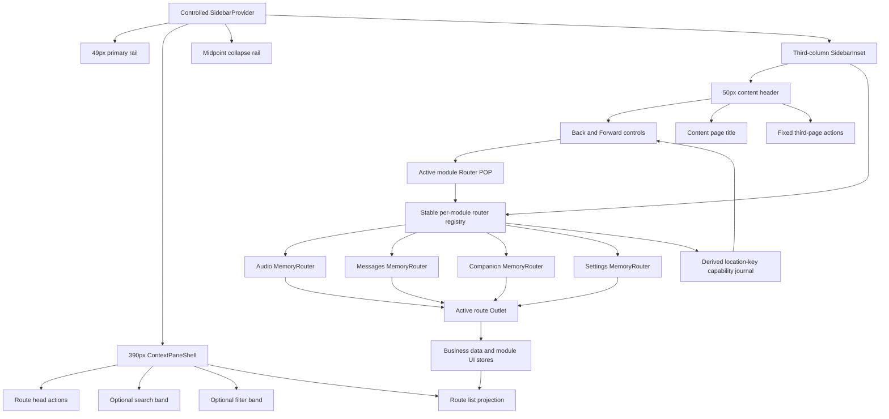

# Electron ReUI App Shell Fidelity Refactor - Plan

## Goal Capsule

| Field | Contract |
| --- | --- |
| Objective | Voice2Text 的 Electron 工作台呈现与 ReUI App Shell 4 一致的三栏层级、密度和栏间交互，同时保留现有音频、互联、消息、设置与录制行为。 |
| Means | 先把参考页的可测量几何和固定截图固化为视觉契约，再重组本地主导航与上下文栏，并用每模块长期存在的 MemoryRouter 管理第三栏页面；所有控件继续使用本地 Radix Nova primitives。（KTD1–KTD6） |
| Visual authority | ReUI App Shell 4 的公开渲染拥有布局、比例、间距、列表密度与折叠轨道的视觉权威；本地 `radix-nova` recipe 拥有组件语义、交互状态、键盘和焦点权威。 |
| Execution profile | 先建立静态几何与行为回归，再分栏实施；最后在获授权的 Electron 环境中按同尺寸截图逐项对照，不以静态测试代替视觉验收。 |
| Stop conditions | 若实现需要修改 Main、Preload、IPC、存储、worker、Flutter、录音状态机或引入 ReUI 运行时依赖，停止并重新确认范围。 |
| Tail ownership | 本计划覆盖 Electron Renderer App Shell、第二栏投影、每模块第三栏 MemoryRouter 迁移、相关测试和 Shell 文档；音频首次使用页面内容本身不属于本次重设计。 |

---

## Product Contract

### Summary

Electron Renderer 采用 ReUI App Shell 4 的三栏构图：49px 主导航栏、390px 上下文栏和占据剩余空间的第三栏。第一栏底部显示个人中心头像占位。第二栏按模块组合头部、搜索、筛选和列表。第三栏使用 50px 通栏承载内容历史的后退、前进、标题和页面操作。第二栏与第三栏之间使用固定在垂直中点的窄轨道完成展开与收起，顶部不再出现面板切换按钮。

第三栏的箭头只导航第三栏内容页面历史。它不切换第一栏模块，也不等同于当前列表的上一项或下一项。第一栏模块切换保持现有应用导航权威；每个模块保留自己的第三栏内容历史。

### Problem Frame

当前项目已经具备三栏结构，但视觉比例、控制位置和信息密度与用户指定的 ReUI 参考仍有明显差异。当前第二栏总宽较窄，搜索与标题混合，缺少稳定筛选区；第三栏顶部按钮承担面板切换，削弱内容导航层级；第一栏也缺少未来个人中心入口。

此前音频首次使用页面曾把参考设计理解为“风格启发”，结果在比例、构图和细节上出现偏差。本次不能再凭印象做相似实现。计划必须把公开参考页的实测尺寸、可见层级和状态样式变成实现与验收契约，并使用同尺寸截图证明结果。

### Key Decisions

- **ReUI 公开渲染是本次 Shell 的直接视觉基准。** (session-settled: user-directed — chosen over a loose style adaptation: the previous audio empty-page adaptation showed that conceptual similarity does not establish fidelity.) Governs R1–R12, R24–R26.
- **第三栏箭头导航第三栏内容页面历史。** (session-settled: user-directed — chosen over global section history and adjacent-list navigation: the user wants the controls scoped to the third content column.) Governs R13–R19.
- **每个第一栏模块使用一个长期存在的独立 MemoryRouter。** (session-settled: user-directed — chosen over a custom history reducer and one global router: switching modules must preserve each module's own page stack without mixing histories.) Governs R14–R19, R28–R32.
- **只有页面级目的地进入历史。** (session-settled: user-directed — chosen over recording every visible state: search, filters, scroll, pending, errors, dialogs, pane state, and automatic recording projections are UI state, not pages.) Governs R15–R19, R28–R32.
- **两栏顶部操作固定归属，不随折叠流动。** (session-settled: user-directed — chosen over mirroring or moving actions: the second and third headers may both contain independent actions, and collapsing the second column only hides its own actions.) Governs R6, R13, R20–R22.
- **第一、第二栏固定，只有第三栏响应窗口宽度。** (session-settled: user-directed — chosen over overlay and progressive context-pane shrinking: the columns must never cover one another.) Governs R1, R5, R20–R21.
- **视觉验证是本次完成条件。** (session-settled: user-approved — chosen over static-only handoff: the user authorized Electron launch, screenshots, and visual comparison to prevent another fidelity miss.) Governs R24–R26.

### Requirements

**Reference geometry and first column**

- R1. At a 1280×720 CSS viewport, the expanded shell must use a 49px first column including its divider, a 390px second column, and a third column beginning at x=440 with a one-pixel tolerance.
- R2. The first column must retain the existing Voice2Text mark and the current Audio, Companion, Messages, and Settings destinations with their labels, selection state, unread badge, tooltips, and navigation callbacks.
- R3. The first-column footer must place a 28px avatar-style personal-center placeholder at the bottom, matching the reference position without exposing invented account data or a dead navigation route.
- R4. The expanded and collapsed shell must remain shadowless and use borders, semantic surface colors, spacing, and typography for hierarchy.
- R5. The first column remains 49px and the expanded second column remains 390px at every supported window width. They must never shrink or overlap the third column; only the third column grows or shrinks with the remaining viewport. The 880px production minimum remains the supported lower bound.

**Second-column composition**

- R6. The second column must expose stable head, search, filter, and list regions, with route-owned optional content instead of one overloaded header container.
- R7. The second-column head and third-column head must both be 50px high and share one horizontal divider baseline.
- R8. The search row must follow the reference 45px band with a 28px-high input, 12px type, compact search icon, 12px horizontal inset, and no shadow.
- R9. The filter row must use compact pill tabs with a 24px selected control, 12px type, semantic counts where data exists, and no card container.
- R10. Audio must provide useful filters over existing processing truth and project search plus filter state without changing canonical selection.
- R11. Audio list rows must adapt the reference hierarchy to real Voice2Text fields: display name, created time or duration, segment count, and processing state; they must not copy mail avatars, fake participants, attachments, or unsupported actions.
- R12. Messages must render both search and filter regions, but every filter and count must be derived from existing Activity data and useful to a real decision. Companion and Settings must omit search or filter bands when they have no decision value rather than rendering empty reference-shaped rows.

**Third-column content history and header**

- R13. The third-column header must place 28px ghost back and forward buttons at the left, followed by a divider, the current content-page title, and third-page-owned actions aligned right. Second-column head actions and third-column page actions are independent, remain in their assigned headers, and are never moved or mirrored because the second column opens or closes.
- R14. Audio, Messages, Companion, and Settings must each own one `createMemoryRouter` instance created outside React render and retained for the Electron Renderer session. Back and Forward operate only on the active module's router and never switch the first column.
- R15. Only explicit navigation to a stable, deterministically reopenable third-column page may `PUSH`. Reopening the current location is a no-op; opening a new page after Back uses normal Router branching and discards the abandoned forward branch.
- R16. Back and Forward use Router `POP` navigation and never create duplicate entries. A small router-subscribed location-key journal may derive button availability, but it must not render pages or become a second route authority.
- R17. Loading, refreshing, partial or paginated snapshots, and request errors must preserve the current location. Only the latest complete successful snapshot may confirm that a routed entity is missing; the router then `REPLACE`s to the module fallback without fabricating a history entry.
- R18. Switching first-column modules must not destroy or recreate their routers. Returning to a module restores its prior third-column route stack; the top-level hash and persisted primary-section navigation remain separate and unchanged by third-column routing.
- R19. Index/fallback, Audio detail, Activity detail, explicit Companion pages/device detail, explicitly navigated Settings category, and explicit capture detail are page routes. Query, filters, scroll, playback position, expanded rows, pending/error presentation, dialogs, hover/focus, automatic recording state, and pane expansion are projections owned outside route history.
- R28. Router-native `PUSH`, `REPLACE`, and `POP` are the only third-column history transitions. Feature effects and controller observers must not infer or append navigation from passive state changes.
- R29. The active module MemoryRouter is the single authority for third-column page identity, title, route actions, and route parameters. Existing feature controllers remain authoritative for business data and non-route UI state; duplicated controller-level current-page state must be removed or reduced to a router-derived projection.
- R30. Explicit capture detail uses short nested paths: `/audio/:audioId/capture/:sessionId` and `/messages/:activityId/capture/:sessionId`. Normal close uses history Back; without a valid owner location it `REPLACE`s to the parent, or to the module index if the owner is missing. Paths carry stable IDs only; `location.state` may carry small non-critical navigation metadata such as an owner location key or focus target, never business objects or required recovery data.
- R31. Search, filters, scroll, playback, expanded state, and similar projections live in long-lived module stores/controllers so they survive route rendering and module switches. Route replay may update canonical selection without clearing those projections or forcing a filter-hidden row into view.
- R32. The latest valid operation wins. Navigation and data work use an AbortSignal where possible and a monotonic generation/revision fence otherwise; late work from an older page, module, snapshot, or reconciliation pass cannot commit location, selection, focus, or content after newer authoritative work.
- R33. The implementation must pin a project-local immutable 1280×720 ReUI reference image plus capture metadata and SHA-256. The live URL is supplemental; visual acceptance compares against the pinned baseline and updates it only through a deliberate documented process.

**Pane switching, behavior, and accessibility**

- R20. The second/third divider must own a fixed 28×48px control centered vertically, with expanded/collapsed labels, keyboard focus, disabled gating, and the existing pane preference as its state authority.
- R21. The midpoint rail must replace every top-positioned context-pane trigger; closing it must preserve the current focus-restoration contract and reopening it must not reset search, filter, selection, or content history.
- R22. Modal blocking, profile blocking, recording continuity, playback closure, exact activity-read behavior, companion selection, settings scrolling, offline state, import, record, retry, and capture-detail behavior must remain unchanged unless an R-ID above explicitly changes presentation.
- R23. Local shadcn/Radix primitives, Lucide icons, semantic tokens, thin focus indicators, reduced-motion behavior, native roles, labels, and controlled state remain authoritative; no ReUI dependency or full preset stylesheet may be added.

**Fidelity evidence and existing work**

- R24. Visual acceptance must compare the pinned ReUI reference and the implemented Electron shell at the same CSS viewport and stable light-mode state, using the live page only as supplemental evidence, then correct measurable deviations in geometry, type scale, spacing, borders, row density, and control placement.
- R25. Geometry assertions must lock the reference-derived column widths, 50px headers, 28px header controls, 28×48px midpoint rail, search-band dimensions, divider alignment, shadowless surfaces, and collapsed-pane placement.
- R26. Canonical Electron goldens must be updated only after the side-by-side result is accepted; semantic and geometry checks must still run on hosts that cannot own canonical pixels.
- R27. The current uncommitted Audio first-use fidelity work must be preserved as baseline input and must not be reverted, redesigned, or absorbed into this Shell refactor except where shared shell geometry necessarily changes its available viewport.

### Reference Fidelity Contract

The measurements below come from the public ReUI App Shell 4 render at a 1280×720 CSS viewport. The implementation pins that capture and its environment metadata under `tests/visual/references`; these are implementation targets, not approximate inspiration.

| Surface | Reference fact | Voice2Text contract |
| --- | --- | --- |
| First column | 49px including the right divider | Match at expanded and collapsed states; retain 48px content width. |
| Second column | 390px content box from x=49 to its right edge at x=439, followed by a 1px divider | Keep this width fixed at every supported window width. It never shrinks or overlays the third column; only the third column absorbs viewport changes. |
| Third column | Starts at x=440 and fills the remainder | Match with a single main landmark. |
| Head bars | 50px high in columns two and three | Use one aligned border baseline. |
| Search band | 45px high with 12px horizontal inset | Keep the search input at 28px high and 12px type. |
| Filter control | 24px selected pill with 12px medium text | Use real route filters and semantic counts only. |
| Midpoint rail | 28×48px at vertical center on the divider | Keep a thin visible affordance and full keyboard access. |
| Header navigation | 28×28px back and forward buttons | Disable unavailable directions and preserve visible thin focus. |
| Profile placeholder | 28×28px at the bottom of the first rail | Use Avatar fallback content without fabricated identity. |
| Selected list row | Accent surface, 12px padding, 14px semibold title, 12px supporting text, faint divider | Adapt row height to real Voice2Text metadata; do not reproduce mail-only content. |

### Key Flows

- F1. **Select and navigate third-column content**
  - **Trigger:** The user selects an Audio, Activity item, Companion page, or Settings category.
  - **Steps:** The active module router pushes the page route; its loader/controller resolves the stable IDs; the header title and action area update; the matching second-column row remains synchronized.
  - **Outcome:** The content page is available to Back and Forward without changing the primary module.
  - **Covered by:** R13–R19, R22.
- F2. **Branch after going back**
  - **Trigger:** The user goes back, then opens a different third-column destination.
  - **Steps:** The new destination replaces the forward branch; Back remains enabled when an earlier valid destination exists; Forward becomes disabled.
  - **Outcome:** The history behaves like page navigation and never replays abandoned destinations.
  - **Covered by:** R14–R17.
- F3. **Collapse and restore the second column**
  - **Trigger:** The user activates the midpoint rail.
  - **Steps:** The existing pane preference changes; the second column leaves or re-enters layout; the rail follows the new divider; focus restoration and content history stay valid.
  - **Outcome:** No top toggle remains and no second copy of pane state appears.
  - **Covered by:** R20–R23.
- F4. **Validate visible fidelity**
  - **Trigger:** The implementation reaches a stable Renderer state.
  - **Steps:** The reference and Electron render at the same CSS viewport; geometry and computed styles are checked; screenshots are inspected side by side; only accepted final images replace goldens.
  - **Outcome:** Fidelity is proven by evidence instead of asserted from code structure.
  - **Covered by:** R1–R12, R24–R26.
- F5. **Switch modules and return**
  - **Trigger:** The user leaves a module after navigating several third-column pages, then returns from the first rail.
  - **Steps:** The Shell changes only the active module; both modules' stable router instances remain alive; module-local query, filter, and scroll state remain outside route history.
  - **Outcome:** The returning module shows the same page and Back/Forward stack it had before the switch.
  - **Covered by:** R14, R18, R29, R31–R32.

### Acceptance Examples

- AE1. **Covers R1, R4, R7, R20, R25.** Given a 1280×720 populated Audio workspace with the second column open, when the shell stabilizes, then the first divider is at x=49, the second divider is at x=440, both head bars are 50px high, the midpoint rail is centered on the second divider, and no in-flow surface has a shadow.
- AE2. **Covers R2, R3, R23.** Given the primary rail, when navigating with pointer and keyboard, then every current destination preserves its callback, label, tooltip, selected state, and unread badge while a bottom avatar placeholder exposes no fabricated account page.
- AE3. **Covers R6–R12.** Given a populated Audio library, when the user searches and changes processing filters, then the second column retains distinct head, search, filter, and list regions; list rows show only real audio metadata; filtering does not clear or replace the selected third-column page.
- AE4. **Covers R13–R19.** Given content pages A, B, and C in one primary section, when the user opens them in order, goes Back to B, and opens D, then Router history becomes A, B, D; Forward is disabled; the first-column section never changes. Switching away and back restores D and that module's independent stack.
- AE5. **Covers R16, R17, R22, R32.** Given a routed Audio or Activity disappears, loading, partial, stale, and failed snapshots preserve the route. Only the latest complete successful snapshot may `REPLACE` it with the module fallback; late older work cannot redirect, restore focus, or invoke unrelated read/playback callbacks.
- AE6. **Covers R20, R21.** Given the second column is open, when the user collapses and reopens it from the midpoint rail, then the rail follows the divider, focus remains deterministic, search/filter/selection/history state remains intact, and there is no top pane trigger.
- AE7. **Covers R5, R21–R23, R27.** Given the 880×620 minimum and any supported wider fixture, when each representative module renders, then the first rail remains 49px, the expanded second column remains 390px, neither column overlaps another, and only the third column changes width. Third-column actions remain reachable and the current Audio first-use composition is not redesigned.
- AE8. **Covers R24–R26.** Given the final code state and authorized visual validation, when reference and implementation screenshots are compared, then every Reference Fidelity Contract row has accepted evidence and the canonical goldens are updated only after mismatches are corrected.
- AE9. **Covers R15–R17, R28–R29, R32.** Given navigation A starts and then newer navigation B starts, when A completes late, then only B may commit. A section switch keeps both routers but prevents late inactive-module work from mutating the active module.
- AE10. **Covers R17, R19, R28, R30.** Given Settings scroll-spy changes anchors or a snapshot changes loading, errors, recording status, or other UI projections, then no passive state change pushes history. Explicit capture detail uses its short nested ID route, Back returns to the exact prior location, and an invalid owner falls back with `REPLACE`.
- AE11. **Covers R16, R21, R31.** Given the active filter hides destination B, when Back successfully applies B and the pane is later reopened, then canonical selection is B, query and filter are unchanged, the selected row reappears when the projection permits it, and only one midpoint rail remains actionable.

### Success Criteria

- A reviewer can identify the ReUI-derived geometry directly from the running Electron shell without relying on explanatory prose.
- Back and Forward provide predictable third-column page history across all supported destinations and never act as top-level module navigation.
- Existing Renderer behavior tests remain valid apart from assertions deliberately changed by this plan.
- The final side-by-side evidence contains no unresolved deviation in the reference contract and no visual regression in the representative Audio, Messages, Companion, Settings, collapsed-pane, 880px-minimum, and narrow third-column states.

### Scope Boundaries

#### Deferred to Follow-Up Work

- A real personal-center route, user profile storage, authentication, account menu, billing, or cloud identity.
- New sort modes that require additional persisted metadata or Main/IPC contracts.
- Drag-resizing the second column; this plan implements the reference fixed-width composition and collapse behavior only.

#### Out of Scope

- Reworking Audio first-use content, its decorative preview, copy, action hierarchy, or microphone behavior.
- Changing Main, Preload, shared contracts, storage, workers, frozen resources, Flutter, Goo, packaging, or release evidence.
- Importing ReUI source code, adding a ReUI dependency, replacing local primitives wholesale, or importing a full Nova/ReUI stylesheet.
- Browser/Hash routing for third-column pages, shareable deep-link URLs, cross-restart restoration of full page stacks, or one global history shared by all first-column modules.
- Adding hidden live regions, global focus state machines, custom screen-reader navigation protocols, or unrelated accessibility redesign.

### Sources and Research

- [ReUI App Shell 4](https://reui.io/preview/base/app-shell-4): visual composition, measured geometry, header controls, filter density, list hierarchy, profile placement, and midpoint collapse rail.
- [React Router `createMemoryRouter`](https://reactrouter.com/api/data-routers/createMemoryRouter): stable in-memory router creation outside the React tree.
- [React Router nested routes](https://reactrouter.com/start/declarative/routing): nested page identity and `Outlet` composition.
- [React Router `Location`](https://api.reactrouter.com/v7/interfaces/react-router.Location.html) and [`useNavigate`](https://reactrouter.com/api/hooks/useNavigate): short paths, optional navigation state, `replace`, and delta navigation.
- `apps/desktop-electron/README.md`: local Radix Nova component authority, shadowless exceptions, thin focus treatment, visual-baseline process, and Electron boundary rules.
- `apps/desktop-electron/src/renderer/App.tsx`: current three-column composition, content presentation, modal navigation gating, capture detail handoff, and route-owned actions.
- `apps/desktop-electron/src/renderer/components/ui/sidebar.tsx`: controlled SidebarProvider, SidebarRail, SidebarInset, menu geometry, and shared surface ownership.
- `apps/desktop-electron/src/renderer/features/shell/context-pane-shell.tsx` and `apps/desktop-electron/src/renderer/features/shell/use-context-pane-shell.ts`: current pane DOM, persistence, Escape handling, and focus behavior.
- `docs/plans/2026-08-19-1154-refactor-electron-sidebar-09-visual-fidelity-plan.md`: established shell geometry, flat-row, surface, visual-environment, and business-preservation constraints.
- `docs/plans/2026-08-25-1021-fix-desktop-input-workspaces-plan.md`: derived third-pane presentation, message selection/search, companion selection, and modal navigation authority.
- `docs/plans/2026-09-02-1008-fix-audio-first-use-fidelity-plan.md`: current first-use fidelity work that this plan must preserve rather than re-scope.
- `docs/solutions/architecture-patterns/desktop-first-workstation-boundaries.md`: Electron remains the platform composition root and does not move domain boundaries during a Renderer-only refactor.

---

## Planning Contract

### Key Technical Decisions

- KTD1. **Bind implementation to a measured fidelity contract.** (session-settled: user-directed — chosen over a loose style adaptation: the shell must reproduce the reference's visible composition before route-specific adaptation.) R1–R12 and R24–R26 own the visual rules; unit work may adapt content semantics but may not substitute different geometry without evidence.
- KTD2. **Keep ReUI visual authority and Radix Nova interaction authority separate.** ReUI governs composition and density; local primitives govern roles, controlled state, focus, keyboard behavior, reduced motion, tokens, and the three documented Electron visual exceptions.
- KTD3. **Make shell geometry shared and slot-driven.** One set of shell variables and shared header/search/filter/list slots owns repeated dimensions; feature consumers supply route content and contextual density without duplicating surface, radius, shadow, or focus styling.
- KTD4. **Use one long-lived MemoryRouter per primary module.** (session-settled: user-directed — chosen over a custom local reducer and one global router.) Audio, Messages, Companion, and Settings each create a router once outside React render. The Shell switches the active provider without recreating any router, so each module preserves its own session history and cannot navigate another module.
- KTD5. **Model only stable pages as nested routes and keep parameters layered.** Page identity uses short paths with opaque IDs; capture detail nests under its Audio or Activity owner. Query/filter/scroll/playback state remains in module stores, while `location.state` carries only small optional navigation metadata. Router `PUSH`, `REPLACE`, and `POP` replace custom transition outcomes.
- KTD6. **Reuse one midpoint Sidebar rail state path.** The controlled SidebarProvider and `useContextPaneShell` remain the pane authority; the shared rail projects that state at the divider and replaces all `ContextPaneTrigger` placements.
- KTD7. **Keep route filters local and selection canonical.** Audio and Activity derive visible lists from query and filter state; filtering never rewrites the selected content page, and clearing the projection restores the same selection when its entity still exists.
- KTD8. **Keep header actions independently owned and stationary.** Collection/context actions belong to the second-column head; current-page actions belong to the third-column head. Both headers may contain actions at the same time, and pane visibility never moves, mirrors, or duplicates an action between them.
- KTD9. **Preserve current working-tree first-use changes.** The implementer must start from the current tree, inspect overlapping Audio changes, and edit only shell integration points required by R27; no reset, replacement, or cleanup of those user-owned changes is allowed.
- KTD10. **Require visual proof before declaring fidelity complete.** (session-settled: user-approved — chosen over static-only handoff: the user authorized UI launch, screenshots, and side-by-side comparison.) Geometry assertions narrow iteration; final screenshots and accepted comparison close the visual contract.
- KTD11. **Separate route identity from business and UI state.** MemoryRouter owns the active third-column page, parameters, title, and page actions. Existing controllers own entity data, operations, query/filter/scroll/playback projections, and selection synchronized from the route; no controller or Shell reducer may maintain a competing page identity. `useContextPaneShell` remains limited to pane preference and focus behavior.
- KTD12. **Pin the external visual source.** The repository stores the accepted 1280×720 ReUI capture separately from Voice2Text goldens, with source URL, capture date, browser/OS, CSS viewport, zoom, font, DPR, theme, checksum, and an explicit update procedure. The live page supplements but cannot silently replace that baseline.
- KTD13. **Make the latest valid operation authoritative.** Every route/data/reconciliation generation aborts older work where possible and checks a monotonic token before committing. A newer navigation or authoritative missing-entity decision wins even when older asynchronous work completes later.

### High-Level Technical Design

```mermaid
stateDiagram-v2
  [*] --> Index
  Index --> Detail: explicit PUSH
  Detail --> NestedDetail: explicit capture PUSH
  NestedDetail --> Detail: POP Back
  Detail --> Detail: query filter scroll or pending projection
  Detail --> Fallback: latest complete snapshot confirms missing; REPLACE
  Detail --> Detail: loading partial error or stale completion
  Detail --> OtherDetail: newer valid navigation wins; PUSH
  OtherDetail --> Detail: POP Back
```

### Destination Ownership Matrix

| Primary section | Page routes | Module state synchronized from route | Not a route |
| --- | --- | --- | --- |
| Audio | `/audio`, `/audio/:audioId`, `/audio/:audioId/capture/:sessionId` | Audio selection, data, playback, query, filters, scroll | Loading/refresh, errors, preflight feedback, automatic recording projection |
| Companion | `/companion`, explicit pairing/history pages, `/companion/device/:deviceId` | Companion controller, peer snapshot, operation state | Snapshot loading, inline pending action, retry feedback |
| Messages | `/messages`, `/messages/:activityId`, `/messages/:activityId/capture/:sessionId` | Exact-read selection, query/filter/scroll, capture data | Automatic first-item fallback, mark-all pending, operation error Dialog |
| Settings | `/settings`, `/settings/:categoryId` from explicit activation | Settings data and scroll projection | Scroll-spy updates, intermediate position, form focus, validation message |

### Sequencing

1. Establish shared geometry, midpoint rail semantics, and reference hooks before feature consumers move.
2. Refactor first-column and second-column composition while preserving current callbacks and controller ownership.
3. Add React Router, create the stable per-module router registry, and prove section isolation before migrating feature pages.
4. Move each third-column page to nested routes, keep UI projections in module stores, then update shell-wide and visual evidence on one stable code state.

### System-Wide Impact

- **End users:** The primary information architecture stays recognizable, but major actions and pane switching move. History creates a new navigation expectation that must remain deterministic across modules.
- **Renderer developers:** Shell geometry and region ownership become shared contracts. Feature code supplies content and behavior but cannot restyle common surfaces independently.
- **Accessibility:** The midpoint rail and history buttons add keyboard targets. Existing Radix behavior and application-owned labels must remain the source of semantics.
- **Data and process boundaries:** No persisted domain data or IPC changes. Pane preference remains the only Shell persistence touched; MemoryRouter stacks and module UI projections are session-local Renderer state. This deliberately expands the Renderer scope from Shell styling into navigation architecture, but not into Main or browser URL routing.

### Risks and Mitigations

| Risk | Mitigation |
| --- | --- |
| The implementation again drifts into a merely similar design | Lock the Reference Fidelity Contract in geometry and visual tests before final styling; require accepted side-by-side evidence per KTD10. |
| A fixed 440px shell prefix leaves less space for third-column content at the 880px minimum | Keep the 49px and 390px contracts unchanged, make only third-column layouts responsive, and test their wrapping, truncation, scrolling, and action reachability at 880×620. |
| A second-column action is unavailable while that column is collapsed | Treat this as the intentional consequence of its fixed ownership; do not move or duplicate it into the third header. Keep only genuinely page-owned actions in the third header and test both pane states. |
| A router is recreated and loses a module's history | Create all four routers once outside React render, retain them in a stable registry, and test repeated module switches. |
| One global router mixes histories across modules | Keep independent router instances and make the first-column switch select a provider, not push a third-column route. |
| Router location and a controller both claim the current page | Make route identity authoritative and remove or derive legacy selected-page state per KTD11. |
| Back/Forward availability requires non-public history internals | Subscribe to public router location/action state and maintain only a location-key capability journal; it may enable buttons but never render or redirect. |
| A routed entity disappears during an incomplete or failed load | Preserve the route until the latest complete successful snapshot confirms absence, then `REPLACE` to fallback per R17. |
| Late loaders or reconciliation overwrite newer navigation | Abort older work and enforce monotonic generations at every commit boundary per R32 and KTD13. |
| Long URLs duplicate the previous page's state | Put stable IDs in short nested paths, module UI state in stores/controllers, and only small optional metadata in `location.state`. |
| Route navigation repeats read, playback, or modal side effects | Test exact callback counts at route and controller boundaries; loaders synchronize data without replaying unrelated user actions. |
| Passive controller changes pollute history | Allow page changes only through explicit Router navigation and use projections for all micro-state per R19 and R28. |
| Shared primitive edits regress overlays or other sidebars | Limit primitive changes to the scoped rail/header contract and test load-bearing semantics instead of full class strings. |
| Current uncommitted Audio first-use work is overwritten | Inspect and preserve the dirty diff before every overlapping edit; keep R27 and KTD9 visible in Audio units. |

### Documentation and Operational Notes

- Update the Electron README so ReUI App Shell 4 is named as the Shell visual-composition authority while `radix-nova` remains the component and typography authority.
- Update the golden README with the new reference viewport, scenario inventory, and side-by-side acceptance rule.
- Do not invoke release validation, packaging, frozen-resource acquisition, or repository-wide gates for this Renderer-only change.

---

## Implementation Units

### U1. Establish the shared ReUI shell geometry and midpoint rail

- **Goal:** Make the shared Shell primitives own the measured column, header, divider, control, and collapsed-state geometry.
- **Requirements:** R1, R4–R8, R20, R21, R23–R25; AE1, AE6, AE7; KTD1–KTD3, KTD6.
- **Dependencies:** None.
- **Files:**
  - `apps/desktop-electron/src/renderer/components/ui/sidebar.tsx`
  - `apps/desktop-electron/src/renderer/features/shell/context-pane-shell.tsx`
  - `apps/desktop-electron/src/renderer/features/shell/context-pane-contract.ts`
  - `apps/desktop-electron/src/renderer/App.tsx`
  - `apps/desktop-electron/tests/unit/renderer/ui_primitives_test.tsx`
  - `apps/desktop-electron/tests/unit/renderer/shell_test.tsx`
  - `apps/desktop-electron/tests/e2e/sidebar_navigation_test.ts`
- **Approach:**
  1. Centralize the 49px, 390px, 440px, and 50px shell values in the shared composition rather than route consumers.
  2. Refine the existing Sidebar rail into the midpoint 28×48px presentation and wire it to the controlled pane callback.
  3. Remove the top-positioned `ContextPaneTrigger` paths only after the rail proves open, close, blocked, Escape, and focus behavior.
  4. Keep the first rail and expanded context pane fixed at 49px and 390px with no overlap; make only the third-column inset responsive. Preserve the current structurally unavailable Audio pane behavior.
- **Execution note:** Add characterization coverage for current preference writes, blocked navigation, Escape, and focus restoration before moving the trigger.
- **Patterns to follow:** Controlled `SidebarProvider`; `useContextPaneShell`; local Nova-aligned `Button` and `SidebarRail`; existing sidebar-navigation semantics.
- **Test scenarios:**
  1. At an expanded normal desktop width, the first and second dividers resolve to the R1 positions and the head bars share one 50px baseline.
  2. Activating the rail writes the current section's pane preference once, restores focus deterministically after close, and leaves other section preferences unchanged.
  3. Modal or profile blocking prevents rail navigation and does not replay it after the blocker closes.
  4. Escape closes the pane once without also navigating third-column history.
  5. At the supported 880px minimum, both fixed columns keep their exact widths, the rail remains inside the viewport, and the third-column content adapts without overlap.
  6. A structurally hidden true-empty Audio pane renders no rail and does not write a closed preference.
- **Verification:** Shared semantic and geometry assertions prove one pane state authority, one midpoint rail, no top trigger, and responsive containment.

### U2. Rebuild the primary rail and profile placeholder

- **Goal:** Match the ReUI first-column hierarchy while preserving the current destination and unread behavior.
- **Requirements:** R2–R5, R23, R25; AE2, AE7; KTD1–KTD3.
- **Dependencies:** U1.
- **Files:**
  - `apps/desktop-electron/src/renderer/components/app-sidebar.tsx`
  - `apps/desktop-electron/src/renderer/components/nav-main.tsx`
  - `apps/desktop-electron/tests/e2e/sidebar_navigation_test.ts`
  - `apps/desktop-electron/tests/unit/renderer/shell_test.tsx`
- **Approach:**
  1. Align mark, icon buttons, active state, navigation spacing, header height, footer grouping, and tooltips to the reference rail.
  2. Add a bottom Avatar fallback slot with a concise personal-center placeholder label and no invented profile route or account menu.
  3. Keep Messages and Settings placement, unread count, `aria-current`, and navigation callbacks unchanged.
- **Patterns to follow:** Existing `Avatar`, `SidebarMenuButton`, Tooltip, Lucide icon mappings, and the current `NavMain` ordering contract.
- **Test scenarios:**
  1. Navigation order, accessible names, tooltips, selected states, and Messages unread count match the existing contract.
  2. The avatar placeholder is visually present at the rail bottom, contains no external image or fabricated user fields, and does not navigate.
  3. Keyboard focus remains thin and visible on every actionable rail item.
- **Verification:** Renderer tests and computed geometry prove the 49px rail, correct destination behavior, and bottom placeholder without a fake product capability.

### U3. Make ContextPaneShell a four-region composition

- **Goal:** Give route features stable head, search, filter, and list ownership without duplicating shared surface styling.
- **Requirements:** R6–R9, R12, R20–R23, R25; AE3, AE6; KTD2, KTD3, KTD6–KTD8.
- **Dependencies:** U1.
- **Files:**
  - `apps/desktop-electron/src/renderer/features/shell/context-pane-shell.tsx`
  - `apps/desktop-electron/src/renderer/features/shell/context-pane-contract.ts`
  - `apps/desktop-electron/src/renderer/App.tsx`
  - `apps/desktop-electron/tests/unit/renderer/shell_test.tsx`
- **Approach:**
  1. Replace the current combined header/footer shape with explicit optional region slots and one scrolling list region.
  2. Keep 50px head, 45px search band, compact filter band, aligned dividers, and 390px normal width in shared ownership.
  3. Keep second-column actions backed by their existing controllers and fixed in the second head. Third-page actions remain independently owned by the third header; pane visibility never transfers actions between them.
  4. Omit absent regions entirely so Companion and Settings do not gain meaningless controls.
- **Patterns to follow:** Existing fixed-header and scrolling-content hooks, local SidebarHeader/Content primitives, and feature-owned controller composition.
- **Test scenarios:**
  1. A full Audio composition renders head, search, filter, then scrolling list in that DOM and visual order.
  2. A Settings composition renders head and list without empty search or filter bands.
  3. Collapsing and reopening preserves region-local search and filter state.
  4. Collapsing the second column hides its own actions without creating copies in the third header; existing third-page actions remain unchanged and invoke only their own controllers.
  5. Fixed regions do not scroll with a long list and the list remains the only second-column scroll owner.
- **Verification:** Component tests prove optional slot composition, action ownership, region order, and scroll boundaries.

### U4. Adapt Audio search, filters, actions, and list rows

- **Goal:** Make Audio the full four-region reference implementation using only existing audio truth.
- **Requirements:** R6–R11, R21–R23, R27; AE3, AE7; KTD7–KTD9.
- **Dependencies:** U3.
- **Files:**
  - `apps/desktop-electron/src/renderer/features/audios/audio-route-feature.tsx`
  - `apps/desktop-electron/src/renderer/App.tsx`
  - `apps/desktop-electron/tests/unit/renderer/audio_route_test.tsx`
  - `apps/desktop-electron/tests/unit/renderer/shell_test.tsx`
- **Approach:**
  1. Add route-local processing filters with counts derived from the current AudioSummary and task projection.
  2. Combine query and filter into one visible-list projection while leaving workspace selection canonical.
  3. Move pane-owned actions into the new head and retain shared pending, disabled, error, import, record, and refresh behavior.
  4. Recompose rows with real created time, duration, segment count, and processing state using the reference type hierarchy and flat divider treatment.
  5. Avoid changes inside the current first-use composition except those required to consume the new Shell viewport.
- **Execution note:** Preserve the current dirty first-use diff and existing behavior assertions before changing shared Audio markup.
- **Patterns to follow:** Existing `filteredAudios`, `processingStateForRow`, flat-row hooks, Item primitive, import controller, and recording preflight state.
- **Test scenarios:**
  1. Each processing category includes the correct AudioSummary/task combinations and displays a truthful count.
  2. Query plus filter narrows the list without clearing the selected workspace or causing playback close.
  3. Clearing query and filter restores the full list and the original selection when it still exists.
  4. Import cancel, import failure, refresh failure, recording pending, processing unavailable, and retry behavior retain existing callbacks and feedback.
  5. A row displays only real audio metadata and never renders mail-specific or invented content.
  6. Loading, list error, true-empty, search-empty, unselected, selected, processing, and active-capture states retain their current authority.
- **Verification:** Focused Audio and Shell tests prove filtering, fixed action ownership, list semantics, selection preservation, and first-use isolation.

### U5. Adapt Messages, Companion, and Settings to the shared second column

- **Goal:** Apply the same Shell grammar without forcing Audio-specific controls into other routes.
- **Requirements:** R6–R9, R12, R21–R23; AE2, AE3, AE7; KTD3, KTD7, KTD8.
- **Dependencies:** U3.
- **Files:**
  - `apps/desktop-electron/src/renderer/features/activity/activity-center.tsx`
  - `apps/desktop-electron/src/renderer/features/companion/companion-feature.tsx`
  - `apps/desktop-electron/src/renderer/App.tsx`
  - `apps/desktop-electron/tests/unit/renderer/activity_center_test.tsx`
  - `apps/desktop-electron/tests/unit/renderer/companion_route_test.tsx`
  - `apps/desktop-electron/tests/e2e/sidebar_navigation_test.ts`
- **Approach:**
  1. Move Messages search and mark-all into the shared regions and provide a visible filter region containing only useful filters and counts supported by current Activity fields.
  2. Keep exact-read, mark-all, search-selection, error Dialog, and unread semantics unchanged.
  3. Render Companion and Settings with only meaningful regions, retaining explicit device selection, pairing footer behavior, settings anchors, and scroll synchronization.
  4. Apply the reference flat-row hierarchy without mail-demo metadata or new product capabilities.
- **Patterns to follow:** Current Activity local projection, explicit CompanionView reconciliation, SettingsContextPane anchors, and derived third-pane presentation.
- **Test scenarios:**
  1. Message search and filters never mark an item read or replace the selected detail; mark-all still targets the complete set.
  2. New or removed Activity items preserve or reconcile selection according to the existing rules.
  3. Companion with zero, one, or multiple peers retains explicit selection, pairing, history, pending, and removed-peer behavior.
  4. Settings category navigation still scrolls and updates the active anchor without empty search/filter bands.
  5. Every list preserves labels, selected state, keyboard activation, empty state, error state, and divider hierarchy.
- **Verification:** Route-focused unit and navigation tests prove shared layout adoption without business-semantic changes.

### U6. Establish persistent per-module MemoryRouter routing and the third-column top bar

- **Goal:** Make four stable MemoryRouter instances the third-column page authority and provide a 50px header with truthful Back/Forward availability.
- **Requirements:** R13–R19, R21–R23, R28–R32; F1, F2, F5; AE4–AE7, AE9–AE11; KTD4, KTD5, KTD8, KTD11, KTD13.
- **Dependencies:** U3–U5.
- **Files:**
  - `apps/desktop-electron/package.json`
  - `apps/desktop-electron/bun.lock`
  - `apps/desktop-electron/src/renderer/features/shell/section-router-registry.tsx`
  - `apps/desktop-electron/src/renderer/features/shell/content-routes.tsx`
  - `apps/desktop-electron/src/renderer/App.tsx`
  - `apps/desktop-electron/tests/unit/renderer/content_router_test.tsx`
  - `apps/desktop-electron/tests/unit/renderer/shell_test.tsx`
- **Approach:**
  1. Add the current compatible `react-router` dependency and create Audio, Messages, Companion, and Settings data routers once outside the React tree. Retain them in a stable registry for the Renderer session.
  2. Define module index routes, page routes, nested capture routes, loaders/error projections, and `Outlet` layouts. First-column switching selects the active router provider and never calls third-column `navigate`.
  3. Make route location the sole page identity. Keep business data and UI micro-state in feature controllers/stores; remove or derive any legacy current-page field that would compete with the router.
  4. Subscribe to each router's public location key and navigation action to maintain a minimal capability journal for `canGoBack`/`canGoForward`. The journal controls disabled presentation only; `navigate(-1)` and `navigate(1)` remain Router operations.
  5. Add a monotonic operation generation and AbortSignal boundary. Only the latest valid navigation/data/reconciliation work may commit location-derived selection, content, or focus.
  6. Replace the third header with a stable 50px ReUI composition on every route; derive title and actions from route handles/matches and disable unavailable directions.
- **Execution note:** Prove router lifetime, section isolation, branch behavior, and capability-journal accuracy before feature pages migrate. Do not use unstable or private Router history fields.
- **Patterns to follow:** React Router's stable `createMemoryRouter`/`RouterProvider` pattern, nested routes and `Outlet`, existing Shell composition root; keep `useContextPaneShell` limited to pane preference, Escape, and focus.
- **Test scenarios:**
  1. Push A, B, C; Back to B; push D; assert A, B, D and a disabled Forward button.
  2. Repeated navigation to the same destination does not grow the stack or repeat callbacks.
  3. Switching primary sections preserves independent router instances, page stacks, and forward branches; returning adds no entry.
  4. Loading, partial data, and request failure preserve location and direction availability; only the latest complete successful snapshot may `REPLACE` a missing entity with fallback.
  5. Navigation A followed by B commits only B; a late A completion cannot navigate, select, steal focus, or change active content. A module switch similarly fences inactive work without destroying its router.
  6. The location-key journal follows PUSH/REPLACE/POP and branch truncation, survives module switches, and never supplies page content.
  7. The stable header remains 50px high on initial, empty, readiness, Settings, and detail pages; pending, first-entry, and tail states expose correct button availability and labels.
- **Verification:** Router and Shell tests prove stable router lifetime, native navigation semantics, capability projection, latest-operation fencing, section isolation, and stable header semantics.

### U8. Migrate module pages to routes and preserve module UI state

- **Goal:** Move Audio, Companion, Messages, Settings, and capture detail to the stable routers while preserving business controllers and non-route UI state.
- **Requirements:** R14–R19, R22–R23, R28–R32; F1, F2, F5; AE4, AE5, AE9–AE11; KTD4, KTD5, KTD7, KTD11, KTD13.
- **Dependencies:** U6.
- **Files:**
  - `apps/desktop-electron/src/renderer/App.tsx`
  - `apps/desktop-electron/src/renderer/features/audios/audio-route-feature.tsx`
  - `apps/desktop-electron/src/renderer/features/companion/companion-feature.tsx`
  - `apps/desktop-electron/src/renderer/features/activity/activity-center.tsx`
  - `apps/desktop-electron/tests/unit/renderer/audio_route_test.tsx`
  - `apps/desktop-electron/tests/unit/renderer/activity_center_test.tsx`
  - `apps/desktop-electron/tests/unit/renderer/companion_route_test.tsx`
  - `apps/desktop-electron/tests/unit/renderer/shell_test.tsx`
  - `apps/desktop-electron/tests/e2e/sidebar_navigation_test.ts`
- **Approach:**
  1. Convert explicit list/page selections to route navigation and read stable IDs from route parameters. Controllers fetch and operate on those IDs but do not keep a competing page stack.
  2. Preserve Audio's async fencing, playback-close count, and route errors. Query/filter/scroll/playback/expanded state moves to or remains in a long-lived module controller/store that survives route elements and module switches.
  3. Keep Activity default selection, Companion snapshot reconciliation, removed-item handling, and automatic active-recording detail as projections or index fallback, never implicit `PUSH` operations.
  4. Push Settings only from explicit category activation. Scroll-spy and replay scrolling update the UI projection without navigating intermediate anchors.
  5. Implement `/audio/:audioId/capture/:sessionId` and `/messages/:activityId/capture/:sessionId`. Normal close uses Back to restore the exact prior route and parameters; if the owner key is invalid, `REPLACE` to parent, then module index when the owner no longer exists.
  6. Keep path parameters to stable IDs. Store no large or required business data in `location.state`; preserve search/filter/scroll and other page projections in module state when replay selects a filter-hidden owner.
  7. Gate entity-missing redirects on the latest complete successful snapshot and fence every late request/reconciliation commit by generation.
- **Execution note:** Characterize each controller's current selection, operation, missing-entity, and passive-reconciliation behavior before migrating it. Route changes must be explicit; do not push from generic controller-observer effects.
- **Patterns to follow:** Existing `selectAudio`, CompanionView controller, exact-read Activity selection, Settings scroll synchronization, capture-detail focus handoff, modal/profile gating, and derived content presentation.
- **Test scenarios:**
  1. Back or Forward to an Audio closes previous playback once, loads once, and synchronizes canonical selection from route parameters.
  2. Rapid Audio selections, Back followed by section switch, route failure, and blocker appearance leave late generations unable to change route-derived selection or content.
  3. Activity replay preserves exact-read semantics and never triggers mark-all; passive first-item fallback does not append history.
  4. Companion snapshot reconciliation and removed-peer fallback do not append history; explicit choose, pairing, history, and device navigation replay correctly.
  5. Settings general → cloud-models → Back reaches general while smooth scrolling through intermediate anchors without growing history.
  6. Explicit Audio/Activity capture detail uses the nested route and can close or Back to its exact owner location including its parameters; invalid ownership falls back by `REPLACE`. Automatic recording detail appears and disappears without growing history or restoring focus to a stale invoker.
  7. A filter-hidden destination can replay successfully with canonical selection updated and query/filter unchanged; reopening the second pane preserves all three states.
  8. The top-level hash and persisted primary section never change from third-column Back or Forward.
- **Verification:** Route-focused unit and e2e tests prove page-level routing, parameter recovery, latest-operation fencing, complete-snapshot missing rules, side-effect counts, filter preservation, and controller ownership.

### U7. Close the fidelity loop with geometry, screenshots, and documentation

- **Goal:** Produce accepted evidence that the final Electron shell matches the named reference and remains usable in all representative states.
- **Requirements:** R1–R13, R20–R27, R31, R33; F4; AE1–AE3, AE6–AE8, AE11; KTD1, KTD2, KTD10, KTD12.
- **Dependencies:** U1–U6, U8.
- **Files:**
  - `apps/desktop-electron/tests/visual/renderer-shell.visual.spec.ts`
  - `apps/desktop-electron/tests/visual/fixtures/renderer-api.ts`
  - `apps/desktop-electron/tests/visual/references/reui-app-shell-4-1280x720.png`
  - `apps/desktop-electron/tests/visual/references/README.md`
  - `apps/desktop-electron/tests/visual/goldens/audio-app-shell-4.png`
  - `apps/desktop-electron/tests/visual/goldens/audio-open-selected-active-capture.png`
  - `apps/desktop-electron/tests/visual/goldens/audio-pane-closed.png`
  - `apps/desktop-electron/tests/visual/goldens/activity-messages.png`
  - `apps/desktop-electron/tests/visual/goldens/companion-multiple-devices.png`
  - `apps/desktop-electron/tests/visual/goldens/settings.png`
  - `apps/desktop-electron/tests/visual/goldens/README.md`
  - `apps/desktop-electron/README.md`
- **Approach:**
  1. Pin the accepted ReUI 1280×720 light-mode capture separately from product goldens. Record source URL, 2026-09-02 capture date, browser/OS, CSS viewport, zoom, font, DPR, theme, SHA-256, and the deliberate recapture/review procedure.
  2. Add a stable 1280×720 populated Audio reference scenario and geometry assertions for every measured contract row.
  3. Update existing representative scenarios for the new shell while retaining their business-state assertions.
  4. Compare the pinned reference and final Electron state at the same CSS viewport, consult the live page only for supplemental inspection, and iterate on visible deviations before accepting goldens.
  5. Verify selected, hover, focus-visible, disabled, expanded, collapsed, long-list, 880px-minimum, narrow third-column, empty, loading, and error states.
  6. Document the split between ReUI visual authority and Radix Nova component authority.
- **Execution note:** Do not update goldens at the start. Update them only after the final side-by-side comparison is accepted.
- **Patterns to follow:** Existing Electron visual harness, CSS-scale screenshots, deterministic fixtures, canonical macOS arm64 baseline policy, and computed-style geometry helpers.
- **Test scenarios:**
  1. Covers AE1. The 1280×720 Audio shell satisfies every numeric reference geometry assertion within one CSS pixel.
  2. Covers AE6. Expanded and collapsed midpoint rails remain centered on the correct divider and the top trigger is absent.
  3. Covers AE7. At 880×620, the 49px and 390px columns remain fixed and non-overlapping while only the third column adapts; its content retains reachability and scrolling without horizontal escape.
  4. Covers AE8. Audio, Messages, Companion, and Settings screenshots show the same first rail, second-column grammar, 50px third header, and shadowless surfaces.
  5. Keyboard traversal reaches primary navigation, avatar placeholder only when actionable, second-column controls, midpoint rail, history buttons, route actions, and content in meaningful order.
  6. Existing Audio first-use screenshots change only where the shared Shell geometry requires it and retain their current route-local composition.
- **Verification:** Authorized Electron geometry and canonical screenshots, plus inspected side-by-side evidence, close the reference-fidelity contract; documentation names the resulting authority and exceptions.

---

## Verification Contract

| Lane | Command or evidence | Applies after | Completion signal |
| --- | --- | --- | --- |
| Diff and source consistency | Inspect the final diff against the pinned ReUI reference, R1–R33, the current dirty Audio first-use diff, and local Radix Nova authority. | Every unit | No unrelated file, business behavior, user-owned change, ReUI dependency, shadow, duplicated surface styling, custom page-history reducer, or second page authority enters the diff. |
| Focused behavior | From `apps/desktop-electron`, run focused Vitest for `content_router_test.tsx`, `shell_test.tsx`, `audio_route_test.tsx`, `activity_center_test.tsx`, `companion_route_test.tsx`, and `sidebar_navigation_test.ts`. | U1–U6 and U8 | Router lifetime, page-level PUSH/REPLACE/POP, pane, selection, filters, latest-operation fencing, complete-snapshot missing rules, side-effect counts, focus, modal gating, and route behavior pass on the changed code state. |
| Electron UI quick gate | From `apps/desktop-electron`, run `bun run check:ui:quick`. | UI code stable | Formatting, lint, types, focused Renderer tests, and sidebar navigation pass. |
| Visual geometry and canonical screenshots | From `apps/desktop-electron`, run the visual suite and deliberately update screenshots only after the accepted comparison. | U7 visual state stable | Geometry passes on every host; canonical macOS arm64 images match the accepted final render. |
| Side-by-side fidelity review | Compare the pinned ReUI App Shell 4 image and the 1280×720 Electron fixture at CSS scale; inspect each Reference Fidelity Contract row and use the live page only as supplemental context. | Final visual candidate | The reference checksum and capture metadata are recorded, and no unresolved geometry, hierarchy, density, border, radius, type, control-placement, or state-style deviation remains. |
| Electron final UI gate | From `apps/desktop-electron`, run `bun run check:ui` once after the final UI code and accepted goldens. | Final code state | Final Renderer lane passes and is not rerun unless UI code changes. |
| Best-effort project watcher | From the repository root, run `./tool/ensure_ui_watcher.sh`. | Final code state | Script exits successfully whether no physical Android device exists or an existing watcher is already active. |

The user has explicitly authorized Electron launch, browser/app control, screenshots, visual tests, and golden updates for this task. Do not run `bun run package`, release validation, resource acquisition, Flutter checks, `check:code`, or `./tool/dev_check.sh` unless later implementation evidence expands the reverse-dependency scope.

---

## Definition of Done

- The running Electron shell satisfies the complete Reference Fidelity Contract at 1280×720 and remains usable at the supported 880×620 minimum, with fixed first/second columns and a responsive third column.
- The first column retains all current destinations and unread behavior and includes a truthful bottom personal-center placeholder.
- The second column renders meaningful head, search, filter, and list regions per route, with Audio implementing the full pattern using real metadata.
- The midpoint rail is the only second-column toggle, follows the divider in both states, and preserves preference, focus, modal, and narrow third-column behavior.
- The third header matches the reference hierarchy and its Back and Forward buttons navigate only the current section's third-column content history.
- Four long-lived MemoryRouter instances preserve independent module page stacks; page-level branching, duplicate suppression, Back/Forward availability, module-switch restoration, and short nested capture routes pass the U6 and U8 scenarios.
- Loading, partial data, errors, and stale completions preserve routes; only the latest complete successful snapshot may replace a missing entity, and the latest valid operation wins every navigation/data race.
- Query, filters, scroll, playback, expanded state, dialogs, pending/error presentation, automatic recording state, and pane expansion remain outside route history and survive the relevant route/module transitions.
- Existing recording, import, playback, processing, message-read, Companion, Settings, modal, blocker, offline, capture-detail, and first-use behavior remains intact.
- The implementation uses only local Radix Nova primitives, Lucide icons, semantic tokens, shadowless surfaces, and thin focus indicators.
- Focused tests, the quick UI gate, visual suite, final UI gate, and project-required watcher complete on the final code state.
- The user accepts the final side-by-side comparison before the plan is considered visually complete.
- The final diff removes abandoned custom-history experiments, obsolete top triggers, duplicate page authorities or cross-header action copies, unused classes, and temporary screenshot artifacts while preserving unrelated user-owned changes and the pinned reference asset.
