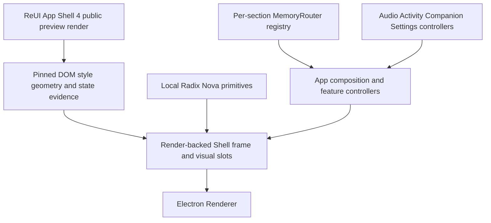
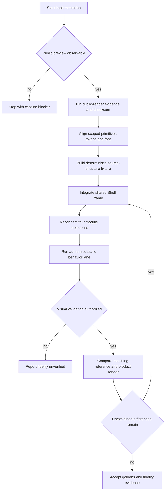

# Electron ReUI App Shell Render Fidelity Refactor - Plan

## Goal Capsule

| Field | Contract |
| --- | --- |
| Objective | Electron 工作台的共享 App Shell 在可迁移的视觉范围内忠实复现 ReUI App Shell 4，同时保持 Voice2Text 的业务行为、路由、数据和平台契约。 |
| Means | 固定公开 ReUI App Shell 4 预览页的实际渲染 DOM、计算样式、资源清单和同环境截图，再以本地 Radix/shadcn primitives 独立实现其视觉结构，将 Voice2Text 数据接入对应视觉槽位。 |
| Authority | 固定的 ReUI App Shell 4 公开预览证据拥有可观察的 Shell 几何与视觉语法；本地 Radix primitives 拥有交互语义、受控状态、键盘和焦点；Voice2Text controllers 与 MemoryRouter 拥有业务和导航。 |
| Execution profile | 公开渲染证据固定是首道门槛。迁移先建立无业务歧义的共享结构，再接入四个模块，最后在获得任务级 Electron 视觉验证授权后完成同环境对照。 |
| Stop conditions | 公开预览无法稳定渲染或采集、需要绕过付费 Registry 才能继续、或需要改变 Main、Preload、IPC、存储、worker、录音状态机与产品信息架构时停止并重新确认。 |
| Tail ownership | 本计划覆盖 Electron Renderer 的共享 App Shell、上下文栏视觉语法、依赖 primitives、字体与视觉验证；第三栏功能页面只接收共享页头和 token，不重做其产品内容结构。 |

---

## Product Contract

### Summary

本次重构以 ReUI App Shell 4 公开预览页的真实渲染结果为起点，不再只从单张截图反推组件结构。
实现采集并固定可观察的 DOM 层级、计算样式、资源、几何与交互状态，再使用本地 Radix/shadcn primitives 独立重建视觉结构，把示例邮件数据替换为 Voice2Text 的音频、消息、互联和设置数据。
第三栏业务页面继续呈现 Voice2Text 内容，只统一共享 Shell 页头、字体、间距和表面 token。

### Problem Frame

上一轮重构明确排除了 ReUI 源码，只固定了栏宽、页头高度、搜索带和按钮尺寸等少量几何事实。
当前实现因此能通过自身几何测试，却仍由本地 Sidebar、Item、Button 默认值和手写 Tailwind 类决定 DOM、字体、间距、圆角、颜色与列表密度。
现有 reference 记录目标字体为 Inter，而 Renderer 使用 SF Pro Text 与 PingFang SC。
现有测试也主要比较产品 golden 与自身基线，没有建立 Registry 源码、目标 reference 和最终实现之间的可追溯闭环。

### Key Decisions

- **Use the live ReUI preview render as the visual authority.** (session-settled: user-directed — chosen after authenticated MCP confirmed App Shell 4 is Pro-locked: the user prioritizes visual fidelity and approved independent local behavior implementation.) Governs R1–R3, R7–R11.
- **Create a new plan and retain the previous plan as history.** (session-settled: user-directed — chosen over rewriting the previous plan: the earlier document must remain available to explain the superseded constraints.) Governs R16.
- **Preserve Voice2Text product behavior and third-pane information architecture.** (session-settled: user-approved — chosen over copying the mail product model: the target supplies visual structure, not Voice2Text business semantics.) Governs R4, R7, R12–R15.

### Requirements

**Source authority and provenance**

- R1. Before changing Shell visual structure, implementation must capture App Shell 4 from the public preview URL as a complete rendered reference: DOM hierarchy, class attributes, computed styles, geometry, loaded visual assets and representative states.
- R2. The captured reference must be pinned by preview URL, capture date, browser engine, viewport, DPR, theme, rendered DOM/style evidence checksum and reference-image checksum; it must explicitly state that it is rendered evidence rather than original Registry source.
- R3. Implementation must not bypass the Pro Registry, decompile restricted bundles, copy the complete website stylesheet or claim access to original Block source. If the public render cannot supply enough observable evidence, implementation stops rather than guesses.
- R16. The new plan and resulting documentation must reference `docs/plans/2026-09-02-1350-refactor-electron-reui-app-shell-plan.md` as superseded design history without modifying it.

**Visual fidelity**

- R5. Shared Shell DOM hierarchy, wrapper order and load-bearing visual structure must reproduce the pinned public render except where R4 or R12–R15 require a documented local delta; implementation code remains independently authored with local primitives.
- R6. Renderer typography must use a bundled Inter-first stack for Latin and numeric text with PingFang SC and system fallbacks for Chinese, without network font loading.
- R7. Primary rail, context header, search, filters, list rows, content header and collapse affordance must keep the reference spacing, density, radii, borders, icon sizing and state hierarchy when populated with Voice2Text data.
- R8. Hover, active, selected, focus-visible, disabled, expanded, collapsed, loading, empty and error presentations must be evaluated against the render-backed visual grammar where the public preview exposes them, with local product-only states following the same observed hierarchy.
- R9. The 1280×720 light-mode fixture is the pixel-fidelity authority; the 880×620 production minimum must remain non-overlapping, reachable and scrollable even when the reference uses a different responsive breakpoint.
- R10. The reference image, rendered-evidence identity and product golden must represent the same preview URL, theme, viewport and observed visual configuration.
- R11. Fidelity acceptance must compare the target reference directly with the product render; a product golden that only matches a prior product render is insufficient evidence.

**Behavior and platform preservation**

- R4. Existing per-section MemoryRouter history, top-level navigation, pane preference, focus restoration, modal blocking, recording continuity, playback closure, activity read behavior, companion selection and settings navigation must retain their current contracts.
- R12. Local shadcn/Radix primitives must retain roles, controlled state, keyboard behavior, focus containment, focus restoration, native disabled semantics and reduced-motion behavior.
- R13. The Renderer must remain shadowless, use thin focus indicators and retain the existing Dialog mask exception.
- R14. Mail-only data, actions, avatars, attachments and identity must not be copied unless an existing Voice2Text field or action provides the same meaning.
- R15. Main, Preload, IPC, shared contracts, storage, workers, frozen resources, Flutter and recording state machines must not change.

**Credential and repository safety**

- R17. ReUI OAuth tokens, personal access tokens and license keys must remain outside tracked files and command output.
- R18. ReUI visual evidence may be captured for development provenance, but the product must contain independently authored repository-owned code and no runtime ReUI network dependency or hotlinked asset.
- R19. Existing user-owned worktree changes must be preserved, and overlapping Renderer changes must be reconciled before each implementation unit.

### Key Flows

- F1. **Capture the render authority**
  - **Trigger:** An implementer begins U1.
  - **Steps:** Open the public App Shell 4 preview; capture desktop/mobile DOM, computed styles, geometry, assets and representative states; record their identity and checksums.
  - **Outcome:** Reproducible public-render evidence is available for independent implementation, or work stops with a clear capture blocker.
  - **Covered by:** R1–R3, R17–R18.
- F2. **Migrate visual structure without changing behavior**
  - **Trigger:** The source authority passes.
  - **Steps:** Establish render-backed local primitives and tokens; rebuild the shared frame; reconnect existing handlers and controllers; adapt real module data into the observed visual slots.
  - **Outcome:** The visual hierarchy follows ReUI while navigation and business behavior remain unchanged.
  - **Covered by:** R4–R8, R12–R15.
- F3. **Close the fidelity loop**
  - **Trigger:** Static behavior checks pass and task-local visual validation is authorized.
  - **Steps:** Render the source-matched target and product fixture in the same environment; compare geometry and computed styles; inspect image differences by region; correct deviations before accepting goldens.
  - **Outcome:** The product golden records an accepted render-backed result rather than a self-referential baseline.
  - **Covered by:** R8–R11.

### Acceptance Examples

- AE1. **Covers R1–R3, R17.** Given the public preview cannot fully render or expose required observable evidence, when implementation starts, then it reports the capture blocker and makes no guessed visual changes.
- AE2. **Covers R2, R10.** Given a successful public-preview capture, when provenance is recorded, then its DOM/style evidence checksum, viewport and theme resolve to the same target used for the reference image.
- AE3. **Covers R4–R8, R12–R14.** Given a populated Audio library, when the migrated Shell renders, then it uses the render-backed hierarchy and states while selecting, searching, filtering, recording and Back/Forward behave as before.
- AE4. **Covers R4, R8, R12.** Given the context pane is collapsed and reopened, when keyboard focus returns to the rail, then module query, filters, selection and route history remain intact.
- AE5. **Covers R7–R9, R14.** Given long Chinese names, large counts and mixed processing states, when context rows render at 1280×720 and 880×620, then content truncates or scrolls within the render-backed grammar without overlap or fabricated mail content.
- AE6. **Covers R8, R11–R13.** Given hover, selected, disabled and keyboard-focused controls, when visual acceptance runs, then render-backed state differences are visible, surfaces remain shadowless and focus stays thin.
- AE7. **Covers R9–R11.** Given the final 1280×720 fixture, when it is compared with the matching ReUI reference, then all unexplained regional differences are resolved before product goldens are updated.
- AE8. **Covers R15, R19.** Given unrelated or later user changes exist, when the refactor lands, then no platform contract files or unrelated diffs are modified or reverted.

### Success Criteria

- SC1. The active Shell render record resolves to the public ReUI App Shell 4 preview and binds its viewport, theme, DOM/style evidence and reference image to checksums.
- SC2. A reviewer can trace every shared Shell wrapper and load-bearing visual outcome to the pinned public render or to one documented Voice2Text/Electron delta.
- SC3. Existing navigation, pane, modal, capture, playback, activity and settings behavior passes its current characterization coverage without contract changes.
- SC4. With explicit visual-validation authorization, direct target-to-product comparison at 1280×720 contains no unexplained regional difference, and 880×620 remains usable.
- SC5. No secret, runtime ReUI request, whole preset stylesheet, wholesale primitive replacement or unrelated platform change enters the repository.

### Scope Boundaries

#### Deferred to Follow-Up Work

- Restyle the internal composition of Audio detail, capture detail, Companion detail, Activity detail and Settings forms after the shared Shell has accepted fidelity evidence.
- Add dark-mode fidelity reference captures after the light-mode render-backed baseline is accepted.
- Refresh to later ReUI App Shell versions through a separate provenance and visual review.

#### Out of Scope

- Copy ReUI's mail data model, reply/star/delete behavior, fake identities or attachments.
- Replace MemoryRouter, feature controllers, IPC or persistent state.
- Import a complete ReUI stylesheet, overwrite the local UI directory or replace customized primitives wholesale.
- Add a ReUI runtime service or fetch visual assets from ReUI during application use.
- Change Flutter or apply Goo component rules to the Electron Renderer.

---

## Planning Contract

### Key Technical Decisions

- KTD1. **Gate implementation on complete public-render capture.** (session-settled: user-directed — approved after the authenticated MCP reported `locked: true` and `requiredPlan: pro`; the user chose style-first independent implementation rather than purchasing source access.) The gate uses the public preview's observable DOM, computed styles, assets, geometry and states and enforces R1–R3 and R17–R18.
- KTD2. **Keep the previous plan immutable and supersede it by reference.** (session-settled: user-directed — chosen over updating the existing artifact: the old assumptions remain useful diagnostic history.) The new documentation points readers to this plan as the active source-fidelity contract per R16.
- KTD3. **Rebuild in two stages.** (session-settled: user-approved — chosen over mixing business adaptation into the first visual pass: visual drift is easier to isolate before real data changes the composition.) First reproduce the observed render with deterministic fixture content; then substitute Voice2Text data into equivalent slots under R5–R8 and R14.
- KTD4. **Split visual and behavioral authority at the component boundary.** ReUI public-render evidence owns observable geometry and visual outcomes. Independently authored local Radix primitives keep behavior and accessibility under R4 and R12–R13.
- KTD5. **Pin the observed Base preview while retaining local Radix behavior.** The render record binds the public Base preview URL, observed neutral theme, Inter-first font, viewport and evidence checksum so a future live-page change cannot silently redefine R10. Base-vs-Radix implementation differences are documented local deltas, not visual redesign authority.
- KTD6. **Use scoped independent implementation.** Reproduce only the required observable structure and styling with existing local primitives. Never copy the complete website stylesheet, decompile production bundles or overwrite `src/renderer/components/ui` wholesale.
- KTD7. **Self-host the fidelity font.** Bundle the approved Inter font files with the Renderer and place PingFang SC after Inter in the stack. Keep `font-src 'self' data:` compatible and do not add a network font exception.
- KTD8. **Move shared composition out of the application controller.** A dedicated Shell frame owns the render-backed layout and slots. `App.tsx` supplies existing data, state and callbacks without owning decorative classes.
- KTD9. **Use reference-to-product comparison as the acceptance oracle.** Geometry and computed-style assertions localize drift. Same-environment regional image comparison closes R8–R11 before golden acceptance.
- KTD10. **Treat responsive behavior as a product delta.** Match the source exactly at 1280×720, then preserve the existing 880px Electron minimum without adopting mobile overlay behavior that would violate R4 or R9.
- KTD11. **Keep credentials process-local.** Prefer ReUI OAuth for MCP. If Registry authentication requires `REUI_LICENSE_KEY`, supply it through the environment and verify it never enters git status, logs or plan artifacts.

### High-Level Technical Design

The first diagram shows the authority split and component flow.

The second diagram defines the gated migration and acceptance sequence.

### Dependencies and Prerequisites

- A publicly accessible App Shell 4 preview with sufficient observable layout and state evidence.
- Local implementations and licensed assets; premium Registry access is no longer a prerequisite.
- Explicitly distinguish current render measurements from the historical reference image until same-session comparison is accepted.
- Explicit visual-validation authorization in the implementation task before any Electron, browser, screenshot, golden or watcher command runs.
- The canonical macOS arm64 Electron environment described in `apps/desktop-electron/tests/visual/goldens/README.md` for final pixel evidence.

Execution-time evidence shows that ReUI MCP OAuth succeeds but App Shell 4 discovery returns `locked: true` and `requiredPlan: pro` for the current account.
The user therefore approved the public Base preview as the visual authority while explicitly keeping implementation behavior local.
If local Radix mechanics differ from the Base preview, the public preview remains the visual outcome target while R12 preserves the application's Radix behavior contract.

### Risks and Mitigations

| Risk | Impact | Mitigation |
| --- | --- | --- |
| Public preview changes after planning | Measurements and screenshot describe different designs | Pin render evidence and require deliberate same-session recapture before acceptance. |
| Public evidence is incomplete | Implementer falls back to guessing | Record missing states and stop affected implementation until observable evidence exists. |
| ReUI Base UI examples conflict with local Radix behavior | Keyboard or focus regressions | Independently implement observed appearance while retaining local Radix primitive APIs and tests. |
| Primitive installation overwrites customized files | Modal, focus or controlled-state regressions | Use `view`, dry-run and scoped diffs; merge by hand; reject whole-directory writes. |
| Inter changes Chinese rendering unexpectedly | Mixed-language rows drift or clip | Test Latin, numbers and Chinese together; retain PingFang SC and system fallbacks. |
| Real Voice2Text data changes reference density | Visual fidelity erodes during adaptation | Prove the source-structure fixture first, then map real fields into fixed visual slots. |
| Golden tests become self-referential again | Regressions pass while target fidelity is lost | Require a matching external reference and regional comparison before every accepted update. |
| Visual validation is not authorized | Fidelity cannot be proven | Complete static planning or code work only and report the result as visually unverified. |

---

## Implementation Units

### U1. Establish public-render reference provenance

- **Goal:** Capture the complete observable App Shell 4 preview and create the immutable rendered-evidence authority record before visual code changes.
- **Requirements:** R1–R3, R10, R16–R18; KTD1, KTD2, KTD5, KTD11.
- **Dependencies:** None.
- **Files:**
  - `apps/desktop-electron/tests/visual/references/reui-app-shell-4-render.json`
  - `apps/desktop-electron/tests/visual/references/README.md`
  - `docs/plans/2026-09-03-0906-refactor-electron-reui-source-fidelity-plan.md`
- **Approach:**
  1. Capture the public Base preview at the canonical desktop viewport and the documented responsive viewport without accessing restricted Registry endpoints.
  2. Record the observable DOM hierarchy, relevant class attributes, computed styles, geometry, font identity, visual asset inventory and representative interaction states.
  3. Record capture metadata and deterministic evidence checksums; label the artifact as rendered evidence, not original ReUI source.
  4. Link the old plan as superseded history in reference documentation while leaving the old artifact unchanged.
- **Execution note:** Treat render capture as a preflight. Do not touch Renderer visual code until desktop/mobile structure and required state evidence are fixed.
- **Patterns to follow:** The shadcn registry provenance table and scoped-diff process in `apps/desktop-electron/README.md`; the immutable capture metadata in `apps/desktop-electron/tests/visual/references/README.md`.
- **Test scenarios:**
  1. Covers AE1. If the public preview cannot fully render, no metadata is accepted and Renderer files remain unchanged.
  2. Covers AE2. A successful capture produces metadata whose DOM/style evidence checksum, viewport and theme agree with the reference image.
  3. A repository search and `git status` contain no token, bearer header value, license key, copied full-site stylesheet or decompiled production bundle.
  4. A changed live render fails the provenance comparison until a deliberate recapture and review updates the authority.
- **Verification:** A reviewer can reproduce the public-render evidence and verify that the implementation is independent, credential-free and not presented as original ReUI source.

### U2. Align required primitives, tokens and typography

- **Goal:** Supply the exact local primitive surface needed to reproduce the pinned render without replacing local Radix behavior.
- **Requirements:** R5–R8, R12–R13, R17–R18; KTD4–KTD7, KTD11.
- **Dependencies:** U1.
- **Files:**
  - `apps/desktop-electron/src/renderer/components/ui/badge.tsx`
  - `apps/desktop-electron/src/renderer/components/ui/avatar.tsx`
  - `apps/desktop-electron/src/renderer/components/ui/button.tsx`
  - `apps/desktop-electron/src/renderer/components/ui/dropdown-menu.tsx`
  - `apps/desktop-electron/src/renderer/components/ui/input.tsx`
  - `apps/desktop-electron/src/renderer/components/ui/item.tsx`
  - `apps/desktop-electron/src/renderer/components/ui/separator.tsx`
  - `apps/desktop-electron/src/renderer/components/ui/sidebar.tsx`
  - `apps/desktop-electron/src/renderer/components/ui/tooltip.tsx`
  - `apps/desktop-electron/package.json` (`@fontsource-variable/inter`)
  - `apps/desktop-electron/public/licenses/inter-OFL.txt`
  - `apps/desktop-electron/src/renderer/index.css`
  - `apps/desktop-electron/tests/unit/renderer/ui_primitives_test.tsx`
- **Approach:**
  1. Compare the observed rendered controls with local files and classify each as reuse, scoped class merge or new component.
  2. Add only missing components needed by the independent implementation and retain local Radix state and accessibility contracts.
  3. Apply only load-bearing Nova-compatible classes supported by the render evidence; keep the three Electron visual exceptions.
  4. Add locally hosted, licensed Inter assets and a mixed-language font stack compatible with the Renderer CSP.
- **Execution note:** Add characterization coverage for customized primitives before changing their load-bearing class or structure.
- **Patterns to follow:** The scoped shadcn alignment workflow and SHA provenance in `apps/desktop-electron/README.md`; existing local primitives under `apps/desktop-electron/src/renderer/components/ui`.
- **Test scenarios:**
  1. Existing controlled, disabled, keyboard, portal and focus-restoration behavior remains unchanged for every touched primitive.
  2. Add only primitives actually consumed by the independent implementation. Preserve existing native scrolling and filter-button semantics; the preview's dependency list does not require unused Button Group, Scroll Area or Tabs wrappers.
  3. Shadow, focus-visible and Dialog overlay assertions retain the Electron exceptions.
  4. The Renderer resolves Inter locally for Latin text and falls back to PingFang SC for Chinese without a network request.
  5. Reduced-motion and forced-colors behavior remains available after class alignment.
- **Verification:** Component tests prove behavioral preservation, and the final diff contains only render-required primitives and token/font changes.

### U3. Build the render-backed Shell frame

- **Goal:** Replace the hand-composed Shell chrome with a dedicated frame that preserves the pinned Block hierarchy and visual slots.
- **Requirements:** R5–R10, R12–R13; KTD3–KTD10.
- **Dependencies:** U1, U2.
- **Files:**
  - `apps/desktop-electron/src/renderer/features/shell/app-shell-frame.tsx`
  - `apps/desktop-electron/src/renderer/features/shell/context-pane-shell.tsx`
  - `apps/desktop-electron/src/renderer/features/shell/context-pane-contract.ts`
  - `apps/desktop-electron/src/renderer/components/app-sidebar.tsx`
  - `apps/desktop-electron/src/renderer/components/nav-main.tsx`
  - `apps/desktop-electron/tests/unit/renderer/shell_test.tsx`
- **Approach:**
  1. Reproduce the source wrapper hierarchy and class ownership in a shared frame with slots for navigation, context head, search, filters, list, content head, page actions and content.
  2. Move decorative Shell classes out of `App.tsx` and feature controllers into the frame or owning shared primitive.
  3. Preserve the existing controlled pane state, midpoint toggle semantics and focus-restoration callbacks as local deltas.
  4. Derive geometry constants from the pinned source and record any 880px product delta separately from the 1280px fidelity target.
- **Execution note:** Prove the frame first with deterministic fixture content that mirrors the Block's slot occupancy before connecting business data.
- **Patterns to follow:** Slot ownership in `apps/desktop-electron/src/renderer/features/shell/context-pane-shell.tsx`; controlled state in `apps/desktop-electron/src/renderer/components/ui/sidebar.tsx`.
- **Test scenarios:**
  1. The frame renders source-order landmarks and slots with no feature controller present.
  2. The 1280×720 structure exposes the render-backed rail, context and content regions without duplicate wrappers or page-level decorative overrides.
  3. Covers AE4. Collapsing and reopening the pane keeps focus semantics and mounted state.
  4. At 880×620, fixed regions do not overlap and content remains reachable.
  5. Empty optional search, filter, action and footer slots do not leave reference-inconsistent spacer bands.
- **Verification:** DOM tests lock the load-bearing hierarchy and slot ownership without asserting entire generated class strings.

### U4. Adapt module projections into ReUI visual slots

- **Goal:** Map Audio, Messages, Companion and Settings context content into the render-backed header, search, tabs and row grammar.
- **Requirements:** R4, R7–R9, R12, R14–R15; KTD3, KTD4, KTD8, KTD10.
- **Dependencies:** U3.
- **Files:**
  - `apps/desktop-electron/src/renderer/features/audios/audio-route-feature.tsx`
  - `apps/desktop-electron/src/renderer/features/activity/activity-center.tsx`
  - `apps/desktop-electron/src/renderer/features/companion/companion-feature.tsx`
  - `apps/desktop-electron/src/renderer/App.tsx`
  - `apps/desktop-electron/tests/unit/renderer/audio_route_test.tsx`
  - `apps/desktop-electron/tests/unit/renderer/activity_center_test.tsx`
  - `apps/desktop-electron/tests/unit/renderer/companion_route_test.tsx`
  - `apps/desktop-electron/tests/unit/renderer/shell_test.tsx`
- **Approach:**
  1. Map real headings, actions, queries, filters and counts into the corresponding Block slots.
  2. Preserve the reference row hierarchy while using real title, time, duration, segment, processing, activity, device and category fields.
  3. Keep query, filters, scroll and selection in their current long-lived owners.
  4. Remove feature-level surface, radius and interaction-state classes that duplicate the new shared grammar.
- **Execution note:** Migrate one representative populated module first, then reuse the accepted grammar for the remaining modules.
- **Patterns to follow:** Current data and state ownership in the four feature projections; observed row, pill and search styling with the existing Item, filter-button and native scrolling semantics.
- **Test scenarios:**
  1. Covers AE3. Audio search, filters, counts, selection and recording action keep their callbacks and state while using the render-backed regions.
  2. Messages preserve exact read and mark-all behavior across all, unread and attention filters.
  3. Companion device selection and pairing footer remain reachable without fake mail-specific actions.
  4. Settings category navigation keeps its current target and does not render empty search or filter bands.
  5. Covers AE5. Long Chinese titles, zero and large counts, every processing state, empty results, loading and errors stay within row and scroll boundaries.
- **Verification:** Focused module tests prove callback counts, selection truth and state persistence; shared visual classes are no longer repeated in feature consumers.

### U5. Integrate the frame with routing and application state

- **Goal:** Connect the new frame to the existing application composition without changing navigation or platform behavior.
- **Requirements:** R4, R8–R9, R12–R15, R19; KTD4, KTD8, KTD10.
- **Dependencies:** U3, U4.
- **Files:**
  - `apps/desktop-electron/src/renderer/App.tsx`
  - `apps/desktop-electron/src/renderer/features/shell/section-router-registry.tsx`
  - `apps/desktop-electron/src/renderer/features/shell/content-routes.tsx`
  - `apps/desktop-electron/src/renderer/features/shell/use-context-pane-shell.ts`
  - `apps/desktop-electron/tests/unit/renderer/content_router_test.tsx`
  - `apps/desktop-electron/tests/unit/renderer/shell_test.tsx`
  - `apps/desktop-electron/tests/e2e/sidebar_navigation_test.ts`
- **Approach:**
  1. Make `App.tsx` supply route title, actions, pane slots, content and existing callbacks to the frame.
  2. Keep the section router registry as the sole third-pane page authority.
  3. Preserve modal navigation gating, capture detail ownership, offline projection and active recording containment.
  4. Reconcile any concurrent user changes before removing superseded Shell markup.
- **Execution note:** Treat current navigation and application tests as characterization contracts before replacing the composition root.
- **Patterns to follow:** `apps/desktop-electron/src/renderer/features/shell/section-router-registry.tsx`; modal and capture orchestration in `apps/desktop-electron/src/renderer/App.tsx`.
- **Test scenarios:**
  1. Audio, Messages, Companion and Settings retain independent Back/Forward stacks through primary-section switches.
  2. Reopening the current destination remains a no-op, and branching after Back discards only the abandoned forward path.
  3. Covers AE4. Pane collapse and restore preserve query, filter, selection and route state.
  4. Modal-active navigation, capture-detail close and offline state behave exactly as before the frame migration.
  5. Covers AE8. No Main, Preload, shared contract or persistence behavior is needed to satisfy the new composition.
- **Verification:** Existing route, Shell and sidebar end-to-end tests pass on the integrated frame with no platform-layer diff.

### U6. Strengthen render-backed fidelity assertions

- **Goal:** Make tests detect drift in typography, spacing and component states instead of checking only coarse geometry.
- **Requirements:** R2, R6–R13; KTD5, KTD7, KTD9, KTD10.
- **Dependencies:** U2–U5.
- **Files:**
  - `apps/desktop-electron/tests/visual/renderer-shell.visual.spec.ts`
  - `apps/desktop-electron/tests/visual/fixtures/renderer-api.ts`
  - `apps/desktop-electron/tests/visual/references/README.md`
  - `apps/desktop-electron/tests/visual/goldens/README.md`
  - `apps/desktop-electron/tests/unit/renderer/shell_test.tsx`
- **Approach:**
  1. Replace stale constants with measurements derived from the pinned source configuration.
  2. Assert load-bearing computed styles for font family, size, weight, line height, padding, gaps, border, radius, icon size and scroll containment.
  3. Add deterministic fixtures for selected, hover, focus-visible, disabled, collapsed, long-content, loading, empty and error states.
  4. Keep semantic assertions portable across hosts and reserve canonical pixels for the recorded macOS arm64 environment.
- **Execution note:** Write assertions against the acquired source contract before accepting any new product golden.
- **Patterns to follow:** Existing geometry helpers in `apps/desktop-electron/tests/visual/renderer-shell.visual.spec.ts`; baseline environment contract in `apps/desktop-electron/tests/visual/goldens/README.md`.
- **Test scenarios:**
  1. A one-pixel geometry or spacing drift fails the owning regional assertion.
  2. A font-family, weight or line-height regression fails before screenshot comparison.
  3. Covers AE6. Hover, selected, disabled and focus-visible fixtures expose distinct expected states without shadows or thick rings.
  4. Covers AE5. Long mixed-language rows and 880px minimum fixtures remain contained and scrollable.
  5. A reference version or checksum mismatch blocks golden acceptance.
- **Verification:** The suite names the exact render-evidence contract behind every measured region and cannot pass solely because the product matches its previous screenshot.

### U7. Complete authorized visual acceptance and documentation

- **Goal:** Close the source-to-reference-to-product loop and document the final local deltas.
- **Requirements:** R8–R11, R13–R16, R18; KTD2, KTD5, KTD9, KTD10.
- **Dependencies:** U6.
- **Files:**
  - `apps/desktop-electron/tests/visual/references/reui-app-shell-4-1280x720.png`
  - `apps/desktop-electron/tests/visual/goldens/audio-app-shell-4.png`
  - `apps/desktop-electron/tests/visual/goldens/audio-open-selected-active-capture.png`
  - `apps/desktop-electron/tests/visual/goldens/audio-pane-closed.png`
  - `apps/desktop-electron/tests/visual/goldens/activity-messages.png`
  - `apps/desktop-electron/tests/visual/goldens/companion-multiple-devices.png`
  - `apps/desktop-electron/tests/visual/goldens/settings.png`
  - `apps/desktop-electron/tests/visual/references/README.md`
  - `apps/desktop-electron/tests/visual/goldens/README.md`
  - `apps/desktop-electron/README.md`
- **Approach:**
  1. Obtain explicit task-local visual-validation permission before launching Electron or changing any image.
  2. Capture the pinned ReUI configuration and product fixture at the same viewport, DPR, theme, font state and stable data state.
  3. Inspect regional overlays or image differences for the rail, context header, search, tabs, rows, content header and collapse affordance.
  4. Resolve every unexplained difference or record a requirement-backed Voice2Text delta before updating product goldens.
  5. Document the render-evidence identity, visual environment, accepted deltas, refresh procedure and superseded-plan relationship.
- **Execution note:** Do not update screenshots at the start of the unit. Accept them only after direct target comparison.
- **Patterns to follow:** Existing visual harness and canonical environment policy; the source provenance from U1.
- **Test scenarios:**
  1. Covers AE7. The 1280×720 target and product render have no unexplained regional deviation after render-backed adaptation.
  2. Audio active capture, pane closed, Messages, Companion and Settings retain the accepted shared Shell grammar.
  3. The 880×620 fixture proves the documented product responsive delta without overlap or unreachable actions.
  4. Reference checksum, source checksum and environment metadata remain synchronized with the accepted images.
  5. Without current visual-validation authorization, no UI process or screenshot command runs and completion is reported as visually unverified.
- **Verification:** Authorized visual evidence is accepted, documentation names every local exception, and no stale golden or temporary screenshot remains.

---

## Verification Contract

| Lane | Applies after | Command or evidence | Completion signal |
| --- | --- | --- | --- |
| Render preflight | U1 | Public preview desktop/mobile capture plus DOM, computed-style, asset, state and checksum review | The observable reference is reproducible, explicitly distinguished from original source and contains no credential material. |
| Diff and boundary review | Every unit | Inspect the diff against R1–R19, the previous plan, current user changes and Electron authority rules | No unrelated business, platform, Flutter or whole-directory primitive change enters the diff. |
| Focused Renderer behavior | U2–U6 | Run the narrowest relevant Vitest files named by each unit when the current task authorizes the required UI verification lane | Touched primitive, module, Shell and router contracts pass on one code state. |
| Electron UI quick gate | U6 | From `apps/desktop-electron`, run `bun run check:ui:quick` only with explicit current-task visual-validation authorization | Formatting, lint, types and focused Renderer behavior pass. |
| Source-backed visual suite | U7 | From `apps/desktop-electron`, run the visual suite in the canonical environment only with explicit authorization | Geometry, computed styles, states and reference-to-product comparison pass. |
| Final Electron UI gate | Final code state | From `apps/desktop-electron`, run `bun run check:ui` once after accepted visual changes and goldens | The final Renderer lane passes and is not rerun unless UI code changes. |
| Project watcher | Final code state | Run `./tool/ensure_ui_watcher.sh` only when visual validation is authorized | The best-effort watcher exits successfully without expanding the Electron scope. |
| Static-only fallback | Any code state without visual permission | Inspect source provenance, diffs and affected references only | Report visual validation as skipped; do not claim R11 or the plan complete. |

Do not run packaging, release validation, resource acquisition, Flutter checks, `check:code` or `./tool/dev_check.sh` unless implementation evidence expands the reverse-dependency scope.

---

## Documentation and Operational Notes

- `apps/desktop-electron/README.md` must name the pinned ReUI public-render evidence as the Shell visual authority and retain the local Radix Nova behavioral authority.
- `apps/desktop-electron/tests/visual/references/README.md` must distinguish public-render evidence, target capture and product golden.
- The reference refresh procedure must require a deliberate public-render recapture, evidence checksum change review and a new accepted product comparison.
- ReUI credentials are developer-local operational prerequisites and must not appear in example values, screenshots, logs or committed environment files.

---

## Sources and Research

- [ReUI App Shell 4](https://reui.io/blocks/application/app-shell/app-shell-4) identifies the Block as a 440px mail-list shell and lists Avatar, Badge, Button, Button Group, Dropdown Menu, Input, Item, Scroll Area, Separator, Sidebar, Tabs and Tooltip dependencies.
- [ReUI Registry](https://reui.io/docs/registry) defines the `@reui` namespace, authenticated premium Registry configuration and license-key requirement.
- [ReUI Codex setup](https://reui.io/docs/codex) defines MCP OAuth, environment-backed bearer authentication and the agent workflow for retrieving real Registry components instead of guessing.
- [ReUI Agent Skills](https://reui.io/docs/agent-skills) establishes the find, install, read API and adapt-by-reuse workflow.
- [shadcn registry namespaces](https://ui.shadcn.com/docs/registry/namespace) documents `view`, dry-run and namespaced item inspection before installation.
- [shadcn registry security guidance](https://ui.shadcn.com/docs/registry/github) recommends reviewing item files, dependencies and environment variables and preferring pinned sources before installation.
- `docs/plans/2026-09-02-1350-refactor-electron-reui-app-shell-plan.md` is the superseded screenshot-led plan and remains diagnostic history.
- `apps/desktop-electron/README.md` is the current Radix Nova provenance, visual-exception and Renderer boundary authority.
- `apps/desktop-electron/src/renderer/App.tsx`, `apps/desktop-electron/src/renderer/features/shell/context-pane-shell.tsx` and `apps/desktop-electron/src/renderer/components/app-sidebar.tsx` own the current hand-composed Shell.
- `apps/desktop-electron/tests/visual/renderer-shell.visual.spec.ts` and `apps/desktop-electron/tests/visual/goldens/README.md` own current geometry, fixture and canonical pixel evidence.

---

## Definition of Done

- U1–U7 satisfy their cited requirements and verification outcomes on the same final source state.
- The implementation is independently derived from checksum-pinned, publicly observable ReUI App Shell 4 render evidence without bypassing premium source access.
- The shared Shell reproduces the render-backed hierarchy and visual grammar with only documented Voice2Text and Electron deltas.
- Audio, Messages, Companion and Settings retain their existing navigation, state, callbacks and business truth.
- No ReUI credential, runtime network dependency, full preset stylesheet or wholesale primitive overwrite enters the repository.
- The previous screenshot-led plan remains unchanged and is clearly identified as superseded history.
- With explicit visual-validation authorization, the canonical 1280×720 comparison has no unexplained deviation and the 880×620 minimum remains usable.
- Without that authorization, the work is handed off as visually unverified and this plan is not declared complete.
