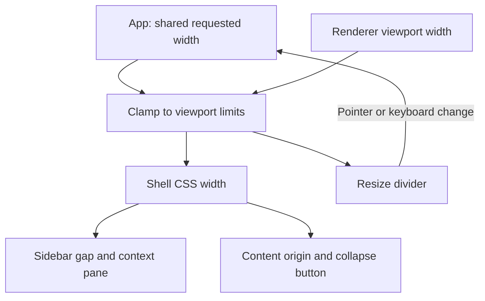

# Shared Context Pane Resize - Plan

## Goal Capsule

- **Objective:** 用户可以按阅读需要分配列表与正文的空间，切换页面时布局保持稳定。
- **Means:** 缩小第二栏默认宽度，并在其右边界提供拖拽调整，采用共享的运行期宽度状态（KTD1–KTD3）。
- **Authority:** 当前用户选择与 `AGENTS.md` 优先于历史 ReUI 固定宽度要求；其余视觉规范继续沿用。
- **Execution profile:** Electron Renderer 内的局部改动，按 U1、U2、U3 顺序实施。
- **Stop conditions:** 遇到用户未提交修改无法安全合并时暂停；未获得当次视觉验证授权时不得启动 UI 或接受截图基准。
- **Delivery:** 实现、验证和代码审查由后续执行负责。本计划不授权推送、发布或创建 PR。

## Product Contract

### Summary

第二栏默认变窄，允许拖拽调整；音频、消息、互联、设置在同一次运行中共用调整结果。
不增加双击重置，不跨重启保存宽度。

### Problem Frame

当前第二栏固定为 390px，加上导航栏与边框后占用 440px。
在较窄窗口中，固定宽度压缩了正文空间，也不能按长文件名等阅读需求调整。

### Key Decisions

- **共用宽度。** (session-settled: user-directed — chosen over per-section widths: 用户了解页面切换时分隔线移动的取舍后，选择暂时共用。) Governs R2.
- **不跨重启记忆，不提供双击重置。** (session-settled: user-directed — chosen over persisted widths and double-click reset: 用户明确去掉这两项功能。) Governs R3, R6.

### Requirements

**Width and lifetime**

- R1. 第二栏默认宽度为 300px，最小宽度为 240px；宽度不包含第一栏及外侧分隔边框。
- R2. 四个主页面共用同一个运行期宽度；切换页面、收起再展开、进入再退出空态不清除该宽度。
- R3. 宽度只保留在内存；应用重启或 Renderer 重新加载后恢复默认，不读写本地存储、Cookie 或后端配置。
- R4. 在受支持的窗口尺寸内，第二栏不得超过 480px，并为右侧主内容至少保留 480px；缩窗产生的临时限宽不覆盖用户原先选择的宽度。

**Interaction**

- R5. 展开且可用的第二栏在右边界支持水平拖拽；分隔条也支持键盘左右键调整，边界处停止变化。
- R6. 拖拽不触发收起或点击正文；单击、双击分隔条都不重置宽度。
- R7. 收起或全页空态不显示可操作的拖拽分隔条；收起按钮仍只负责展开与收起。
- R8. 指针释放、取消、失去捕获、窗口失焦、页面切换、面板消失或模态打开后结束拖拽；保留最后有效宽度并清除拖拽效果。

**Compatibility**

- R9. 保留路由历史、筛选、选中项、滚动内容、录制及播放行为；第一栏尺寸和现有展开/收起偏好不变。
- R10. 沿用本地 shadcn/Radix、无阴影和细焦点规范；不添加全局播报、隐藏 live region 或全局焦点协议。

### Acceptance Examples

- AE1. Covers R1–R3. 启动后第二栏为默认宽度；在音频调到 360px 后切换设置仍为 360px，重新加载后恢复默认。
- AE2. Covers R2, R7. 调宽后收起再展开，或资料库变空后重新出现内容，第二栏恢复调整后的宽度。
- AE3. Covers R4. 在 1280px 窗口选到 480px，缩到 880px 时实际栏宽临时变为 350px；恢复宽窗口后回到 480px。
- AE4. Covers R5, R6, R8. 指针离开分隔条仍可继续拖动，释放后停止；取消或模态出现后继续移动指针不再改变宽度。

### Scope Boundaries

仅修改 Electron 外壳的第二栏宽度及调整交互。
不做每页独立宽度、跨窗口同步、拖到边缘自动收起、双击重置、持久化、移动端分栏或通用多面板框架。
不改 Main、Preload、IPC、存储、worker、Flutter 或录制状态机。
前一项“音频全页空态隐藏顶部栏”已有未提交修改，不属于本计划的新增工作，实施时必须保留。

## Planning Contract

### Key Technical Decisions

- KTD1. **独立的内存宽度控制。** 由 `App` 中不随页面切换卸载的 hook 管理期望宽度与窗口限宽，落实 R2、R3；不混入负责持久化展开状态的 `useContextPaneShell`。
- KTD2. **一份有效宽度驱动全部几何。** 继续使用 `--sidebar-width` 驱动占位、容器、正文起点和收起按钮。当前展开前缀为第一栏 49px、第二栏及 1px 外边框之和；收起前缀仍为 48px。移除产品对 390/440 的固定断言，不改参考网页的原始测量值。
- KTD3. **区分期望宽度与有效宽度。** 以当前 Renderer 视口宽度 W 计算上限 `min(480, W - 50 - 480)`，再按 R1、R4 限制有效宽度。仅窗口变化不改期望宽度；用户开始拖拽时从当前有效宽度起算，避免缩窗后第一下拖动跳跃。本次保持已有 880px 最小窗口契约。
- KTD4. **独立调整分隔条。** 使用局部拖拽控件，不复用只会切换开关的 `SidebarRail` 点击逻辑。分隔条位于边框附近，采用约 8px 透明命中区；命中区与中部收起按钮互不重叠，不能覆盖正文操作。装饰由共享 primitive 拥有，外壳只设置位置。
- KTD5. **最小键盘语义。** 现有 `Separator` 仅负责静态分隔，`Slider` 的轨道取值交互不能直接表示边界位移。为 R5 的可调整分隔条提供有名称、可聚焦的 separator、当前值及上下限，左右键每次调整 10px；保留现有 Escape 收起行为，不新增快捷键、重置命令或播报协议。
- KTD6. **拖拽生命周期局限于外壳。** 使用指针捕获，按帧合并移动更新；只接受主要指针。拖拽期间关闭 `sidebar-gap` 与 `sidebar-container` 已有的宽度过渡，并抑制文本选择。按 R8 统一收尾，不留下事件监听、待执行帧或全局样式。模态打开时不得启动调整。
- KTD7. **参考证据与产品差异分开。** 本计划取代历史计划中的固定第二栏宽度要求，不改其他 ReUI 视觉约束。公开参考截图、DOM 和校验和保留；在产品验收记录中说明新默认宽度及拖拽状态。

### High-Level Technical Design

调整控件只有 idle 与 dragging 两个交互状态。
R8 的任一结束条件都清理本次指针交互；正常收起与模态焦点行为继续由原有组件负责。

### Grounding and Integration

- `apps/desktop-electron/src/renderer/features/shell/context-pane-contract.ts`：当前固定几何值。
- `apps/desktop-electron/src/renderer/features/shell/app-shell-frame.tsx`：CSS 宽度变量与中部收起按钮的位置所有者。
- `apps/desktop-electron/src/renderer/components/ui/sidebar.tsx`：占位和容器具有 200ms 宽度过渡；拖拽时需要同时关闭。
- `apps/desktop-electron/src/renderer/features/shell/use-context-pane-shell.ts`：展开状态按页面持久化；不得改变该现有契约。
- `docs/plans/2026-09-03-0906-refactor-electron-reui-source-fidelity-plan.md`：历史视觉约束，固定宽度部分按 KTD7 替代。

## Implementation Units

### U1. Shared runtime width and geometry

- **Goal:** 第二栏采用新的默认尺寸，并在页面切换、空态与窗口变化时保持一致。
- **Requirements:** R1–R4, R7, R9；KTD1–KTD3。
- **Dependencies:** 无。
- **Files:** `apps/desktop-electron/src/renderer/features/shell/context-pane-contract.ts`、`apps/desktop-electron/src/renderer/features/shell/use-context-pane-width.ts`（新增）、`apps/desktop-electron/src/renderer/features/shell/app-shell-frame.tsx`、`apps/desktop-electron/src/renderer/App.tsx`、`apps/desktop-electron/tests/unit/renderer/context_pane_width_test.tsx`（新增）、`apps/desktop-electron/tests/unit/renderer/shell_test.tsx`。
- **Approach:** 提取宽度边界计算与运行期状态，接入外壳已有 CSS 变量；保留空态顶部栏修改，不调整业务组件。
- **Patterns to follow:** 现有外壳 controlled props、面板生命周期及容错模式；不复制展开偏好的持久化行为。
- **Execution note:** 先补充宽度计算和页面切换的回归覆盖，再接入布局。
- **Test scenarios:**
  1. Covers AE1. 默认尺寸正确，切换四个页面共享宽度；重新挂载应用后恢复默认，宽度操作不产生存储写入。
  2. Covers AE2. 收起、展开、空态消失与恢复都保留期望宽度，第一栏与展开偏好不变。
  3. Covers AE3. 在 880、1280、1600px 视口验证默认、最小、最大及缩窗恢复；从临时限宽状态开始调整不跳跃。
- **Verification:** 边界计算及外壳状态测试通过，所有依赖列宽的位置使用同一有效值。

### U2. Resize interaction without collapse conflicts

- **Goal:** 第二栏支持可终止、跟手且有键盘等价操作的调整。
- **Requirements:** R5–R10；KTD4–KTD6。
- **Dependencies:** U1。
- **Files:** `apps/desktop-electron/src/renderer/components/ui/pane-resize-handle.tsx`（新增）、`apps/desktop-electron/src/renderer/components/ui/sidebar.tsx`、`apps/desktop-electron/src/renderer/features/shell/app-shell-frame.tsx`、`apps/desktop-electron/src/renderer/features/shell/use-context-pane-width.ts`、`apps/desktop-electron/src/renderer/App.tsx`、`apps/desktop-electron/tests/unit/renderer/context_pane_width_test.tsx`、`apps/desktop-electron/tests/unit/renderer/shell_test.tsx`。
- **Approach:** 让分隔条发出宽度调整意图，外壳传递面板可用和模态状态；关闭与恢复过渡样式只作用于本次调整。
- **Patterns to follow:** 本地 primitive 拥有装饰默认；沿用现有模态阻断、收起按钮和细焦点规范。
- **Test scenarios:**
  1. Covers AE4. 拖动、移出命中区、释放及取消正确更新或停止更新；非主要指针不启动调整。
  2. 左右键按 KTD5 调整并在边界停止；键盘焦点、名称及数值与有效栏宽一致。
  3. 单击和双击不重置、不收起；收起按钮仍只切换开关。
  4. 页切换、模态打开、面板隐藏、窗口失焦或组件卸载后，后续移动和排队帧不再修改宽度，文本选择与动画恢复。
  5. 多次拖拽不累计监听器，不触发录制、播放、路由或存储回调。
- **Verification:** 交互回归通过；浏览器中的命中区、指针捕获及过渡效果留给 U3 验收，不以模拟事件替代。

### U3. Product geometry and visual acceptance

- **Goal:** 证明新尺寸与交互在桌面实际渲染中有效，并更新产品基准说明。
- **Requirements:** R1–R10；KTD7。
- **Dependencies:** U1, U2。
- **Files:** `apps/desktop-electron/tests/visual/renderer-shell.visual.spec.ts`、`apps/desktop-electron/tests/e2e/sidebar_navigation_test.ts`、`apps/desktop-electron/tests/visual/goldens/`（仅受影响的产品图与 README）、`apps/desktop-electron/tests/visual/references/README.md`、`apps/desktop-electron/tests/visual/references/reui-app-shell-4-render.json`（仅产品 acceptance 描述）。
- **Approach:** 将固定宽度断言改成产品尺寸契约，新增真实拖拽与窗口变化验证；在授权后检查候选图，再更新产品截图。保持参考 evidence 和其校验和不变。
- **Test scenarios:**
  1. 默认和边界尺寸下第二栏、正文起点、分隔条及收起按钮对齐；列表和正文能独立滚动。
  2. 在 1280px 及 880px 窗口实际拖拽，验证跟手、释放后停止、收起按钮不误触及正文至少保留 R4 空间。
  3. 四页面切换、空态往返、长中文文件名及筛选按钮在窄栏中可达，不产生页面级横向溢出。
  4. 实际重新加载后按 R3 恢复；无新增运行错误，无持久化宽度数据。
  5. 既有录制、空态顶部栏、焦点恢复与路由测试继续有效；未经授权不更新这些截图。
- **Verification:** 产品截图与几何、行为断言共同通过；已知的参考页宽度差异记录清楚。

## Verification Contract

计划阶段仅检查文档和引用，不运行测试、构建或 UI。
实施时按 `AGENTS.md` 的 Electron Renderer 验证路径执行：获得当次视觉验证授权后，从 `apps/desktop-electron` 运行 `bun run check:ui:quick`、相关视觉测试及最终 `bun run check:ui`。
最终检查通过后，只有 UI 代码再变化才重跑。
无授权时仅进行非视觉静态检查，报告 U3 未验收，不启动应用、浏览器或 watcher，不接受新截图。
不运行打包、资源获取、release 检查或全仓验证。

## Definition of Done

- U1 的尺寸与状态测试证明 R1–R4，宽度状态没有进入持久化层。
- U2 的交互验证证明 R5–R10，拖拽与收起、模态及业务行为相互独立。
- U3 在获得授权后完成实际渲染验收与产品基准更新；未执行不得宣称视觉通过。
- 现有空态顶部栏修改和其他用户工作完整保留，未引入废弃尝试、无用依赖或全局交互协议。
