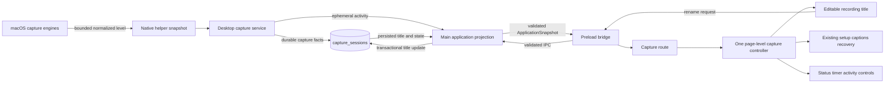

# Desktop Recording Detail Header and Footer - Plan

## Goal Capsule

| Field | Contract |
| --- | --- |
| Objective | 桌面端用户开始或继续一段录音时，能够在清爽、稳定的录制页面中直接识别并修改录音名称，并从固定底栏确认录制状态、时长、实时音频活动以及暂停或停止保存。 |
| Means | 参考 ReUI Form 4 的通栏、分区、分隔线和底部操作区语法，为 Electron 主内容区增加录制专用标题编辑器与固定底栏；名称以 SQLite 会话记录为权威，音频活动由原生录音层提供瞬时只读遥测。（KTD1–KTD8） |
| Authority | 本计划的 Product Contract 拥有本轮产品范围；ReUI Form 4 拥有布局语法和信息密度参考；本地 shadcn/Radix Nova primitives 拥有组件语义、键盘、焦点和交互状态；现有录制状态机、恢复协议和停止确认行为拥有业务权威。 |
| Execution profile | 先建立名称、遥测和 IPC 契约，再扩展 Shell 插槽，最后组装标题与底栏并补齐状态/恢复回归。实现期间保留当前工作树中的 Shell 与设置重构，不覆盖或回退用户已有改动。 |
| Stop conditions | 如果真实音频活动必须引入原始 PCM 跨进程传输、数据库迁移、移动端改动、录音状态机语义变更，或中间内容区重排，停止并重新确认范围。若当前并行 Shell 改动使标题或底栏插槽契约无法无冲突落地，也先重新评估集成点。 |
| Tail ownership | 本计划覆盖 Electron Renderer、Preload、Main、共享契约、SQLite capture repository 与 macOS 原生录音遥测；不覆盖移动端、中间内容重新排版、录音列表重命名、悬浮控制条视觉重做或发布候选流程。 |

---

## Product Contract

### Summary

桌面录制详情页的顶部标题不再显示固定的“录制详情”，而是显示当前录音名称。新录音名称未读取完成前，顶部不显示名称或编辑入口，录制流程不可继续；读取失败时返回上一页并显示错误 Dialog。名称加载成功后，点击名称或其右侧编辑图标进入单行编辑并自动聚焦。输入框随文本变宽且有约 180px 的最小宽度，不设置固定像素最大宽度；产品输入上限为 50 个字符，但编辑时不显示计数。名称在失焦时校验并自动保存，不提供 Enter 保存、Escape 取消或自定义焦点恢复。

录制进行中，固定底栏统一承载录制状态、时长、实时音频活动波形、暂停/继续以及“停止并保存”。停止动作继续使用现有确认 Dialog 和单次提交保护。页面不再展示“切换页面不会停止”“正在安全保存到本机”等重复说明。异常、部分录制、轨道丢失、停止保存失败和恢复提示仍在用户做决定的位置可见。

本轮不重新设计中间内容区。现有实时字幕、恢复与其他业务内容继续保留，只调整可滚动区域，使其位于顶部通栏和固定底栏之间。

### Problem Frame

当前录制页面把真正影响操作的信息分散在正文：Shell 只显示固定页名“录制详情”，录音名称重复出现在正文，状态、时长和暂停/停止按钮也随正文滚动。与此同时，页面包含多条不影响下一步决定的说明文案，视觉主次不够明确。

用户已经明确了新的信息架构，但真实音频活动、名称的日序号生成和录制中改名都跨越 Renderer、Main、持久化及原生录音层。计划需要先确定这些数据的权威和生命周期，避免只完成表面布局，却在应用重启、恢复或最终音频落库时丢失名称，或用与真实声音无关的动画冒充波形。

### Key Decisions

- **顶部通栏只承载当前录音名称和紧邻的编辑入口。** (session-settled: user-directed — chosen over the fixed “录制详情” title and extra explanatory metadata.) Governs R1–R5, R15.
- **新录音名称使用本地日期与当天持久化会话序号。** (session-settled: user-directed — chosen over a generic “音频录制” name.) Governs R6–R8.
- **名称输入框随内容增长，只有最小宽度，没有产品定义的固定最大宽度。** (session-settled: user-directed — the full header provides the natural boundary.) Governs R3–R5.
- **状态、时长、实时音频活动和录制控制统一进入固定底栏。** (session-settled: user-directed — chosen over controls embedded in scrolling content.) Governs R9–R14.
- **中间内容区本轮不重新排版。** (session-settled: user-directed — the user has not yet chosen its composition.) Governs R15–R17.
- **删除不影响下一步决定的常驻提示，但保留异常和失败信息。** (session-settled: user-directed — concise copy must not erase actionable state.) Governs R12, R16–R17.
- **名称读取失败即终止进入录制设置。** (session-settled: user-directed — chosen over manual naming or a stale fallback because later recording steps depend on a valid persisted naming context.) Governs R1, R5–R8.
- **Footer 始终保持单行，本轮不处理较窄窗口降级。** (session-settled: user-directed — chosen over a two-row responsive footer; visual crowding will be revisited only after real use.) Governs R9–R14.
- **待恢复录音将 `Recover-` 永久写入名称。** (session-settled: user-directed — chosen over a display-only badge so the user can directly delete or edit the prefix.) Governs R8, R17.
- **名称编辑只使用失焦提交和原生输入行为。** (session-settled: user-directed — chosen over custom Enter/Escape and focus-restoration protocols.) Governs R2–R5.
- **视觉检查是布局验收的最终条件。** (session-settled: user-approved — static evidence may prove behavior but cannot close visible layout claims.) Governs R3–R4, R9–R10.

### Requirements

**顶部名称与编辑**

- R1. 新录音名称未读取完成前，第三栏顶部不显示占位名称或编辑入口，且不能继续开始录制。读取成功后，准备中、录制中、暂停、部分录制、恢复、正在结束、已完成或失败的会话必须显示其当前名称，不得显示固定的“录制详情”；终态只读展示，不开放资料库音频重命名。
- R2. 在开始前以及 preparing、recording、paused、partial-running 和 recoverable 等可编辑状态，名称右侧必须显示一个紧邻的编辑图标；点击名称或图标都进入同一个内联编辑状态并自动聚焦、选中适合直接修改的文本。图标按钮具有明确的可访问名称，界面不增加常驻说明段落来解释可编辑性。finalizing、completed 和 failed 等只读状态只显示名称，不渲染编辑入口。
- R3. 编辑控件保持单行，具有约 180px 的最小可见宽度，并随当前文本内容增长。不得设置固定像素最大宽度；用户输入的名称内容最多 50 个字符，编辑时不显示字符计数，其可见范围由第三栏顶部通栏的剩余空间、内边距和编辑入口自然约束。Main 首次恢复时追加的 `Recover-` 不占这 50 个字符，因而系统前缀仍存在时持久化总长度最多为 58 个字符。
- R4. 展示态名称保持单行并尽量使用顶部通栏的可用宽度；空间不足时尾部省略，编辑入口不得被挤出页面。编辑态不增加可见的内部滚动条；文本超过可见范围时只使用原生单行 Input 的光标跟随与左右方向键行为查看完整名称，不编写自定义键盘或滚动协议。
- R5. 名称只在失焦提交时校验并保存，不做输入过程中的实时校验，也不增加 Enter 保存、Escape 取消或自定义焦点恢复。提交时去除首尾空白；全空白、超出契约或其他校验失败不得覆盖已有名称，并通过本地 Dialog 呈现校验结果。保存期间避免重复提交；保存失败使用 Dialog 呈现错误，并提供“重试”和“取消”操作。顶部通栏不显示内联错误文案。

**默认名称与持久化**

- R6. 新录音建议名称必须遵循 `新录音` + 录音正式开始时的本地日期 `YYYYMMDD` + 当天序号的格式；序号从 `01` 开始，至少两位，超过 99 后自然扩展，不截断。进入设置页和结束/保存时间都不决定名称日期。读取建议名称期间保持标题为空；读取失败时返回上一页并显示错误 Dialog，不允许使用旧默认名、空名称或手动绕过继续录制。
- R7. 当天序号以录音正式开始时所在本地自然日内，`capture_sessions.created_at_ms` 已经创建的会话数量为依据。建议但未开始的录音不占号；已经创建后失败、恢复或删除处置的会话仍占号，避免同一天重复使用历史编号。若设置页跨过午夜且用户未修改建议名称，开始录制前必须按开始时刻重新生成；用户手动名称保持不变。
- R8. 用户在开始前修改的名称必须用于创建会话；开始后的改名必须原子更新当前 `capture_sessions.title`，立即投影到 ApplicationSnapshot，并成为最终音频、正式转写交接和恢复展示所使用的最新名称。录音第一次进入待恢复状态时，Main 必须将 `Recover-` 恰好一次地永久写入当前数据库名称；用户随后可以编辑或删除整个前缀，恢复成功后也不自动移除。应用重启不得退回“音频录制”或“中断的音频录制”等进程内默认值。

**固定底栏与录制状态**

- R9. 录音会话尚未创建时不显示 Footer；会话创建后，录制详情页必须在第三栏底部提供与顶部对应的固定 Footer，并持续显示到离开详情页。Footer 无阴影、使用上边框和语义 surface，始终位于可滚动中间内容之外。
- R10. Footer 始终保持单行：左侧或主信息区组合展示当前状态、`HH:MM:SS` 或现有等价格式的时长和真实音频活动波形，右侧展示当前合法操作。本轮不为较窄窗口增加换行、双行、隐藏或优先级降级规则，也不以 880px 下绝不拥挤作为静态验收条件；真实视觉拥挤在获授权的桌面检查中记录，后续再决定是否调整。
- R11. 音频活动波形只反映当前健康录音轨道的归一化活动强度，取健康系统音频和麦克风中的较高值，范围为 0–1，并通过 `ApplicationSnapshot.capture.audioActivity` 投影给 Renderer。它不是说话人声纹或生物识别信息，不传输原始音频样本，不写入 SQLite、命令回执、日志或最终元数据；页面不额外显示数值音量。
- R12. 录制中显示“暂停录制”和“停止并保存”；暂停后同一位置改为“继续录制”，系统唤醒需要人工继续时使用现有的“确认并继续录制”语义。暂停、正在结束、终态或无健康轨道时，波形归零或停止活动，不以随机动画伪造声音。
- R13. “停止并保存”继续打开现有受控 AlertDialog；确认后维持单次提交、pending 禁用和确定性焦点行为。保存失败必须保留可恢复/重试信息，不得因为底栏迁移而绕过现有停止、恢复或部分录制策略。
- R14. 500ms 现有主进程轮询作为 `capture.audioActivity` 更新节奏；原生最近音量结果的有效期至少覆盖该周期与合理调度抖动，目标约 750ms。麦克风和系统音频使用相同的归一化峰值算法、采样窗口和有效期，但不做设备级听感校准；双轨取较高值。如果 Main 明确收到本轮快照读取失败，必须只投影 `audioActivity = 0`，保留最后确认的录制状态、时长和持久化事实，下一次成功后再恢复活动。Renderer 使用有界短历史和轻量插值，尊重 reduced-motion，不建立高频 IPC、无限历史或后台持续动画。

### Footer State Matrix

| Lifecycle | Status and timer | Waveform | Footer actions | Other decision UI |
| --- | --- | --- | --- | --- |
| Name loading / setup before session creation | Footer absent | Absent | Start remains unavailable until the name loads | Name-load failure returns to the previous page and opens an error Dialog |
| Preparing | “正在开始录制”; `00:00:00` or the existing authoritative elapsed value | Static zero | Recording controls disabled | Existing preparation failure path remains |
| Recording | “正在录制”; elapsed time increments | Real healthy-track activity | Pause; Stop and save | None duplicated in the middle |
| Paused | “录制已暂停”; retain current elapsed time | Static zero | Resume; Stop and save | None duplicated in the middle |
| Wake requires resume | Existing wake/pause status; retain current elapsed time | Static zero | Confirm and resume; Stop and save | Existing interruption detail remains visible once |
| Partial capture while a healthy track continues | “部分录制”; elapsed time increments | Surviving healthy-track activity | Pause; Stop and save | Track-loss detail remains in the existing middle content |
| Finalizing | “正在停止并保存”; retain final elapsed time | Static zero | Controls present but disabled while pending | Existing save failure behavior remains authoritative |
| Recoverable | “录制需要恢复”; retain recorded elapsed time | Static zero | No pause/resume/stop controls | Existing keep/discard recovery actions remain in the middle content |
| Completed | “录制已保存”; final elapsed time | Static zero | No recording controls | Existing terminal/new-recording action remains in its current owner |
| Failed or terminal partial capture | Concise failure/partial status; retain recorded elapsed time | Static zero | No recording controls | Existing retry, recovery or begin-again action remains in the middle content |

**内容与文案边界**

- R15. `ActiveCaptionWorkspace`、录制设置、恢复处置和其他现有中间业务内容必须保留在顶部和底栏之间。本轮只移除已经迁移到标题/底栏的重复摘要与控制，不重新决定中间区的信息架构、卡片、分栏或空状态。
- R16. 必须移除常驻的“切换页面不会停止此会话”“跨页面持续运行，由本机安全保存”“录音正在安全保存到本机”等非决策性说明；不得以相似措辞在其他位置重复补回。
- R17. 部分录制、轨道丢失、权限变化、恢复待处理、停止/改名失败等会改变用户下一步决定的状态仍必须可见，并优先靠近对应标题或底栏控制；不要新增隐藏 live region、重复 status/alert 或自定义全局焦点协议。

### Key Flows

- F1. **创建并开始新录音**
  - **Trigger:** 用户进入新的录制设置。
  - **Steps:** 名称返回前顶部为空且录制不可继续；Main 按当前本地自然日查询已创建会话数并返回建议名称；失败则返回上一页并显示错误 Dialog。Renderer 仅在用户尚未修改名称时接纳建议；正式开始前，未修改的建议名称再按开始时刻校准，然后随 start request 写入会话。
  - **Outcome:** 标题从设置到录制保持一致，刷新或重启后仍由持久化会话恢复。
  - **Covered by:** R1–R8.
- F2. **录制中改名**
  - **Trigger:** 用户点击标题或编辑图标。
  - **Steps:** 输入框聚焦；用户修改后失焦；Renderer 在提交时校验。校验失败显示结果 Dialog；校验通过则发出带 sessionId 的更新。Main 在事务中更新名称并回推新的 ApplicationSnapshot；保存失败 Dialog 提供重试或取消。
  - **Outcome:** 标题即时稳定为新名称，最终音频与转写交接使用同一名称。
  - **Covered by:** R1–R5, R8.
- F3. **暂停、继续和停止**
  - **Trigger:** 用户在固定底栏操作当前录制。
  - **Steps:** 现有控制请求保持 sessionId 和 idempotency 保护；暂停切换为继续。点击停止时，如名称存在未保存修改，先执行失焦校验和持久化；只有名称成功保存后才打开停止确认 Dialog。校验或保存失败只显示对应 Dialog 并终止本次停止流程；确认停止后 Footer 进入保存 pending，成功或失败按现有状态机投影。
  - **Outcome:** 控制位置稳定，且不改变任何录制安全语义。
  - **Covered by:** R9–R14, R17.
- F4. **轨道异常或恢复**
  - **Trigger:** 麦克风/系统音频失效、应用重启发现可恢复会话，或保存失败。
  - **Steps:** 真实健康轨道继续提供使用同一算法的活动值；失效轨道被排除；瞬时快照读取失败只把波纹归零。会话第一次进入待恢复状态时，Main 将 `Recover-` 恰好一次地写入数据库名称；Footer 显示恢复状态，中间区保留现有恢复/部分录制决策。
  - **Outcome:** 精简后的页面仍给用户足够信息安全完成、保留或重新开始录音。
  - **Covered by:** R8, R11–R17.

### Acceptance Examples

- AE1. **Covers R1–R5.** Given 名称为“季度客户访谈”的活动录音，when 用户点击标题，then 单行输入框立即聚焦且宽度至少约 180px；继续输入时输入框随内容增长且不显示字符计数，达到 50 个字符后不再接受更多输入。展示态空间不足时名称尾部省略且编辑图标仍可见；再次编辑时没有可见滚动条，原生方向键和光标跟随可查看完整名称。
- AE2. **Covers R5, R8.** Given 一个录制中会话，when 用户把名称改为“  产品回访  ”后点击页面其他区域，then 只提交一次“产品回访”，顶部立即更新，重启后仍显示该名称；when 更新失败，then 原值不丢失且 Dialog 提供重试或取消，标题通栏没有内联错误文案。
- AE3. **Covers R5.** Given 用户正在编辑名称，when 输入全空白并失焦，then 仍保留原名称并显示校验结果 Dialog；输入过程中不出现实时校验提示，Enter 和 Escape 不触发产品自定义的保存、取消或焦点恢复逻辑。
- AE4. **Covers R6–R8.** Given 本地日期为 2026-07-01 且数据库中该自然日已有一条会话，when 开始新录音，then 默认名称是 `新录音2026070102`。关闭但未开始不占号；开始失败但会话已创建则下一条使用 `03`。若设置页在 7 月 1 日打开、录音在 7 月 2 日正式开始，未修改的名称使用 7 月 2 日日期和序号；手动名称不变。
- AE5. **Covers R9–R14.** Given 双轨录制正在进行，when 麦克风峰值为 0.35、系统音频峰值为 0.72，then 底栏显示录制中、递增时长、约 0.72 的活动波形以及暂停和停止按钮；数据库和命令回执中不存在该峰值字段。
- AE6. **Covers R11–R14.** Given 录制被暂停或进入 finalizing，when 后续快照到达，then 波形回到静止，时长遵循现有状态机，按钮 pending 状态清晰，且不存在随机“仍在说话”的动画。
- AE7. **Covers R12–R13.** Given 用户点击“停止并保存”，when 尚未确认，then 录制继续且现有确认 Dialog 获得焦点；when 连续点击确认，then 只发出一次 stop request，并在成功、部分保存和失败路径上保留现有结果语义。
- AE8. **Covers R15–R17.** Given 页面存在实时字幕和部分录制警告，when 新顶部与底栏渲染，then字幕/警告仍在中间区，常驻安全保存与跨页面说明消失，轨道丢失和恢复操作仍可见。
- AE9. **Covers R1, R8, R15.** Given 应用在录制中退出后重新启动，when 恢复详情页，then 顶部显示数据库中最后保存的名称，底栏显示恢复状态，中间区继续提供原有恢复处置，不出现进程默认标题。
- AE10. **Covers R1, R6.** Given 建议名称尚未返回，when 新录音设置正在加载，then 顶部没有名称或编辑入口且开始录制不可用；when 数据库或请求失败，then 页面返回上一页并显示错误 Dialog，不继续设置流程。
- AE11. **Covers R8, R17.** Given 数据库名称为“客户访谈”的会话第一次进入待恢复状态，when 恢复列表和详情加载，then 持久化名称为 `Recover-客户访谈`，重复扫描不再添加前缀，用户可编辑或删除整个名称，恢复成功后前缀不自动移除。
- AE12. **Covers R9–R14.** Given Footer State Matrix 中任一生命周期，when 状态变化，then Footer 的存在性、状态、时长、波纹和控制严格匹配对应行；瞬时快照读取失败只令波纹归零，下一次成功后恢复。
- AE13. **Covers R5, R8, R13.** Given 名称存在未保存修改，when 用户点击“停止并保存”，then 系统先校验并保存名称；只有成功后才打开停止确认 Dialog。校验或保存失败时停止流程不启动，最终音频和转写使用已提交的新名称。

### Success Criteria

- 用户无需阅读正文即可在顶部确认或修改录音名称，并可在底栏判断录制是否仍在进行、持续多久以及当前是否有真实音频活动。
- 名称在开始、录制中改名、最终交接和恢复重启四个阶段保持同一个持久化事实。
- 页面常驻文案显著减少，但所有会改变用户决定的异常与恢复状态仍有覆盖。
- 中间内容区没有被本轮实现提前定型，现有字幕和恢复行为无回归。

### Scope Boundaries

#### Deferred to Follow-Up Work

- 中间内容区的完整信息架构、卡片/分栏、空状态以及录制过程中应该呈现的主要内容。
- 已完成音频在资料库详情页中的重命名能力，以及跨设备名称同步。
- 更高刷新率、频谱分析、多轨独立电平或可回放的完整波形。

#### Out of Scope

- Flutter 或其他移动端界面、Goo 组件、伴侣设备录制界面。
- 重新设计实时字幕、正式转写、恢复处置、部分录制详情或悬浮录制控制条。
- 移除停止确认、改变暂停/继续/停止状态机、录音编码、分块、journal、hash 或恢复安全策略。
- 把原始 PCM、频谱或活动历史传给 Renderer，或将活动遥测写入数据库、日志和产物元数据。
- 引入 ReUI 运行时依赖、复制其源码、整体覆盖本地 primitives 或导入完整样式预设。
- 本轮主动更新截图/golden、启动 Electron 或执行浏览器驱动视觉验证；这些动作需要用户在实施任务中另行明确授权。

### Dependencies

- SQLite `capture_sessions` 已包含 `title` 与 `created_at_ms`，本计划不需要 schema migration。
- `ApplicationSnapshot.capture` 已包含 `title` 和 `elapsedMs`，可在其上增加瞬时 `audioActivity` projection，而不改变顶层活动消息列表或资料库音频记录结构。
- macOS 原生麦克风链路已有可复用的 meter accumulator；系统音频链路已有 normalized peak 计算，但需要形成与快照生命周期一致的有界读取。
- 当前工作树存在未提交的 App Shell、设置和 visual fixture 改动。实施时必须基于这些改动做最小范围合并，不得 reset、覆盖或把它们误归入本功能。

### Sources and Research

- [ReUI Form 4](https://reui.io/preview/base/form-4): 顶部信息层级、分区边框、紧凑字段以及带上边框的底部操作区；仅作为布局语法来源。
- `apps/desktop-electron/src/renderer/features/capture/capture-workspace.tsx`: 当前设置、活动录制摘要、字幕、中断状态、停止确认和控制行为。
- `apps/desktop-electron/src/renderer/features/shell/app-shell-frame.tsx`: 当前 50px 第三栏顶部通栏、滚动容器、标题焦点和 Shell 几何。
- `apps/desktop-electron/src/renderer/App.tsx`: 当前 capture route 的固定“录制详情”标题、页面组合、应用快照和详情路由。
- `apps/desktop-electron/src/shared/contracts/capture.ts`, `application_state.ts`, `ipc.ts`: 当前录制状态、ApplicationSnapshot、标题长度与 Renderer/Main API 边界。
- `apps/desktop-electron/src/main/index.ts`: 当前进程内 `activeCaptureTitle`、500ms 快照轮询、正式转写交接和 bootstrap 默认标题。
- `apps/desktop-electron/src/main/storage/repositories/capture_repository.ts`: 已持久化的会话标题、创建时间、快照与命令回执事务边界。
- `packages/desktop_macos_native/Sources/CaptureCore/MicrophoneCapture.swift`, `CoreAudioProcessTapCapture.swift`, `CaptureController.swift`: 已有麦克风电平累计、系统音频 peak 和原生捕获状态权威。
- `docs/solutions/architecture-patterns/desktop-first-workstation-boundaries.md`: 桌面特有能力留在 Electron/native composition root，并按目标平台提供证据。
- `docs/plans/2026-08-28-1606-refactor-electron-accessibility-cleanup-plan.md`: 保留 Radix AlertDialog、可见 pending/error 与局部确定性焦点，不复制 live announcement 协议。

---

## Planning Contract

### Key Technical Decisions

- KTD1. **用一个页面级 Capture Controller 组合 Shell 顶部、中间和 Footer。** (session-settled: user-approved — chosen over duplicated state, Portal, global state, or dynamic slot registration.) 从现有 `CaptureWorkspace` 提取 feature-owned controller hook；App 只调用它并把同一 controller 的三个 projection 交给 `AppShellFrame` 的 custom-title/footer slots 与中间内容。Shell 统一拥有固定几何、滚动区和分隔 surface，App 不接管录制业务细节。
- KTD2. **SQLite 会话记录是活动录音名称的唯一权威。** Main 不再依赖易丢失的 `activeCaptureTitle` 作为恢复和最终交接事实。Repository 暴露带标题的当前会话投影和事务化 rename；ApplicationSnapshot、正式转写以及恢复列表都从该权威读取。首次进入 recovery 的状态迁移在同一持久化边界将 `Recover-` 恰好一次地写入名称，之后把它当作普通可编辑名称且不在恢复成功后自动删除。
- KTD3. **默认编号在 Main/Repository 按正式开始时刻生成。** Main 使用本机时区计算录音开始时所在自然日的 `[startMs, endMs)`，Repository 只统计范围内已创建会话；Renderer 可提前请求建议名称，但未修改草稿必须在 start 边界按开始时刻重新计算，迟到结果不能覆盖用户已编辑的草稿。单活动会话限制保证当前范围内不需要预占号或新增唯一索引。
- KTD4. **名称编辑分成未创建草稿与已创建持久化两条路径。** 开始前只更新本地 draft，start 一次写入；会话创建后仅由 blur 触发提交时校验与 rename IPC。普通名称最多 50 个字符且不显示计数，恢复前缀是系统持久化附加内容。Renderer 用最后确认值、dirty generation 和单次提交状态解决重复 blur、快照回推和迟到响应。校验与保存失败统一进入本地 Dialog；不新增 Enter、Escape、自定义滚动条或自定义焦点恢复协议。
- KTD5. **`capture.audioActivity` 是瞬时 presentation telemetry。** 保持现有 `captureSnapshotSchema` 为可持久化事实，另设严格的 runtime snapshot/telemetry schema。原生层让麦克风和系统音频使用相同峰值算法、窗口和约 750ms 有效期，按健康轨道取最大值而不做设备级校准。Main 只把它加入 `ApplicationSnapshot.capture.audioActivity`；明确的 runtime refresh 失败只投影零值，不改写 durable facts。该字段不进入顶层活动消息列表、repository snapshot、command receipt、日志或 domain replay，原始 PCM 永不跨进程。
- KTD6. **波形是有限窗口的电平可视化，不是假装完整音频波形。** Renderer 从 500ms 快照构造固定长度的柱形/折线历史；新样本覆盖最旧样本，状态非活动时归零。使用语义 SVG/CSS 或本地 primitive，提供“录音活动”可访问名称，不暴露每一根柱为独立语义。
- KTD7. **现有状态机和控制协议保持不变，并串行化 dirty rename 与 stop。** pause/resume/stop 仍走既有 request、idempotency、pending、AlertDialog、partial capture 与 recovery 路径。点击停止时，页面级 controller 先提交尚未保存的名称；校验或保存失败即终止该次 stop intent，只有成功后才打开停止确认 Dialog。Main 在 finalizing 交接时读取已经提交的数据库名称。
- KTD8. **ReUI 只约束构图，不替代本地组件。** 顶栏、内容区、底栏使用 ReUI Form 4 的通栏、分隔和操作区节奏；Input、Button、AlertDialog、Tooltip 与焦点行为继续使用本地 shadcn/Radix Nova，实现保持 shadowless 和 thin focus。
- KTD9. **异常信息按决策位置保留。** 常驻解释文字删除；名称校验、保存失败和重试统一使用本地 Dialog，不在标题通栏增加内联错误；录制/轨道/保存相关状态留在底栏或现有恢复区。只保留一个可见状态来源，不新增重复 live regions。
- KTD10. **实施尊重当前脏工作树。** 在修改 `App.tsx`、`app-shell-frame.tsx`、Shell tests 和 visual fixtures 前先检查现有 diff，以当前内容为基线做局部补丁；任何冲突均按用户改动优先，不通过重置或整文件替换解决。

### High-Level Technical Design

以下结构图用于说明责任边界，不规定具体组件名、函数签名或 CSS 实现。



```mermaid
sequenceDiagram
  participant UI as Renderer title editor
  participant IPC as Preload/Main IPC
  participant DB as CaptureRepository
  participant State as ApplicationSnapshot
  UI->>IPC: request suggested title on fresh setup
  IPC->>DB: count sessions in local-day range
  DB-->>IPC: persisted count
  IPC-->>UI: 新录音YYYYMMDDNN
  Note over UI: Title stays empty until success; failure returns and opens Dialog
  UI->>IPC: start with chosen title
  IPC->>DB: create session with title
  DB-->>State: project persisted title
  State-->>UI: render authoritative title
  UI->>UI: blur triggers submit-time validation
  alt validation fails
    UI->>UI: show validation Dialog
  else validation passes
    UI->>IPC: rename(sessionId, title)
  end
  IPC->>DB: transactional update
  DB-->>State: publish latest title
  State-->>UI: settle editor value
```



```mermaid
stateDiagram-v2
  [*] --> Displaying
  Displaying --> Editing: click title or edit icon
  Editing --> Validating: blur
  Validating --> Editing: invalid; show Dialog
  Validating --> Saving: valid changed value
  Validating --> Displaying: unchanged value
  Saving --> Displaying: authoritative snapshot confirms update
  Saving --> Editing: update fails; show retry Dialog
  Saving --> Saving: duplicate blur ignored
  Displaying --> Editing: later user edit starts new generation
```

### Desktop Layout Wireframe

```text
┌──────────────────────────────────────────────────────────────────────────────┐
│ ←  新录音2026070101  ✎                                                  │ 50px
├──────────────────────────────────────────────────────────────────────────────┤
│                                                                              │
│                 现有录制设置 / 实时字幕 / 恢复内容                           │
│                 （本轮不决定这里的重新排版）                                 │
│                                                                              │
│                                                        可滚动内容区           │
├──────────────────────────────────────────────────────────────────────────────┤
│ ● 正在录制   00:12:48   ▁▂▄▆▃▅▂▇▅▃       [暂停录制] [停止并保存]              │
└──────────────────────────────────────────────────────────────────────────────┘
```

顶部名称编辑时替换为单行 Input；底栏固定，只有中间区域滚动。异常时用同一信息位替换或补充状态，不增加第二组常驻说明。

### Data and Lifecycle Rules

| Concern | Authority | Durable? | Renderer behavior |
| --- | --- | --- | --- |
| Fresh suggested title | Main formal-start-time calculation + repository count | No, until start | Header stays empty until success; failure exits setup; untouched draft recalculates at start |
| Active recording title | `capture_sessions.title` | Yes | Display from ApplicationSnapshot; optimistic draft settles against returned snapshot |
| Recovery title | First recovery state transition + `capture_sessions.title` | Yes | Persist `Recover-` once; list/detail render and edit the stored full name |
| Elapsed time and capture state | Existing capture snapshot/state machine | Existing behavior | Display in footer |
| Audio activity | Native current meter aggregated by Main as `capture.audioActivity` | No | Fixed-size history; clear/zero outside active capture and on explicit refresh failure |
| Pause/resume/stop pending | Existing request controller | No | Disable relevant controls; retain existing Dialog semantics |
| Partial/recovery/error detail | Existing capture/recovery projections | Existing behavior | Remains visible near footer or current middle recovery UI |

### Sequencing

1. Add title suggestion/rename and ephemeral activity contracts with unit coverage before any UI consumes them.
2. Make Repository/Main state use persisted title and split durable snapshot data from transient activity telemetry.
3. Expose truthful native activity values and prove bounds/paused behavior.
4. Add backward-compatible Shell title/footer slots, then implement the capture title editor and footer as focused feature components.
5. Integrate the components into setup, active, partial, recovery and finalizing paths; remove duplicate body summary/copy only after replacement information exists.
6. Run focused non-visual contract and behavior tests. Run repository UI gates or visual comparison only if the implementation task receives explicit visual-validation authorization.

### System-Wide Impact

- **IPC/API:** Adds a read-only default-title suggestion call and an active-session rename call; extends `ApplicationSnapshot.capture` with bounded `audioActivity` data. Both remain main-window scoped and schema-validated, without changing the existing top-level activity-message collection.
- **Persistence:** Adds repository queries/methods only; no schema migration. Rename and the first recovery-prefix transition occur transactionally and update `updated_at_ms` without mutating capture identity or command receipts.
- **Native helper:** Extends current snapshot output with a scalar activity value or equivalent transient field. The TypeScript domain must separate that value before persistence.
- **Renderer:** One feature-owned page controller supplies the custom title, existing middle content and Footer; other routes retain existing string title/ref behavior. Middle content becomes the sole scroll owner, while Footer intentionally remains a single row at all supported desktop widths in this iteration.
- **Recovery/finalization:** Existing recovery-list results gain their stored title; first recovery persists `Recover-` exactly once. Final audio/transcript handoff reads the latest stored title rather than a process global, and stop cannot overtake a dirty rename.
- **Floating UI:** No visual change. If the shared ApplicationSnapshot grows, floating projection tests must prove title/activity remain omitted unless already required by its explicit contract.
- **Security/privacy:** No raw audio or history leaves the native capture boundary. Only a normalized scalar reaches the main Renderer and is not logged or persisted.

### Assumptions

- Electron production minimum remains 880×620 and the current 50px third-column header contract remains in force.
- Footer 在本轮所有桌面宽度下保持单行；880px 只用于保留现有窗口契约，不构成“内容一定不拥挤”的验收承诺，也不触发本轮响应式降级设计。
- Only one active capture session can be controlled by the main window, so same-day suggestion count does not need reservation or collision handling in this scope.
- The current 500ms snapshot loop is sufficiently responsive for an activity visualization intended as status feedback, not metering or editing-grade waveform analysis. Native level retention is about 750ms so ordinary poll jitter does not turn continuous sound into false silence.
- Editing is enabled before start and while a current session is preparing, recording, paused, partial-running or recoverable. It is disabled while finalizing; terminal library-item rename remains deferred.
- “最大宽度就是应用的最大宽度” means no hardcoded **像素宽度**上限；这不取消 50 个用户输入字符的产品校验。Normal flex/grid containment and viewport clipping remain required to prevent Shell overflow.

### Open Questions

- None blocking. The visual treatment of the middle content area is deliberately deferred rather than unresolved within this plan.

---

## Implementation Units

### U1. Add naming and activity contracts

**Goal:** Establish validated public boundaries for fresh-name suggestion, active-session rename and transient activity without changing current control semantics.

**Requirements:** R1, R5–R8, R11, R14, R17; KTD2–KTD5, KTD7.

**Files:**

- `apps/desktop-electron/src/shared/contracts/capture.ts`
- `apps/desktop-electron/src/shared/contracts/application_state.ts`
- `apps/desktop-electron/src/shared/contracts/ipc.ts`
- `apps/desktop-electron/src/shared/contracts/index.ts`
- `apps/desktop-electron/src/preload/api.ts`
- `apps/desktop-electron/src/main/ipc/desktop_ipc.ts`
- `apps/desktop-electron/src/main/ipc/register_desktop_ipc.ts`
- `apps/desktop-electron/tests/unit/ipc_contract_test.ts`
- `apps/desktop-electron/tests/integration/register_desktop_ipc_test.ts`

**Approach:**

- Keep the shared/storage defensive title ceiling at 256 characters, while defining the Renderer product rule as at most 50 user-entered characters. This leaves room for Main to prepend the eight-character `Recover-` marker without rejecting an otherwise valid 50-character user name. Add the stored title to the existing recovery-list item projection; do not create a new recovery-management API.
- Define a trimmed rename request with sessionId, a strict suggestion response, and typed failures for suggestion/rename boundaries. Renderer may use the native input length constraint to prevent a 51st user character, but it presents validation results only at blur/start commit; Main still rejects empty or over-256 defensive payloads. An intact system-applied `Recover-` prefix is excluded from the 50-character user-content allowance.
- Add preload methods that parse both request and response and register main-window-only handlers through the existing allowlist pattern.
- Add a strict runtime snapshot/telemetry shape at the native-helper boundary and one optional/bounded normalized `capture.audioActivity` field to active ApplicationSnapshot phases. Keep the existing durable capture snapshot and command receipt schemas unchanged, and keep audio activity absent from idle.
- Preserve existing capture start/control request shapes and protocol behaviors.

**Test Scenarios:**

- A valid sessionId and trimmed title round-trip through preload and the IPC handler; empty, whitespace-only, over-256 and malformed session IDs are rejected before mutation. Renderer tests separately prove the 50-character product limit.
- Suggestion responses accept `新录音2026070101` and reject empty/oversized values.
- `capture.audioActivity` accepts values from 0 through 1 and rejects NaN, negatives and values above 1; idle state cannot carry it, and the existing top-level activity-message array remains unchanged.
- A non-main window cannot call suggest or rename, and registration still rejects duplicate or unlisted channels.

**Verification:** Focused contract and IPC Vitest files pass without launching Electron or a browser.

### U2. Make persisted title authoritative and generate daily suggestions

**Goal:** Ensure naming is stable across start, rename, final handoff and recovery without a schema migration.

**Requirements:** R5–R8, R17; KTD2–KTD4, KTD9–KTD10.

**Dependencies:** U1.

**Files:**

- `apps/desktop-electron/src/main/storage/repositories/capture_repository.ts`
- `apps/desktop-electron/src/main/domain/capture/desktop_capture_service.ts`
- `apps/desktop-electron/src/main/index.ts`
- `apps/desktop-electron/tests/e2e/macos_capture_flow_test.ts`
- `apps/desktop-electron/tests/integration/domain_ipc_test.ts`
- `apps/desktop-electron/tests/unit/application_state_test.ts`

**Approach:**

- Add repository operations to count sessions in an explicit timestamp range, fetch the stored title with the current session, and atomically update an eligible session title and `updated_at_ms`.
- Compute local-day boundaries and format `YYYYMMDD` in Main at the formal start boundary, then derive `count + 1` with minimum two-digit padding. A preview suggestion may be shown earlier, but start must recompute it when the draft is untouched. Keep clock/time-zone injection available to deterministic tests.
- Replace process-global title use in ApplicationSnapshot publication, formal transcript/audio handoff and bootstrap recovery with repository-backed title lookup. Keep a short-lived draft only before `beginSession` exists.
- Gate rename by matching current session identity and allowed lifecycle states; return the latest ApplicationSnapshot so the caller settles against authoritative data.
- Extend the existing recovery-list query/projection with the stored title. On the actual first transition into the recoverable state, atomically prepend `Recover-` unless that same transition already applied it; later recovery scans must only read the stored name. If the user later removes or edits the prefix, scanning must not recreate it.
- Do not reuse deleted/failed/recovered numbers because the source count includes all created session rows.

**Test Scenarios:**

- Zero, one, 99 and 100 existing sessions produce `01`, `02`, `100` and `101` suffixes as applicable.
- Sessions just before/after local midnight count toward the correct formal start day, including a setup opened before midnight and started after midnight, plus a clock-injected daylight-saving boundary where the host time zone observes one. An explicitly edited title is never recomputed.
- An abandoned suggestion does not create a row or consume a number; a row created before a failed start does consume it.
- Rename updates exactly one current eligible session, trims the value, updates the application projection, and a stale/wrong sessionId cannot rename another session.
- Restart/recovery restores the stored title, and final audio/formal transcript handoff uses the latest renamed value rather than a default global.
- First recovery transition persists `Recover-客户访谈`, repeated scans do not produce `Recover-Recover-客户访谈`, and removing the prefix manually does not cause a later scan to restore it.
- A rename storage failure leaves the previous stored title intact and returns a typed failure without corrupting the capture snapshot.

**Verification:** Focused repository/domain/ApplicationSnapshot Vitest tests pass; inspect the SQLite schema diff to confirm no migration was added.

### U3. Expose truthful ephemeral audio activity

**Goal:** Supply a bounded real-time activity scalar from healthy native tracks without persisting or logging audio-derived telemetry.

**Requirements:** R11–R14; KTD5–KTD7.

**Dependencies:** U1.

**Files:**

- `packages/desktop_macos_native/Sources/CaptureCore/MicrophoneCapture.swift`
- `packages/desktop_macos_native/Sources/CaptureCore/CoreAudioProcessTapCapture.swift`
- `packages/desktop_macos_native/Sources/CaptureCore/CaptureController.swift`
- native helper response serialization files discovered from the current snapshot command path
- `apps/desktop-electron/src/main/features/importing/macos_native_helper_client.ts`
- `apps/desktop-electron/src/main/domain/capture/capture_native_port.ts`
- `apps/desktop-electron/src/main/domain/capture/macos_capture_native_port.ts`
- `apps/desktop-electron/src/main/domain/capture/desktop_capture_service.ts`
- `apps/desktop-electron/src/main/storage/repositories/capture_repository.ts`
- `packages/desktop_macos_native/Tests/CaptureCoreTests/MicrophoneCaptureTests.swift`
- `packages/desktop_macos_native/Tests/CaptureCoreTests/CaptureControllerTests.swift`
- `apps/desktop-electron/tests/unit/macos_native_helper_client_test.ts`

**Approach:**

- Reuse the microphone meter accumulator and give system-audio peak the same consumable/decaying snapshot semantics. Retain the most recent level for about 750ms—longer than one 500ms poll plus ordinary scheduling jitter—then let genuinely stale samples fall back to zero.
- At controller snapshot time, include only healthy, running tracks and clamp their maximum to 0–1; paused, finalizing and terminal states emit zero.
- Use the same normalized peak algorithm, sample window and approximately 750ms retention for microphone and system audio. Do not introduce per-device calibration; document the result as approximate activity rather than a professional level meter.
- Make the native capture port return the strict runtime snapshot. Parse the transient scalar at the helper boundary, then have the repository-facing service extract the durable `CaptureSnapshot` and explicitly omit telemetry from repository writes and command receipt JSON.
- If an explicit runtime snapshot refresh fails, publish `audioActivity = 0` for that refresh while preserving the last confirmed lifecycle, elapsed time and durable facts; the next successful refresh may drive the waveform again without opening a Dialog.
- Keep the current 500ms lifecycle poll; do not add a raw sample stream or a second high-frequency IPC channel.

**Test Scenarios:**

- Microphone-only, system-only and dual-track sessions return the active healthy track or maximum healthy-track level within 0–1.
- A failed track is excluded while the surviving healthy track continues to drive activity.
- Pausing, finalizing, stopping or expiration of the approximately 750ms meter retention window returns zero. Continuous samples remain nonzero across successive 500ms controller polls.
- Helper parsing rejects out-of-range activity and tolerates the planned backward-compatible absence during version rollout only if the existing helper compatibility policy requires it.
- Persisted capture snapshot rows and command receipt JSON never contain `audioActivity`, while active `ApplicationSnapshot.capture` may contain it; the top-level activity-message array is unaffected.

**Verification:** Native `swift test` for the CaptureCore package target and focused helper/domain Vitest tests pass; no UI process is launched.

### U4. Add backward-compatible Shell title and footer composition

**Goal:** Make the third column support a capture-specific editable title and fixed footer while leaving all other routes unchanged.

**Requirements:** R1–R4, R9–R10, R15; KTD1, KTD8, KTD10.

**Dependencies:** None; integrate against the current working-tree version.

**Files:**

- `apps/desktop-electron/src/renderer/features/shell/app-shell-frame.tsx`
- `apps/desktop-electron/src/renderer/App.tsx`
- `apps/desktop-electron/tests/unit/renderer/shell_test.tsx`
- `apps/desktop-electron/tests/unit/renderer/context_pane_width_test.tsx`

**Approach:**

- Preserve the existing default `<h1>` path, `titleRef`, history focus restoration and route actions for non-capture pages.
- Add narrow custom-title and footer slots. The Shell keeps header/footer height, border, background and scroll ownership; the supplied nodes own only capture content and contextual layout.
- Structure the third column as header `shrink-0`, middle `min-h-0 flex-1 overflow-auto`, footer `shrink-0`. Avoid sticky descendants and shadows.
- Inspect and merge around existing uncommitted Shell changes before editing; do not overwrite the file wholesale.

**Test Scenarios:**

- Existing string-title routes still render one heading and preserve Back/Forward focus behavior.
- Capture route can supply an editable title node without creating a duplicate “录制详情” heading.
- Footer remains outside the scrolling content DOM, spans the third column, and the content ref still points to the scroll owner.
- Footer markup remains one row and does not introduce a narrow-width wrap, hide, priority-collapse or two-row branch. Static assertions only prove Shell containment/scroll ownership; they do not claim that the final 880px composition is visually uncrowded.

**Verification:** Focused Shell/component tests and static DOM/class assertions pass; visual validation remains separately permission-gated.

### U5. Implement the recording title editor

**Goal:** Deliver auto-sizing inline editing for setup and eligible active-session states using native/local primitive semantics only.

**Requirements:** R1–R8, R16–R17; KTD1–KTD4, KTD8–KTD10.

**Dependencies:** U1, U2, U4.

**Files:**

- `apps/desktop-electron/src/renderer/features/capture/capture-workspace.tsx`
- a focused capture title component under `apps/desktop-electron/src/renderer/features/capture/` if separation improves testability
- `apps/desktop-electron/src/renderer/App.tsx`
- `apps/desktop-electron/tests/unit/renderer/capture_workspace_test.tsx`
- `apps/desktop-electron/tests/e2e/capture_renderer_flow_test.tsx`

**Approach:**

- Move setup title editing out of the duplicated body field and into the Shell header. Keep the title and edit icon absent while requesting a fresh suggestion; disable start until it succeeds. A suggestion failure returns to the previous page and opens the error Dialog instead of continuing with a fallback.
- Use the local Input/Button/Tooltip primitives and a content-sizing technique supported by the Electron Chromium target. Keep a measured minimum inline size near 180px, no hardcoded pixel width cap, and a min-width-zero container that naturally respects the available header. Limit user-authored content to 50 characters without a visible counter; when an intact system-applied `Recover-` prefix is present, allow that prefix in addition to the 50-character content. Keep display mode on one line with ellipsis and the edit icon visible.
- Do not add an internal scrollbar or custom arrow-key logic. Rely on the native single-line input caret-follow behavior for reviewing text outside the current visible portion.
- Treat blur as the only product-defined auto-save trigger and perform validation only at that commit boundary. Do not add Enter, Escape or custom focus-restoration behavior beyond the local primitives' native behavior. Fence each async save/suggestion with a generation so older responses cannot overwrite later typing.
- While saving, keep the title readable and prevent duplicate submissions. Validation failure opens a result Dialog; persistence failure opens a retry/cancel Dialog. Preserve the confirmed title and draft as appropriate, and do not add inline header errors or duplicate announcements.
- Disable editing during finalizing and terminal-only library handoff states; keep current name visible.

**Test Scenarios:**

- Clicking either the visible name or pencil focuses the same input; the icon retains the meaningful accessible name required by the local primitive contract, without adding feature-specific keyboard handling.
- The editor has the required minimum, grows for short-to-long text, remains one line, accepts at most 50 user-content characters without showing a counter, and does not push Shell navigation away. A persisted recovery name may additionally contain Main's intact `Recover-` prefix within the shared 256-character defensive ceiling.
- Blur saves at most once. Unchanged text produces no update; whitespace-only or otherwise invalid text produces no rename request and opens the validation-result Dialog. Enter and Escape do not invoke product-specific save, cancel or focus-restoration logic.
- A late preview suggestion never overwrites user typing; start recomputes an untouched suggestion from the formal start time; a late rename response from edit generation A never overwrites later generation B.
- Setup start uses the edited draft; active rename updates from the authoritative snapshot; finalizing disables edit; a rejected update retains the draft and supports retry.
- When Stop is requested with a dirty draft, the title editor completes blur-equivalent validation and persistence first. Failure opens only the relevant validation/save Dialog and cancels that stop intent; success hands control back so the stop confirmation Dialog can open, never concurrently.
- The old body title input and redundant “跨页面持续运行/安全保存” text no longer render.

**Verification:** Focused Renderer unit and integration tests pass without launching Electron.

### U6. Implement and integrate the fixed recording footer

**Goal:** Centralize active status, timer, real activity and capture controls in a stable bottom action area.

**Requirements:** R9–R17; KTD1, KTD5–KTD10.

**Dependencies:** U1, U3, U4.

**Files:**

- `apps/desktop-electron/src/renderer/features/capture/capture-workspace.tsx`
- a focused footer/activity component under `apps/desktop-electron/src/renderer/features/capture/`
- `apps/desktop-electron/src/renderer/App.tsx`
- `apps/desktop-electron/tests/unit/renderer/capture_workspace_test.tsx`
- `apps/desktop-electron/tests/e2e/capture_renderer_flow_test.tsx`

**Approach:**

- Have the feature-owned page-level Capture Controller project the existing status and pause/resume/stop callbacks into the Footer; `App` only composes its header, middle and footer projections.
- Implement the Footer State Matrix exactly. Render one concise status, tabular timer and bounded activity visualization on the left and only the lifecycle-legal actions on the right. Keep the footer one row with no narrow-width adaptation in this iteration; preserve the wake-resume label and current disabled gates.
- Keep the existing controlled AlertDialog and its local primitive behavior. Move rather than duplicate controls, then remove the old body summary, timer and button group.
- Reset waveform history when sessionId changes, activity stops, capture pauses, an explicit snapshot refresh fails or the component unmounts. Respect reduced motion and keep visual nodes semantically grouped.
- Keep partial/recovery messaging and `ActiveCaptionWorkspace` in the current middle content; surface only decision-critical capture status near footer controls.

**Test Scenarios:**

- Recording, paused, wake-resume, partial-running, finalizing, completed and failed fixtures each show the expected footer state and only legal actions.
- Timer and new activity samples update without unbounded node/history growth; pause/finalizing/session change clears the activity display.
- Pause/resume dispatch the existing control action once. Stop first settles a dirty title, then opens the existing Dialog; cancel closes without dispatch, confirm is single-flight and pending disables controls. No feature-specific focus-restoration protocol is added.
- Partial capture and track-loss details remain visible; both healthy tracks lost yields zero activity and retains the existing recovery/terminal action.
- Active captions remain mounted in the middle while the footer stays outside its scroll area.
- Removed safety/cross-page copy and old body controls do not appear elsewhere.
- A snapshot refresh failure zeros only the waveform while preserving the last confirmed state and elapsed time; a later successful sample resumes it without a meter-error Dialog.

**Verification:** Focused capture workspace and renderer-flow tests pass without launching Electron.

### U7. Close cross-boundary regressions and handoff evidence

**Goal:** Prove the complete desktop flow across IPC, recovery, floating projection and the current dirty Shell baseline.

**Requirements:** R1–R17; KTD1–KTD10.

**Dependencies:** U1–U6.

**Files:**

- `apps/desktop-electron/tests/e2e/macos_capture_flow_test.ts`
- `apps/desktop-electron/tests/e2e/capture_renderer_flow_test.tsx`
- `apps/desktop-electron/tests/unit/floating_capture_projection_test.ts`
- `apps/desktop-electron/tests/visual/fixtures/renderer-api.ts` only when required for compile/test fixture parity
- `apps/desktop-electron/tests/visual/renderer-shell.visual.spec.ts` and goldens only after explicit visual-validation authorization
- relevant Electron README or capture contract documentation if public behavior is documented there

**Approach:**

- Add an end-to-end state sequence covering suggestion, start, rename, pause/resume, stop, final handoff and restart recovery with the same title.
- Cover the blocking name-load failure path, the one-time persisted recovery prefix, the complete Footer State Matrix and dirty-rename-before-stop serialization.
- Assert activity remains transient and redacted from the floating projection unless an existing explicit floating contract requires it; do not redesign the floating UI.
- Reconcile test fixtures that construct strict ApplicationSnapshots and remove assertions for the fixed “录制详情” title only on capture routes.
- Review the final diff against the pre-existing dirty files so unrelated Shell/settings/golden edits remain identifiable and untouched.

**Test Scenarios:**

- A fresh named recording completes with the edited name in the final audio/transcript handoff, while an interrupted recording restores the same stored name after bootstrap.
- A partial-track capture continues with the healthy track activity, stops safely, and never persists activity telemetry.
- Floating capture projection omits the title editor state and activity history and preserves its existing action availability.
- Non-capture routes retain their titles and footer absence; capture route alone uses the recording name and footer.
- Strict fixtures compile with the new projection shape and no existing capture control/recovery tests regress.

**Verification:** Run the non-visual gates in the Verification Contract. Separately request visual-validation authorization before any Electron/browser/screenshot work. U7 and visible layout acceptance are not complete until the authorized UI gates and active-capture comparison pass on the final unchanged UI code.

---

## Verification Contract

### Non-Visual Checks Allowed by This Plan

Run the narrowest affected tests first from `apps/desktop-electron`:

```bash
bunx vitest run tests/unit/ipc_contract_test.ts tests/integration/register_desktop_ipc_test.ts tests/integration/domain_ipc_test.ts
bunx vitest run tests/unit/renderer/shell_test.tsx tests/unit/renderer/context_pane_width_test.tsx tests/unit/renderer/capture_workspace_test.tsx tests/e2e/capture_renderer_flow_test.tsx
bunx vitest run tests/e2e/macos_capture_flow_test.ts tests/unit/macos_native_helper_client_test.ts tests/unit/floating_capture_projection_test.ts
```

Run the native package tests from the repository root:

```bash
swift test --package-path packages/desktop_macos_native
```

Because the plan changes Electron Main, Preload, shared contracts, storage and ordinary native-worker integration, run the repository's required code lane from `apps/desktop-electron` after focused tests:

```bash
bun run check:code
```

This command does not authorize any Electron/browser launch or screenshot work. Because the repository policy also classifies this as Electron Renderer UI work, do not invoke `check:ui:quick` or `check:ui` without the explicit permission described below.

### Permission-Gated UI Verification

The repository explicitly requires current-task authorization before Electron/browser launch, screenshots, goldens or the UI verification lane. If the implementation task receives that authorization, run exactly once on the final unchanged UI code state from `apps/desktop-electron`:

```bash
bun run check:ui:quick
bun run check:ui
```

Then perform only the authorized active-capture visual comparison. Update `audio-open-selected-active-capture.png` only after the user accepts the visible result. If authorization is not given, skip these commands and report: visual validation was not authorized; no Electron process, browser, screenshot or golden was changed.

If authorization is not given, implementation may still hand off the code and non-visual evidence, but it must mark R3, R4 and R10 as visually unverified. It must not describe the page, U7 or overall layout acceptance as complete.

### Quality Gates

- Every strict Zod contract rejects invalid title/activity payloads at the nearest boundary.
- Activity telemetry is proven absent from repository rows, receipts, logs, final metadata and floating UI projection.
- Existing stop AlertDialog, recovery, partial capture and idempotency tests remain green; no feature-specific title or Footer focus-restoration protocol is introduced.
- No schema migration, ReUI dependency, raw audio IPC, hidden live region or duplicate recording control group is introduced.
- Final diff review separates this feature from the user’s pre-existing Shell/settings/visual changes and contains no abandoned experimental code.

---

## Definition of Done

- R1–R17 and AE1–AE13 are satisfied with evidence from the listed unit, integration, native and authorized visual checks.
- A fresh recording receives the documented date/sequence name; user edits persist through start, active capture, final handoff and restart recovery.
- The header contains one recording name and one adjacent edit affordance, with content-based growth, the agreed minimum width, no fixed pixel maximum, a 50-character user-content limit (plus an intact system-applied `Recover-` prefix) and no visible counter.
- The fixed single-row footer alone owns active status, elapsed time, truthful activity visualization and lifecycle-legal pause/resume/stop controls; the middle content remains scrollable and otherwise undesigned.
- Redundant always-visible safety/cross-page copy is gone, while actionable partial/recovery/failure states remain visible.
- Audio activity is bounded, state-correct, reduced-motion aware, non-biometric in naming, and demonstrably non-durable.
- Non-capture Shell routes and the floating capture surface preserve their existing contracts.
- The required non-visual checks pass, and the separately authorized visual checks pass on the final unchanged code state. If authorization is withheld, the code can be handed off but this Definition of Done remains open with R3/R4/R10 explicitly marked visually unverified.
- No user-owned dirty-worktree changes are reset or overwritten, and all abandoned prototypes, duplicate implementations and temporary instrumentation are removed from the final diff.

### Per-Unit Completion

- U1 is done when new API/state schemas and allowlisted handlers have boundary tests.
- U2 is done when SQLite-backed naming, daily numbering, rename and restart/finalization tests pass without migration.
- U3 is done when native levels are truthful and bounded and persistence tests prove their ephemerality.
- U4 is done when the Shell supports custom capture title/footer while default routes retain current semantics.
- U5 is done when setup and active inline editing satisfy autofocus, autosize, 50-character, blur-save, Dialog error/retry and concurrency scenarios without custom Enter/Escape/focus-restoration logic.
- U6 is done when every Footer State Matrix path renders the correct single-row footer, stale activity is safely zeroed and dirty rename cannot be overtaken by stop.
- U7 is done when the cross-boundary lifecycle, one-time recovery prefix, floating projection and final diff audits close without unrelated regressions, and separately authorized visual validation closes R3/R4/R10.
